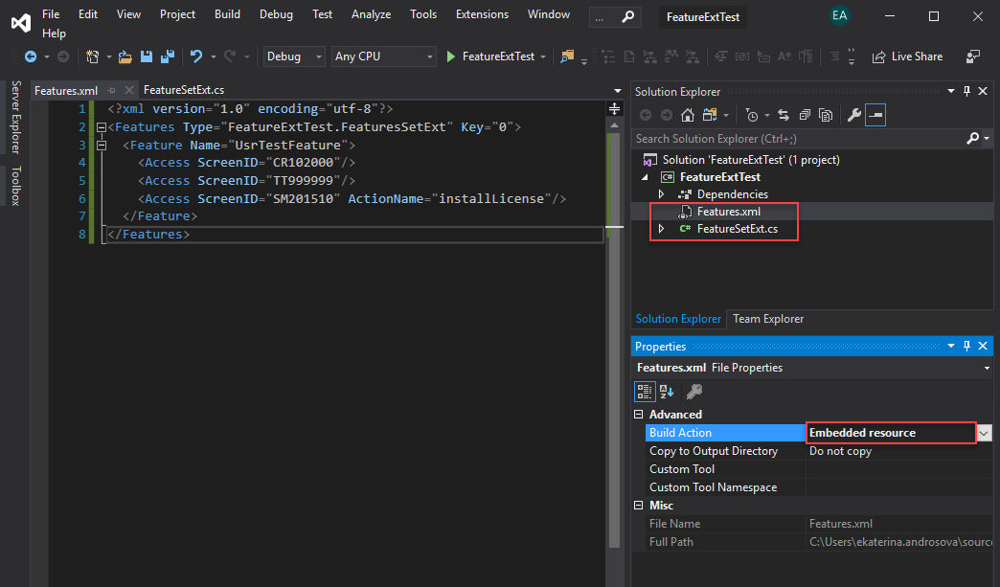

# To Add a Custom Feature Switch {#_8285172e-d3b1-48d9-bcc1-5d20e39cc3f0 .task}

This section explains how to add a custom feature switch into an ISV solution. For details about custom feature switches, see [Custom Feature Switches](HowAddFeature.md).

## Before You Proceed { .section}

Before you start adding a switch for a custom feature, the following prerequisite steps should be performed:

-   The new custom feature should be developed and integrated into Acumatica ERP.
-   You should have Acumatica Developer Network \(ADN\) Level 2 or Level 3. For details, see the [Acumatica Developer Network](https://adn.acumatica.com/why-join-adn/) website.
-   You should contact the Independent Software Vendor \(ISV\) team or Technical Contract Manager to create a stock keeping unit \(SKU\) and sign a contract.

For the custom feature switch to work properly, you also need to make sure that you have done the following:

-   Defined access rights for all custom forms if the feature switch you are developing restricts these custom forms partially \(that is, it restricts only some caches, actions, or fields on the form, rather than restricting access to the forms as a whole\)
-   Defined access rights for all standard forms that the custom feature switch restricts completely or partially
-   Included the defined access rights in your customization project

For details on access rights, see [User Roles: General Information](../UserGuide/User_Roles_GeneralInfo.md). For details on adding access rights to a customization project, see [Access Rights](CG_GL_Items_AccessRights.md).

## To Add a Custom Feature Switch { .section}

To add a custom feature switch, do the following:

1.  Create your `Features.xml` file with information about your feature, as shown in the following example.

    ```
    <?xml version="1.0" encoding="utf-8"?>
    <Features Type="FeatureExtTest.FeaturesSetExt" Key="0">
    	<Feature Name="UsrTestFeature">
    		<Access ScreenID="CR102000"/>
    		<Access ScreenID="TT999999"/>
    		<Access ScreenID="SM201510" ActionName="installLicense"/>
    	</Feature>
    </Features>
    ```

    For details about the structure of the `Features.xml` file, see [The Features.xml File](CG_FeatureFile.md).

2.  Add the `Features.xml` file to your C\# project, and set the **Build Action** property of the `Features.xml` file in Visual Studio to *Embedded Resource*, as shown in the following screenshot.

    

3.  Add a field to the FeaturesSet DAC by creating a cache extension, and add a related column to the database. The name of the new column must consist of the `Usr` prefix and the feature name. For details, see [To Add a Custom Data Field](https://help-2022r2.acumatica.com/Wiki/ShowWiki.aspx?wikiname=HelpRoot_Dev_Customization&PageID=5a2bddc7-dd58-4de4-a9f5-f4d5ce073b77). The `FeatureSetExt` cache extension that you have created for the new field must adhere to the following rules:
    -   The same name must be used for the custom feature in the FeaturesSet table column and in the `Features.xml` file.
    -   The `FeatureSetExt` class must be in the same project as the `Features.xml` file.
    -   The namespace of the `FeatureSetExt` class must start with the project name followed by the name of the folder in which the `Features.xml` file is located. For example, if your `Features.xml` file is located directly in the `FeatureExtTest` project root, then the namespace of the `FeatureSetExt` class must be `FeatureExtTest`. If your `Features.xml` file is located in the `Features/Resources/` folder of the `FeatureExtTest` project, the namespace of the `FeatureSetExt` class must be `FeatureExtTest.Features.Resources`.
4.  Customize the [Enable/Disable Features](../UserGuide/CS_10_00_00.md) \(CS100000\) form by adding a check box with the name of the custom feature on it. For details, see [To Add a Box for a Data Field](CG_GL_UI_PXForm_AddBox.md).
5.  Share the feature switch name with a representative of the ISV support team. The name of the feature switch must adhere to `[Full_Name_Of_FeaturesSetExt]+[Name_Of_The_DAC_Property]` format. For instance, the feature switch name would be `CustomFeatures.CustomObjects.FeaturesSetExt+UsrCustomFeature` for the `FeatureSetExt` class shown in the following code snippet.

    ```
    using PX.Data;
    using PX.Objects.CS;
    
    namespace CustomFeatures.CustomObjects
    {
    	public sealed class FeaturesSetExt : PXCacheExtension<FeaturesSet>
    	{
    		public abstract class usrCustomFeature : IBqlField	{ }
    		[Feature(false, typeof(FeaturesSet.inventory), DisplayName = "Custom Feature Switch")]
    		public bool? UsrCustomFeature { get; set; }
    	}
    }
    ```

    **Attention:** The feature switch name is case sensitive and must use the exact case that is used by the namespace and the DAC property of the `FeatureSetExt` class.


-   **[Custom Feature Switches](../CustomizationPlatform/HowAddFeature.md)**  

-   **[The Features.xml File](../CustomizationPlatform/CG_FeatureFile.md)**  


**Parent topic:**[Managing Customization Projects](../CustomizationPlatform/CG_GL_Projects.md)

