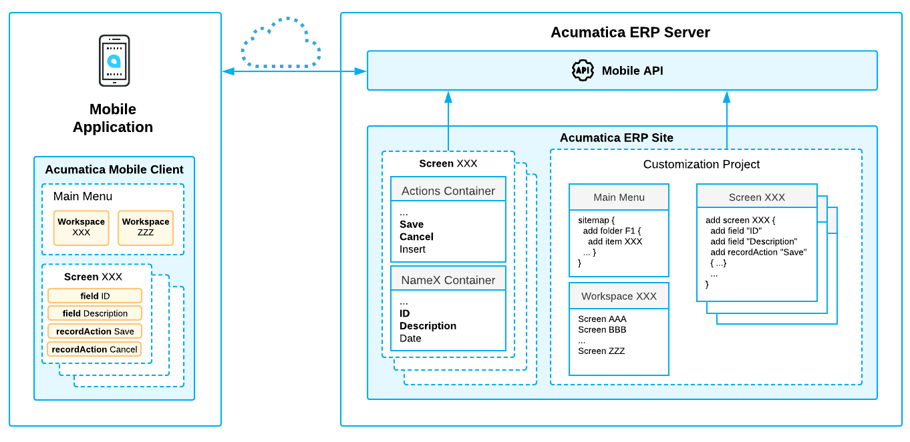

# To Add a Form To Mobile Site Map {#_933cf90e-5a0a-4791-967f-b1932b5b9897 .concept}

Suppose that you need to add to the Acumatica mobile app a screen that corresponds to an Acumatica ERP form. The form ID is *XXX*. The desired mobile screen has to contain the Date and Description fields and the Insert and Delete actions of the original *XXX* form of Acumatica ERP. Further suppose that you need to add the screen to a workspace.



The diagram above shows how the Acumatica Mobile Framework uses the MSDL code to configure the *XXX* screen in the mobile app. \(See [Configuring the Mobile Site Map](../Shared/../StudioDeveloperGuide/MOBILE_MSDL.md) for details.\) You declare the desired screen, workspace, containers, fields, actions, and other objects by using Mobile Site Map Definition Language \(MSDL\) in the Customization Project Editor. The objects you want to be displayed on the mobile app screen must be present on the original Acumatica ERP form \(see [Getting the WSDL Schema](../Shared/../StudioDeveloperGuide/MOBILE_BasicInfo.md)\).

After you publish your customization project, the screen you have defined by using MSDL appears in the mobile app.

## To Add a Screen to the Mobile Site Map { .section}

To add a screen to the mobile site map, perform the following steps:

1.  Get the WSDL schema for the original *XXX* screen of Acumatica ERP, as described in [Getting the WSDL Schema](../Shared/../StudioDeveloperGuide/MOBILE_BasicInfo.md).
2.  Open the [Customization Projects](../Shared/../UserGuide/SM_20_45_05.md) \(SM204505\) form, and in the **Project Name** column, click the link of the customization project. The Customization Project Editor opens.
3.  Open the [Mobile Application](../Shared/../UserGuide/AU_22_00_00.md) page.
4.  On the More menu of the page, click **Add New Screen**.

    The **Add New Screen** dialog box opens.

5.  In the dialog box, enter the form ID of the Acumatica ERP form \(and thus of the corresponding screen in the mobile app\) that you want to add to the mobile app, and click **OK**.

    The Add: &lt;screen\_name&gt; page opens. The row with the *Add New Screen* item and its details appears in the list of modified screens on the [Mobile Application](../Shared/../UserGuide/AU_22_00_00.md) page of the Customization Project Editor.

6.  Notice that the initial code of the screen includes only one `add` instruction.

    ```
    add screen <screen_ID> {
    # you can add commands here
    # ObjectAttribute = Value
    }
    ```

    \(See [add](../Shared/../StudioDeveloperGuide/MOBILE_Ref_MSDL_Instr_ADD.md) for details about the instruction.\)

7.  Implement the code of the new screen in the **Commands** area of the Add page. For details, see [Screens](../Shared/../StudioDeveloperGuide/mobile_msdl_screens.md).

    While implementing the code, use the Element Inspector to learn the names of fields, containers, and actions that you are mapping. For details, see [Element Inspector](../Shared/../UserGuide/AU_ElementInspector.md).

8.  Save your changes.

    Your commands are applied to the site map. If any errors have occurred, you can see them in the **Errors** area of the page. If your changes have been applied successfully, you can see the updated site map in the **Result Preview** area of the form.

9.  On the Update: SITEMAP page, add the screen to the mobile site map, as illustrated in the following code.

    ```
    add item <screen_ID> {
        visible = True    
        displayName = "screen_title"  }
    ```

10. Add a screen to a mobile workspace on the [Mobile Workspaces](../Shared/../UserGuide/AU_22_00_12.md) \(AU220012\) form.
11. Save your changes, and publish your customization project.

**Parent topic:**[Mobile Application](../CustomizationPlatform/CG_GL_Items_MobileApp.md)

