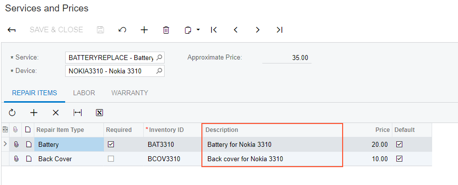

# Adding a Field from Another DAC {#_72283636-bb6e-41e2-a8eb-27f3c723dae6 .concept}

This topic describes how to add a UI control to an ASPX from another DAC.

## Customization Description { .section}

Suppose that you want to display boxes \(or columns in a grid\) from multiple DACs. For example, suppose that you are developing the custom Service and Prices \(RS203000\) maintenance form with several tabs, including the **Repair Items** tab. You have a service item that is defined by a custom DAC called `RSSVRepairItem`, and it has a corresponding stock item with a unique ID. Suppose you want to display information on this custom item and a description of its corresponding stock item.

The following screenshot shows an example of this form \(which is designed in the *T210 Customized Forms and Master-Details Relationships* training course\).



The `RSSVRepairItem` DAC includes the `InventoryID` field, which identifies a stock item. The field is defined as the following code shows.

```
[Inventory]
[PXDefault]
public virtual int? InventoryID { get; set; }
public abstract class inventoryID : PX.Data.BQL.BqlInt.Field<inventoryID> { }
```

The view for the **Repair Items** tab is defined as the following code shows.

```
public SelectFrom<RSSVRepairItem>.
	Where<RSSVRepairItem.serviceID.IsEqual<RSSVRepairPrice.serviceID.FromCurrent>.
		And<RSSVRepairItem.deviceID.IsEqual<RSSVRepairPrice.deviceID.FromCurrent>>>.View
			RepairItems;
```

## Implementation { .section}

To display a UI control from a DAC which is not selected in a view, you can use one of the following approaches:

-   Adding a control in the ASPX without modifying the view.

    You use this approach when a DAC selected in the view includes a field which is a primary key of a table from which you want to display a field. For example, the `RSSVRepairItem` DAC is selected in the view of the **RepairItems** tab, and the DAC includes a PK field, which is `InventoryID`.

-   Joining the DAC in the view and adding a control in ASPX.

    You should use this approach if a DAC selected in the view does not include a field which is a primary key of a table from which you want to display a field.


To display information by configuring the ASPX file only \(without modifying the view\), do the following:

1.  Learn the name of the field you want to display.

    For example, to learn the name of the field for the stock item description, go to the [Stock Items](../UserGuide/IN_20_25_00.md) \(IN202500\) form and inspect the **Description** box on the Summary area by using the Element Inspector. The field name for the box is descr.

2.  In the ASPX for the Services and Prices form, you specify a data field from the selector of another field \(in this example, the description of the inventory ID\) as two field names separated by one underscore character, such as `InventoryID_descr`.

    The element in the ASPX file should look as follows.

    ```
    <px:PXGridColumn DataField="InventoryID_description" Width="280" >
    </px:PXGridColumn>
    ```


To display information by configuring both the view and the ASPX file, do the following:

1.  Learn the name of the field you want to display and its DAC.
2.  Modify the view by joining the DAC from which you want to display a view.

    For example, on the **Tax Details** tab of the [Sales Orders](../UserGuide/SO_30_10_00.md) \(SO301000\) form, you want to display the `TaxType` field from the `Tax` DAC. The view is defined as shown in the following code.

    ```
    public PXSelectJoin<SOTaxTran, LeftJoin<Tax, On<Tax.taxID, Equal<SOTaxTran.taxID>>>,
      Where<SOTaxTran.orderType, Equal<Current<SOOrder.orderType>>,
        And<SOTaxTran.orderNbr, Equal<Current<SOOrder.orderNbr>>>>> Taxes;
    ```

3.  In the form's ASPX file, add the UI element to display the field value.

    In the example presented in the previous instruction,in the `SO301000.aspx` file, add the following column to the **Tax Details** grid.

    ```
    <px:PXGridColumn AllowNull="False" DataField="Tax__TaxType" Label="Tax Type"/>
    ```

    Note that to add a field, you specify the DAC name and the field name by separating them with a double underscore.


## Summary { .section}

To add a box \(or a column\) to a form that is mapped to a field from a DAC not used in a view, you use the following formula in the DataField attribute in the ASPX file: &lt;PK\_field\_name&gt;\_&lt;field\_name&gt;.

To add a box \(or a column\) to a form that is mapped to a field from a DAC selected in a view, you use the following formula in the DataField attribute in the ASPX file: &lt;DAC\_name&gt;\_\_&lt;field\_name&gt;.

## Examples in Acumatica ERP Source Code { .section}

The following table lists similar examples of displaying fields from different DACs in Acumatica ERP forms.

|Form|Location on the Form|Location in Source Code|
|----|--------------------|-----------------------|
|[Sales Orders](../UserGuide/SO_30_10_00.md) \(SO301000\)|The following columns on the **Tax Details** tab are mapped by using ASPX and joining DACs in a view:-   **Tax Type**
-   **Pending Tax**
-   **Reverse Tax**
-   **Include in VAT Exempt Tax**
-   **Statistical Tax**

|-   `SOOrderEntry` graph
-   `<px:PXGridLevel DataMember="Taxes">`

|
|[Vendor Prices](../UserGuide/AP_20_20_00.md) \(AP202000\)|The **Vendor Name** and **Description** columns in the form grid are mapped by using ASPX and joining DAC in a view.|-   `APVendorPriceMaint` graph
-   `<px:PXGridLevel DataMember="Records">`

|
|[Deactivate Expired Cards](../UserGuide/AR_51_25_00.md) \(AR512500\)|The following columns in the form grid are mapped by using ASPX and joining DAC in a view:-   **Customer Name**
-   **Customer Class**
-   **Email**
-   **Phone 1**
-   **Fax**

|-   `APExpiringCardsProcess` graph
-   `<px:PXGridLevel DataMember="Cards">`

|

**Parent topic:**[Use Cases](../CustomizationPlatform/CG_Example_UseCases.md)

