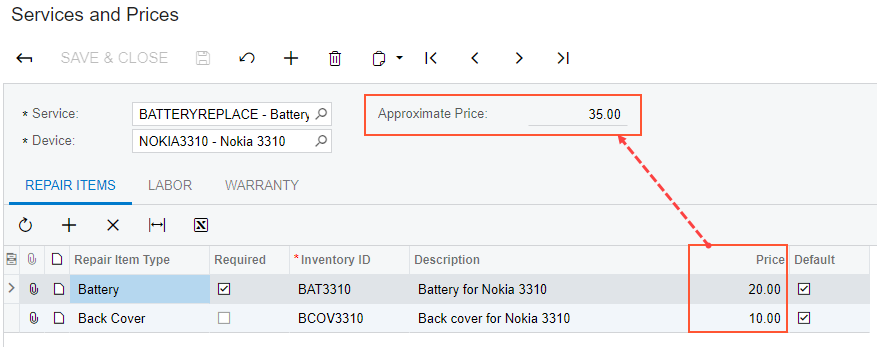
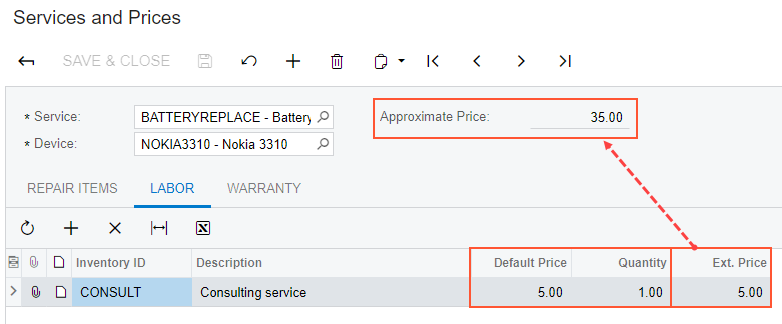

# Calculating Field Values \(with PXFormula\) {#_d75dbfeb-65d2-4f73-80cf-d3d5240a807b .concept}

This topic describes how to calculate values on a form of Acumatica ERP.

## Customization Description { .section}

Suppose that you need to calculate the total price of a provided service based on the stock and non-stock items included in the service. For example, suppose that you are developing the custom Service and Prices \(RS203000\) maintenance form with several tabs, including **Repair Items** and **Labor** \(where a user adds the stock items and non-stock items, respectively, included in the service\). The total price, displayed in the **Approximate Price** box of the Summary area of the form, is a sum of all stock and non-stock items added to the service.

The following screenshots show an example of this form \(which is developed in the *T210 Customized Forms and Master-Details Relationships* training course\). On the **Repair Items** tab \(shown in the first screenshot\), a user can add stock items. In the second screenshot, you can see the **Labor** tab, where a user can add non-stock items and specify their quantities.





The value in the **Approximate Price** box should be changed when the user adds a new item or deletes an item on a **Repair Items** or **Labor** tabs.

Suppose that the value of the item price on the **Repair Items** tab is stored in the `BasePrice` field of the `RSSVRepairItem` DAC, as the following code shows.

```
[PXCacheName("Repair Item")]
public class RSSVRepairItem : PXBqlTable, IBqlTable
{  
  ...

  #region BasePrice
  [PXDBDecimal()]
  [PXDefault(TypeCode.Decimal, "0.0")]
  [PXUIField(DisplayName = "Price")]
  public virtual Decimal? BasePrice { get; set; }
  public abstract class basePrice : PX.Data.BQL.BqlDecimal.Field<basePrice> { }
  #endregion
}
```

The extended price on the **Labor** tab \(the **Ext. Price** column\) is stored in the `ExtPrice` field of the `RSSVLabor` DAC, as the following code shows.

```
[PXCacheName("Repair Labor")]
public class RSSVLabor : PXBqlTable, IBqlTable
{
  ...

  #region ExtPrice
  [PXDBDecimal()]
  [PXDefault(TypeCode.Decimal, "0.0")]
  [PXUIField(DisplayName = "Ext. Price", Enabled = false)]
   public virtual Decimal? ExtPrice { get; set; }
   public abstract class extPrice : PX.Data.BQL.BqlDecimal.Field<extPrice> { }
   #endregion
}
```

The result of the calculation should be stored in the `Price` field of the `RSSVRepairPrice` DAC, which is defined as the following code shows.

```
[PXCacheName("Repair Price")]
public class RSSVRepairPrice : PXBqlTable, IBqlTable
{
  ...

  #region Price
  [PXDBDecimal()]
  [PXDefault(TypeCode.Decimal, "0.0")]
  [PXUIField(DisplayName = "Approximate Price", Enabled = false)]
  public virtual Decimal? Price { get; set; }
  public abstract class price : PX.Data.BQL.BqlDecimal.Field<price> { }
  #endregion
}
```

## Implementation { .section}

You can calculate values in one of the following ways:

-   Use the PXFormula or PXUnboundFormula attribute on a field in a DAC.

    You can use this approach if the calculations are simple and can be performed by using functions provided by Acumatica Framework, which are listed in [Calculation of Field Values](../StudioDeveloperGuide/BL__con_Attr_Calculations.md).

    The difference between the PXFormula and PXUnboundFormula attributes is that the PXFormula attribute writes the result of the calculation to the specified database field, and the PXUnboundFormula attribute writes the result to the field provided by the aggregateType parameter.

-   Calculate values in an event handler.

    You should use this approach if the calculations are complex and cannot be performed by using functions provided by Acumatica Framework.


In the current case, you can use the PXFormula attribute to implement calculations on the Services and Prices form. Because you are using the PXFormula attribute, you do not need to define any event handlers to implement these calculations.

To implement the calculation of the field values, do the following:

1.  Add the PXFormula attribute to the `BasePrice` field of the `RSSVRepairItem` DAC, as shown in bold type in the following code.

    ```
    [PXDBDecimal()]
    [PXDefault(TypeCode.Decimal, "0.0")]
    [PXUIField(DisplayName = "Price")]
    **\[PXFormula\(null,
      typeof\(SumCalc&lt;RSSVRepairPrice.price&gt;\)\)\]**
    public virtual Decimal? BasePrice { get; set; }
    ```

    In this code, the PXFormula attribute calculates the `Price` value of the `RSSVRepairPrice` DAC as the sum of the `BasePrice` values of all records in the **Repair Items** tab.

2.  Add the PXFormula attribute to the `ExtPrice` field of the `RSSVLabor` DAC, as shown in bold type in the following code.

    ```
    [PXDBDecimal()]
    [PXUIField(DisplayName = "Ext. Price")]
    [PXDefault(TypeCode.Decimal, "0.0")]
    **\[PXFormula\(
      typeof\(Mult&lt;RSSVLabor.quantity, RSSVLabor.defaultPrice&gt;\),
      typeof\(SumCalc&lt;RSSVRepairPrice.price&gt;\)\)\]**
    public virtual Decimal? ExtPrice { get; set; }
    ```

    In this code, the PXFormula attribute calculates the `ExtPrice` value as the product of the `Quantity` and `DefaultPrice` values of the same record, and calculates the `Price` value of the `RSSVRepairPrice` DAC as the sum of `ExtPrice` values of all records in the **Labor** tab.

3.  In the ASPX file of the form, set the CommitChanges attribute to *True* for the **Quantity** column of the grid to be able to calculate the `ExtPrice` value.

## Summary { .section}

To calculate values, you use the PXFormula attribute on the fields that are used in the calculations. As a parameter of the PXFormula attribute, you provide a function that specifies how to calculate the resulting value and in which field the resulting value should be stored.

You can see the complete list of functions in the [Calculation of Field Values](../StudioDeveloperGuide/BL__con_Attr_Calculations.md) topic. For more information on the PXFormula attribute, see the [PXFormulaAttribute Class](https://help.acumatica.com/(W(2))/Help?ScreenId=ShowWiki&pageid=dbafa6c6-e444-206f-6d5e-8f5606b4b69e) topic in the API Reference.

## Examples in Acumatica ERP Source Code { .section}

The following table lists similar examples of calculating values in Acumatica ERP forms.

|Form|Location on the Form|Location in Source Code|
|----|--------------------|-----------------------|
|[Invoices](../UserGuide/SO_30_30_00.md) \(SO303000\)|Multiple calculations are made on this form. For example, the value in the **Ext. Price** box of the Summary area is calculated based on the values in the **Quantity** and **Unit Price** columns on the **Document Details** tab.|The PX.Objects.AR.ARTran DAC|
|[Sales Orders](../UserGuide/SO_30_10_00.md) \(SO301000\)|Multiple calculations are made on this form. For example, the value of the **Ext. Price** box of the Summary area is calculated based on the values in the **Quantity** and **Unit Price** columns on the **Document Details** tab.You can see more complex calculations that use the PXFormula attribute with the `SOLing.UnbilledQty` field.

|The PX.Objects.SO.SOLine DAC|
|[Bills and Adjustments](../UserGuide/AP_30_10_00.md) \(AP301000\)|Multiple calculations. For example, the value of the **Ext. Cost** box of the Summary area is calculated based on the values of the **Quantity** and **Unit Cost** columns on the **Document Details** tab.|The PX.Objects.AP.APTran DAC|

**Parent topic:**[Use Cases](../CustomizationPlatform/CG_Example_UseCases.md)

