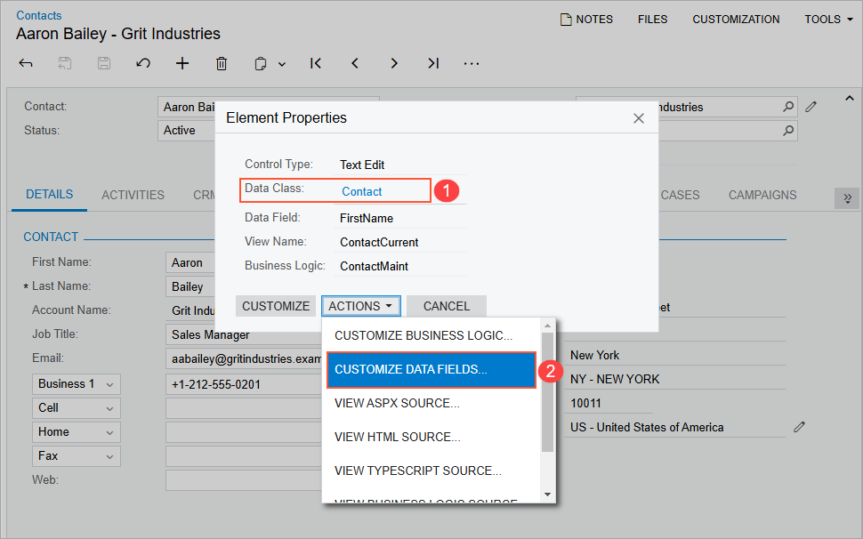

# To Start the Customization of a Data Access Class {#_81300776-772d-40cf-bcc9-bf3fb2e564ad .concept}

**Note:** Before you start a DAC customization, we recommend that you check the possibility to use the appropriate business entity attributes, which can be defined on the [Attributes](../UserGuide/CS_20_50_00.md) \(CS205000\) form, instead of custom fields. See [Use of Entity Attributes Instead of Custom Fields](CG_Examples_AttribVSCustomFields.md) for details.

You might need to customize an existing data access class in the following cases:

-   On a form, you want to create a custom data field to be used for a custom control.
-   In Acumatica ERP, you want to change the business logic for a data field in the DAC.

    **Important:** If multiple Acumatica ERP forms contain controls for the same field, changing an attribute of the field in the DAC modifies the behavior of these controls for the field on all forms.

If you know the name of the data access class to be customized, you can first add a *DAC* item for the class on the Customized Data Classes page of the [Customization Project Editor](../UserGuide/SM_20_45_10.md) \(see [To Add a DAC Item for an Existing Data Access Class to a Project](CG_GL_Items_DACs_AddingExisting.md) for details\) and then click the item to open it in the [Data Class](../UserGuide/AU_DataClassEditor.md).

You usually start the customization of a data access class on a form that contains boxes used by users to work with data of an appropriate business entity, such as a sales order invoice.

## To Start DAC Customization { .section}

To start the customization of a DAC from a form, perform the following actions:

1.  Open the form in the browser.
2.  On the form title bar, click **Customization** &gt; **Inspect Element** to open the [Element Inspector](../UserGuide/AU_ElementInspector.md).

    **Note:** If you need to activate the [Element Inspector](../UserGuide/AU_ElementInspector.md) for a pop-up panel, a dialog box, or another UI element that opens in modal mode and makes the [Customization Menu](../UserGuide/AU_CustomizationMenu.md) unavailable for selection, you can press Ctrl+Alt.

3.  On the form, click the area with the boxes that are used for the data of the business entity, to open the [Element Properties Dialog Box](../UserGuide/AU_ElementInspector.md#_8ce780b0-243f-480c-8b4c-ed6431116e3f) for the area.
4.  In the **Data Class** box of the dialog box, view the name of the DAC for the element you clicked \(see Item 1 in the following screenshot\). If you are not sure that this DAC is the needed one, click **Cancel** and repeat Step 3.
5.  Click **Actions** &gt; **Customize Data Fields** \(Item 2\).

    

6.  If there is no currently selected customization project and the Element Inspector opens the [Table 1](../UserGuide/AU_CustomizationMenu.md#_6adfabb5-9264-4273-938a-db4a41510b1c), select an existing customization project or create a new one.

If the customization project does not contain a *DAC* item for the data access class, the [Customization Project Editor](../UserGuide/SM_20_45_10.md) adds the item to the project to keep the changes in the database. The DAC is opened in the [Data Class](../UserGuide/AU_DataClassEditor.md), and you can start the customization of the class.

When you click **Save** on the editor toolbar, the editor updates the *DAC* item in the database.

-   **[Use of Entity Attributes Instead of Custom Fields](../CustomizationPlatform/CG_Examples_AttribVSCustomFields.md)**  

**Parent topic:**[Data Access Class](../CustomizationPlatform/CG_GL_BL_DAC.md)

