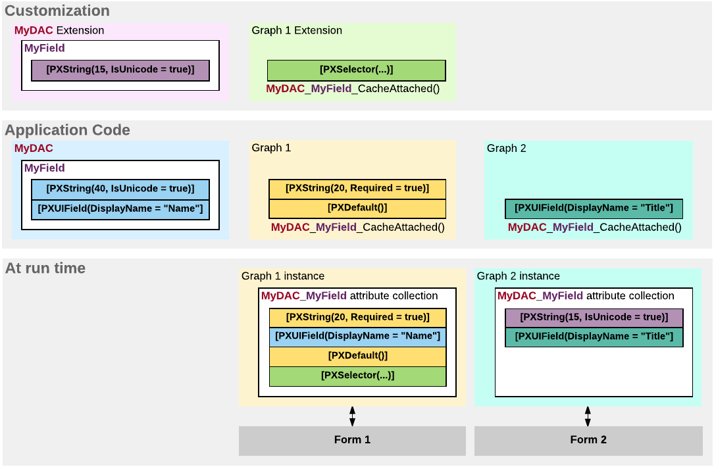

# Data Field {#_b3d24079-bda4-4f82-9fbd-c444a8bcb733 .concept}

In a data access class \(DAC\), a data field declaration consists of the following elements:

-   A public abstract class \(which is also referred to as a *class field* or *BQL field*\) that implements the PX.Data.IBqlField interface. This abstract class is used as a *type* to reference the field in the BQL statements specified in the data views and attributes added to data field declarations.
-   Attributes that provide the common business logic for the field. On a field, you use attributes to define the data field specification, which includes multiple parameters, such as the data type, default value, and field caption on the UI. The type attribute, such as PXDBString and PXDBDecimal, is the only mandatory attribute of a DAC field.
-   A public virtual property \(which is also referred to as *property field*\) of a nullable data type that corresponds to the data type of this field. This property keeps the value of the data field. The attributes are added to the property and not to the abstract class of the data field declaration.

For a data field, you can customize only field attributes. You do this in one of the following ways:

-   In the DAC \(on the DAC level\)
-   In a graph \(on the graph level\)

On the DAC level, you can customize the attributes of a field by adding, deleting, replacing, or modifying an attribute in the DAC extension by using the [Data Class](../UserGuide/AU_DataClassEditor.md).

On the graph level, you can define a new set of attributes for a field and apply changes by means of the CacheAttached\(\) event handler in the graph extension.

The following diagram shows an example that demonstrates how the attributes of a field declared in a data access class can be changed on the DAC and graph levels for two forms.

**Note:** In the example, as recommended in [Customization of Field Attributes in DAC Extensions](CG_Platform_Framework_CS_DACExt_FieldAttributes.md), the CacheAttached\(\) event handler is always used to merge the custom attributes of the field with the original ones instead of replacing them on the graph level.

On the diagram, you can see that the attribute collection for the same data field in the cache object can be different for graphs that provide business logic for different forms.

-   **[To Customize a Field on the DAC Level](../CustomizationPlatform/CG_GL_BL_DataField_TypeLevel.md)**  

-   **[To Customize a Field on the Graph Level](../CustomizationPlatform/CG_GL_BL_DataField_CacheLevel.md)**  

-   **[To Set a Default Value](../CustomizationPlatform/CG_GL_BL_DataField_Default.md)**  

-   **[To Change the Label of a Field](../CustomizationPlatform/CG_GL_BL_DataField_Name.md)**  

-   **[To Make a Field Mandatory](../CustomizationPlatform/CG_GL_BL_DataField_Mandatory.md)**  

-   **[To Customize the Table of a Selector Field](../CustomizationPlatform/CG_GL_BL_DataField_Selector.md)**  

-   **[To Provide Multilanguage Support for a Field](../CustomizationPlatform/CG_GL_BL_DataField_MultiLanguage.md)**  

**Parent topic:**[Customizing Business Logic](../CustomizationPlatform/CG_GL_BL.md)

