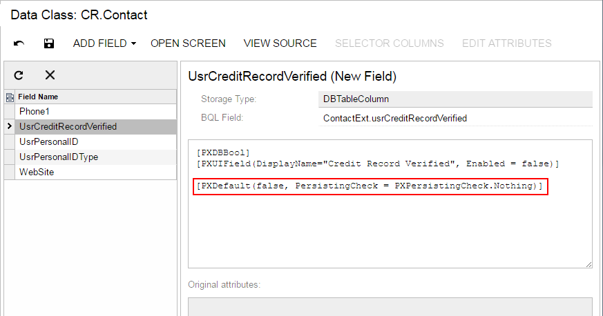

# To Set a Default Value {#_08861773-9b09-4212-a581-5f8db3d36a26 .concept}

When a user creates a new record of a business entity through a form of Acumatica ERP, you might need to set a default value for a data field. You use the PXDefault attribute for a data field to set a constant as the default value, or you provide a BQL query to obtain a value from the database or data records from the cache. The default value is assigned to the field when a data record holding this field is inserted into the cache.

**Note:** If the default value is taken from a field that can be auto-generated by the database \(such as an ID\), you should use the PXDBDefault attribute instead of the PXDefault attribute.

You can set a default value for an original or custom text field on the DAC and graph levels. The following sections provide detailed information:

-   [To Set a Default Value for an Original Field on the DAC Level](#_1a95ac32-1599-4105-a9b4-41389790801d)
-   [To Set a Default Value for an Original Field on the Graph Level](#_85b6159e-d4e9-4e86-8fad-8f444b5999ee)
-   [To Set a Default Value for a Custom Field on the DAC Level](#_1e21988c-9e40-4800-a52e-6447655322e2)

## To Set a Default Value for an Original Field on the DAC Level {#_1a95ac32-1599-4105-a9b4-41389790801d .section}

To set a default value for a field used on multiple forms, you should customize the original attributes of the field in the data access class extension. To do this, perform the following actions:

1.  Open the field in the Data Class Editor, as described in [To Customize a Field on the DAC Level](CG_GL_BL_DataField_TypeLevel.md).
2.  In the **Customize Attributes** box, select *Append to Original*.
3.  In the edit area below the box, add the PXDefault attribute and define a default value for the attribute.
4.  Click **Save** on the editor toolbar to save your changes to the customization project.

## To Set a Default Value for an Original Field on the Graph Level {#_85b6159e-d4e9-4e86-8fad-8f444b5999ee .section}

To set a default value for a field used on a single form, you should customize the original attributes of the field in the graph extension. To do this, perform the following actions:

1.  Create the code template that includes the original attributes of the field and the DACName\_FieldPropertyName\_CacheAttached\(\) event handler, which replaces the attributes within the graph, as described in [To Customize a Field on the Graph Level](CG_GL_BL_DataField_CacheLevel.md).
2.  By using the Code editor, replace the original attributes in the template, as shown in the following code snippet.

    ```
    [PXMergeAttributes(Method = MergeMethod.Append)]
    [PXDefault(false, PersistingCheck = PXPersistingCheck.Nothing)]
    protected void DACName_FieldPropertyName_CacheAttached(PXCache cache)
    {
    }
    ```

3.  Click **Save** on the editor toolbar to save your changes to the customization project.

## To Set a Default Value for a Custom Field on the DAC Level {#_1e21988c-9e40-4800-a52e-6447655322e2 .section}

If you need to set a default value for a custom data field on the DAC level, you add the PXDefault attribute and define a default value for the attribute in the edit area of the Data Class Editor, as shown in the following screenshot.



**Parent topic:**[Data Field](../CustomizationPlatform/CG_GL_BL_DataField.md)

