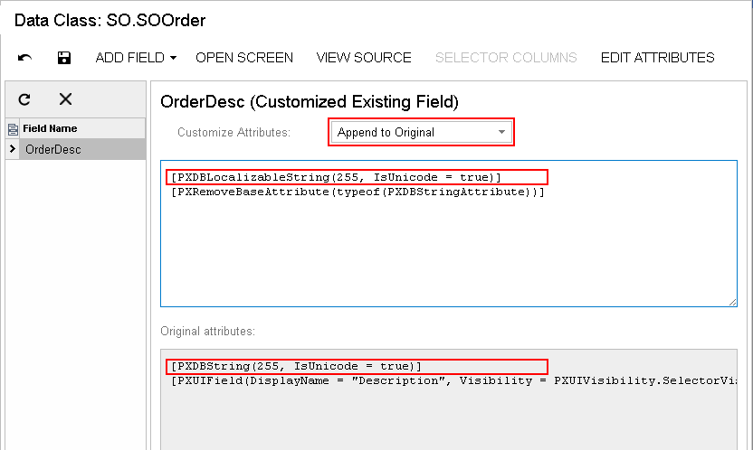

# To Provide Multilanguage Support for a Field {#_ac951f15-9c6c-4b58-9a24-6f04a8084df7 .concept}

Acumatica ERP supports locale-specific settings and the translation of the strings used on the application interface. Acumatica ERP also provides the functionality to translate user input to multiple languages and store translations in the database. \(See [Locales and Languages](../UserGuide/SM__CON_Locales_and_Languages.md) for details.\)

For example, if there are multiple active system locales in an instance of Acumatica ERP, and a text field on a form is declared as a multilanguage field, the field control displays the value for the current locale. If the database does not contain a value for the current locale, the control displays the value for the default system locale.

To declare a text field as a multilanguage one, in the data access class, you should use the PXDBLocalizableString attribute instead of PXDBString or PXDBText. The PXDBText attribute has to be replaced with the PXDBLocalizableString one without any length specified.

**Note:**

-   Please do not confuse the PXDBLocalizableString attribute with PXDBLocalString. The PXDBLocalString attribute is deprecated and should not be used in the customization code.
-   By default, the system supports multilingual user input for some boxes listed in [Boxes That Have Multilanguage Support](../UserGuide/SM__CON_Boxes_MultiLanguage.md).

You can provide multilanguage support for an original or custom text field, as described in the following sections.

## To Provide Multilanguage Support for an Original Field on the DAC Level {#_1a95ac32-1599-4105-a9b4-41389790801d .section}

To provide multilanguage support for a field used on multiple forms, you should customize the original attributes of the field in the data access class extension. To do this, perform the following actions:

1.  Open the field in the Data Class Editor, as described in [To Customize a Field on the DAC Level](CG_GL_BL_DataField_TypeLevel.md).
2.  On the More menu \(under **Actions**\), click **Edit Attributes**.
3.  In the **Customize Attributes** dialog box, which opens, select the PXDBString \(or PXDBText\) attribute, and click **Delete Row** \(Х\) on the toolbar.
4.  Click **OK** to save your changes and close the dialog box.
5.  In the **Customize Attributes** box of the editor, select *Append to Original*, as shown in the screenshot below.
6.  In the work area below the box, add the PXDBLocalizableString attribute, which has the same parameters as the deleted PXDBString \(or PXDBText\) attribute.
7.  Click **Save** on the editor toolbar to save your changes to the customization project.

For example, after you perform these actions for the **Description** field on the Sales Orders \(SO301000\) form, the **Customize Attributes** area of the Data Class Editor contains the following code \(as shown in the screenshot below\).

```
[PXDBLocalizableString(255, IsUnicode = true)]
[PXRemoveBaseAttribute(typeof(PXDBStringAttribute))]
```



## To Provide MultiLanguage Support for an Original Field on the Graph Level {#_85b6159e-d4e9-4e86-8fad-8f444b5999ee .section}

To provide multilanguage support for a field used on a single form, you should customize the original attributes of the field in the graph extension. To do this, perform the following actions:

1.  Create the code template, which includes the original attributes of the field and the DACName\_FieldPropertyName\_CacheAttached\(\) event handler, which replaces the attributes within the graph, as described in [To Customize a Field on the Graph Level](CG_GL_BL_DataField_CacheLevel.md).
2.  By using the Code editor, replace the original attributes in the template, as shown in the following code snippet.

    ```
    [PXMergeAttributes(Method = MergeMethod.Merge)]
    [PXDBLocalizableString(255, IsUnicode = true)]
    protected void DACName_FieldPropertyName_CacheAttached(PXCache cache)
    {
    }
    ```

3.  Click **Save** on the editor toolbar to save the changes to the customization project.

## To Provide Multilanguage Support for a Custom Field {#_1e21988c-9e40-4800-a52e-6447655322e2 .section}

If you need to create a custom text box with multilanguage support, first you create a custom field with the PXDBString attribute. Then in the DAC, you replace this attribute name with PXDBLocalizableString.

**Parent topic:**[Data Field](../CustomizationPlatform/CG_GL_BL_DataField.md)

