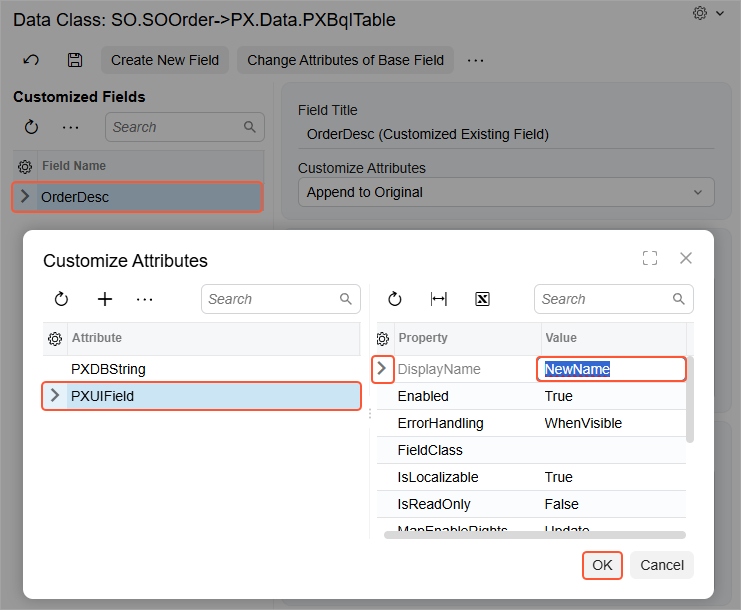

# To Change the Label of a Field {#_a5d3b509-1967-4589-b33b-fc505993459a .concept}

You can change the label for an original data field on the DAC and graph levels. The following sections provide detailed information:

-   [To Change the Label of a Field on the DAC Level](#_1a95ac32-1599-4105-a9b4-41389790801d)
-   [To Change the Label of a Field on the Graph Level](#_85b6159e-d4e9-4e86-8fad-8f444b5999ee)

## To Change the Label of a Field on the DAC Level {#_1a95ac32-1599-4105-a9b4-41389790801d .section}

To change the label of a control for a field used on multiple forms, you should customize the PXUIField attribute of the field in the data access class extension. To do this, perform the following actions:

1.  Open the field in the Data Class Editor, as described in [To Customize a Field on the DAC Level](CG_GL_BL_DataField_TypeLevel.md).
2.  In the **Customize Attributes** box, select *Append to Original*.
3.  On the More menu \(under **Actions**\), click **Edit Attributes**.
4.  In the **Attribute** list of the **Customize Attributes** dialog box, which opens, click the PXUIField attribute to select it.
5.  In the parameter list, specify a new label for the DisplayName parameter, as the screenshot below shows.
6.  Click **OK** to exit the dialog box.

    As a result, the editor adds the following attribute for the field to the DAC extension.

    ```language-csharp
    [PXCustomizeBaseAttribute(typeof(PXUIFieldAttribute), "DisplayName", "NewName")]
    ```

    **Note:** The editor currently inserts the deprecated PXCustomizeBaseAttribute attribute, which is used to redefine the value of a property for an attribute. Although this attribute still works, you should instead use the appropriate customization attribute from the [PXCustomize](https://help.acumatica.com/Help?ScreenId=ShowWiki&pageid=65178fd8-b72b-6d7b-3282-22e3f004d66a) static class. In the preceding example, this is the [PXCustomize.PXUIFieldAttributeAttribute](https://help.acumatica.com/Help?ScreenId=ShowWiki&pageid=360c50f2-fe12-c722-9f83-6108aefb0082) attribute. To use this attribute, you can replace the inserted code with the following code.

    ```language-csharp
    [PXCustomize.PXUIFieldAttribute(DisplayName = "NewName")]
    ```

7.  Click **Save** on the editor toolbar to save your changes to the customization project.

    


## To Change the Label of a Field on the Graph Level {#_85b6159e-d4e9-4e86-8fad-8f444b5999ee .section}

To change the label of a field for a single form, you should customize the PXUIField attribute of the field in the graph extension. To do this, perform the following actions:

1.  Create the code template that includes the original attributes of the field and the DACName\_FieldPropertyName\_CacheAttached\(\) event handler, which replaces the attributes within the graph, as described in [To Customize a Field on the Graph Level](CG_GL_BL_DataField_CacheLevel.md).
2.  By using the Code editor, replace the original attributes in the template, as shown in the following code snippet.

    ```language-csharp
    [PXCustomize.PXUIFieldAttribute(DisplayName = "NewName")]
    protected void DACName_FieldPropertyName_CacheAttached(PXCache cache)
    {
    }
    ```

3.  Click **Save** on the editor toolbar to save your changes to the customization project.

**Parent topic:**[Data Field](../CustomizationPlatform/CG_GL_BL_DataField.md)

