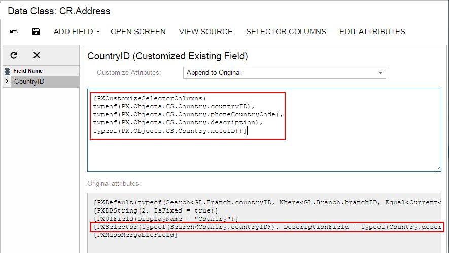

# To Customize the Table of a Selector Field {#_b20fc284-9627-48bf-9972-a90bee8dabef .concept}

For a selector field, you use the [Data Class](../UserGuide/AU_DataClassEditor.md) to add, delete, and sort the columns of the selector table and store the changes in the customization project as a *DAC* item.

You can customize the table of an original selector field on the data access class \(DAC\) and graph levels. The following sections provide detailed information:

-   [To Customize the Table of an Original Selector Field on the DAC Level](#_1a95ac32-1599-4105-a9b4-41389790801d)
-   [To Customize the Table of an Original Selector Field on the Graph Level](#_85b6159e-d4e9-4e86-8fad-8f444b5999ee)

## To Customize the Table of an Original Selector Field on the DAC Level {#_1a95ac32-1599-4105-a9b4-41389790801d .section}

To customize the table of an original selector field for all controls for the field, you should customize the PXSelector attribute of the field in the data access class extension. To do this, perform the following actions:

1.  Open the field in the Data Class Editor, as described in [To Customize a Field on the DAC Level](CG_GL_BL_DataField_TypeLevel.md).
2.  On the More menu \(under **Actions**\), click **Edit Selector Columns**.
3.  In the **Customize Selector Columns** dialog box, which opens, make the required changes.

    You can use this dialog box to add new columns to the selector table and to reorder columns in the table. \(See [Customize Selector Columns Dialog Box](../UserGuide/AU_DataClassEditor.md#_bf428176-8d39-4317-ac59-b297decc2365) for details.\)

4.  Click **OK** to add the PXCustomizeSelectorColumns attribute for the field in the edit area of the Data Class Editor based on your changes, as shown in the following screenshot.

    

5.  Click **Save** on the editor toolbar to save your changes to the customization project.

## To Customize the Table of an Original Selector Field on the Graph Level {#_85b6159e-d4e9-4e86-8fad-8f444b5999ee .section}

To customize the selector table for the selector control on a single form, you should customize the PXSelector attribute of the appropriate field in the graph extension. To do this, perform the following actions:

1.  Create the code template that includes the field attributes and the DACName\_FieldPropertyName\_CacheAttached\(\) event handler that replaces the attributes within the graph, as described in [To Customize a Field on the Graph Level](CG_GL_BL_DataField_CacheLevel.md).
2.  By using the Code editor, replace the original attributes in the template, as shown in the following code snippet.

    ```
    [PXCustomizeSelectorColumns(<NEW CONTENT OF THE PXSELECTOR ATTRIBUTE>)]
    protected void DACName_FieldPropertyName_CacheAttached(PXCache cache)
    {
    }
    ```

3.  Click **Save** on the editor toolbar to save your changes to the customization project.

**Parent topic:**[Data Field](../CustomizationPlatform/CG_GL_BL_DataField.md)

