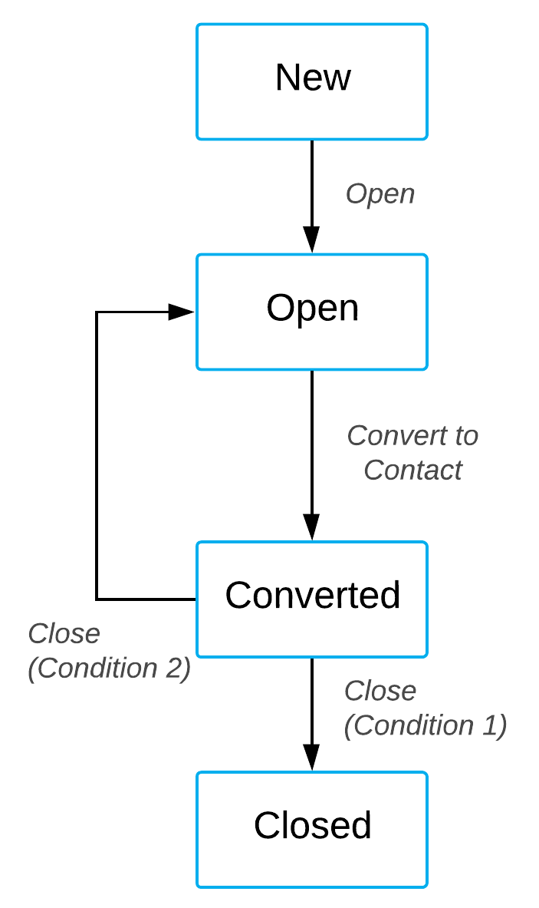

# Defining a New Workflow {#_aabf52e0-9616-4883-bed4-548fa37d7cd7 .concept}

In this example, defining workflows for working with a lead is described. Suppose, you need to define a workflow for a process of changing the status of a lead on the Leads \(CR301000\) form. Statuses and actions that switch the status are presented in the following diagram.

A lead can have the following statuses:

-   *New*. This is the initial status of a created lead. A user can change a lead's status from *New* to *Open* by selecting the **Open** action.
-   *Open*. A user can change a lead's status from *Open* to *Converted* by selecting the **Convert to Contact** action.
-   *Converted*. A user can change the lead's status by selecting the **Close** action. The status is changed from *Converted* to *Closed* in case the `Attention` field of a lead has the *C* value \(which is determined by Condition 1\), from *Converted* to *Open* if the `Attention` field of a lead has the *O* value \(which is determined by Condition 2\).
-   *Closed*.

Based on this description, you can define a workflow for a lead by doing the following:

1.  Add the Leads form to the list of customized screens.
2.  On the [Conditions](../UserGuide/AU_20_10_10.md) page, define conditions depending on which the *Converted* status is changed
3.  On the [Dialog Boxes](../UserGuide/AU_20_10_40.md) page, define dialog boxes that request a user to enter values needed to perform actions.
4.  On the [Workflows](../UserGuide/AU_20_10_20.md) page, create a workflow.
5.  On the [Workflow \(Tree View\)](../UserGuide/AU_20_10_30.md) or [Workflow \(Diagram View\)](../UserGuide/AU_20_10_30_VisualEditor.md) pages, define states of the created workflow.
6.  For each state, you define a list of actions available for this state.
7.  For each action, you define a transition that this action performs.

## Add the Leads form to the List of Customized Screens { .section}

To add the form in the list of customized screens, do the following:

1.  Open Customization Project Editor.
2.  In the navigation pane, click **Screens**.
3.  On the page toolbar, click **Add Screen** &gt; **Customize Existing Screen**.
4.  In the **Customize Existing Screen** dialog box which opens, select the Leads form.
5.  Click **OK**.

    The Leads form is displayed on the Customized Screens page and in the navigation page under the **Screens** node.

For details on adding a form to the list of customized screens, see [Workflow Creation: To Add a Workflow](../DeveloperGuide/WorkflowUI_CreatingWorkflow_Activity_CreateWorkflow.md).

## Define Conditions { .section}

To define conditions for the **Close** action, do the following:

1.  In the navigation pane of Customization Project Editor, select **Screens** &gt; **CR301000** &gt; **Conditions**.

    The Conditions: CR301000 \(Leads\) page opens.

2.  Add the condition which is fulfilled changes the status to *Closed* by doing the following:
    1.  On the **Conditions** pane, click **Add New Record**.
    2.  In the **Condition Properties** dialog box which opens, type the name of the condition in the **Condition Name** box: `Condition Close`.
    3.  On the table toolbar, click **Add Row** and specify the following values:
        -   **Field Name**: *Attention*
        -   **Condition**: *Equals*
        -   **Value**: `'C'`
    4.  Click **OK**.
3.  Add the condition which is fulfilled changes the state to *Open*. To do that, repeat the steps from the previous bullet. In the **Condition Properties** dialog box, specify the following values:
    -   **Field Name**: *Attention*
    -   **Condition**: *Equals*
    -   **Value**: `'O'`

For details on adding a condition, see [Conditions and Transitions: To Add Conditions](../DeveloperGuide/WorkflowUI_ConditionsTransitions_Activity_AddConditions.md) and [Conditions and Transitions: General Information](../DeveloperGuide/WorkflowUI_ConditionsTransitions_GeneralInfo.md).

## Define Dialog Boxes { .section}

When a user opens a lead, he should specify a reason for opening it. The reason is stored in the `Reason` field of the Leads form. To request the `Reason` field value from the user when he selects the **Open** action, you define a dialog box as follows:

1.  In the navigation pane of Customization Project Editor, select **Screens** &gt; **CR301000** &gt; **Dialog Boxes**.

    The CR301000 \(Leads\) Dialog Boxes page opens.

2.  In the **Dialog Boxes** pane, click **+**.

    The **New Dialog Box** dialog box opens.

3.  In the **Dialog Box Name** box, specify the name of the dialog box: `Reason`.
4.  Click **OK**.
5.  In the **Dialog Box Fields** table, enter the following values:
    -   **Schema Field**: *PX.Objects.CR.Contact.Resolution*
    -   **Field Name**: *Resolution*
    -   **Display Name**: `Reason`
    -   **Default Value**: *Assign*
6.  On the page toolbar, click **Save**.

For details on creating dialog boxes, see [Workflow Dialog Boxes: General Information](../DeveloperGuide/WorkflowAPI_DialogBox_GeneralInfo.md) and [Workflow Elements: To Add a Dialog Box](../DeveloperGuide/WorkflowUI_ConfiguringWorkflowElements_Activity_AddDialogBox.md).

## Create a Workflow { .section}

To create a new workflow, do the following:

1.  In the navigation pane of Customization Project Editor, select **Screens** &gt; **CR301000** &gt; **Workflows**.

    The CR301000 \(Leads\) Workflows page opens.

    **Tip:** The Leads form has a predefined workflow for which the **State Identifying** box value is already specified.

2.  On the page toolbar, click **Add Workflow**.
3.  In the **Add Workflow** dialog box which opens, specify the following values:
    -   **Operation**: *Create New Workflow*
    -   **Workflow Type**: *DEFAULT*
    -   **Workflow Name**: `DEFAULT`
4.  Click **OK**.

    In the page table, the new row appears.

5.  Clear the **Active** box for the predefined workflow, and select the **Active**box for the created workflow.
6.  On the page toolbar, click **Save**.
7.  Click the name of the created workflow in the table.

    The Workflow Editor page opens. Now you can proceed with defining states of a lead for the new workflow.

## Define States for the Workflow { .section}

To define statuses of a lead, do the following:

1.  In the navigation pane of Customization Project Editor, select **Screens** &gt; **CR301000** &gt; **Workflows** &gt; **Default** .

    The CR301000 \(Leads\) Workflows: Default page opens.

2.  Define the *New* status of the lead by doing the following:
    1.  In the **States and Transitions** pane, click **+** &gt; **Add State**.
    2.  In the **Add State** dialog box which opens, specify the following values:
        -   **Identifier**: `N`
        -   **Description**: `New`
    3.  Click **OK**.

        The *New* status appears in the **Statuses and Transitions** navigation pane.

    4.  On the **State Properties** tab, select the **Initial State of the Workflow** box. It means that when a lead is created, the `Status` field \(which is selected as a state identifier by default\) of the lead is assigned the *New* value.
    5.  In the **Fields** table of the **State Properties** tab, add the following rows:

        |Object Name|Field Name|Disabled|Hide|Required|Default Value|
        |-----------|----------|--------|----|--------|-------------|
        |*Lead/Contact*|*Owner*|cleared|cleared|cleared|`@me`|
        |*Lead/Contact*|*Company Name*|cleared|cleared|selected|empty|
        |*Lead/Contact*|*Workgroup*|selected|cleared|cleared|empty|

        The table rows define the state of boxes on the Leads form when a lead has the *New* status. For example, the `@me` default value of the `Owner` field name means the **Owner** box is assigned the name of the current Acumatica ERP user. For details on possible filter values, see [Managing Advanced Filters](../UserGuide/GI_Reusable_Filters_Mapref.md).

    6.  On the page toolbar, click **Save**.
3.  Define the *Open*, *Converted*, and *Closed* states of the workflow by following the same instruction.

## Define Actions for Each State { .section}

For the *New* state, the **Open** action changes the state of a lead to *Open*. To define this action, do the following:

1.  In the **States and Transitions** pane, select the **New** state.
2.  On the tab toolbar, click **Create Action**.
3.  In the **New Action** dialog box which opens, specify the following values:
    -   **Action Name**: Open
    -   **Display Name**: Open
    -   **Place in Folder**: Actions
4.  Click **OK**.
5.  In the row that appears, in the **Dialog Box** column, select the dialog box you defined previously, *Reason*.
6.  On the **Update Fields** tab, define fields that should be updated before the action method is invoked. Do the following:
    1.  On the tab toolbar, click **Add Row**.
    2.  In the new row, specify the following values:
        -   **Field**: *Reason*
        -   **Value**: *\[Reason.Resolution\]*
7.  On the page toolbar, click **Save**.

According to the diagram of the workflow shown at the beginning of the example, for the rest of the states you should specify the following actions and transitions:

-   For the **Open** state: the **Convert to Contact** action
-   For the **Converted** state: the **Close** action

## Define a Transition for an Action { .section}

For the New action, define a transition as follows:

1.  In the **States and Transitions** pane, select the **New** state.
2.  On the pane toolbar, click **+** &gt; **Add Transition**.
3.  In the **Add Transition** dialog box which opens, specify the following values:
    -   **Transition Name**: `Open`
    -   **Action Name**: *Open*
    -   **Condition**: cleared
    -   **Target State**: *Open*
4.  Click **OK**.

    The Open \(Open-&gt;Open\) transition appears in the States and Transitions pane.

5.  On the page toolbar, click **Save**.

For the **Convert to Contact** action of the *Open* state, define the Convert \(Convert to Contact-&gt;Converted\) transition. For the **Close** action of the *Converted* state, define two transitions: one with the **Condition** box value set to *Condition 1*, and another with the **Condition** box value set to *Condition 2*.

The resulting **States and Transitions** pane should look as shown in the following screenshot.

**Parent topic:**[Defining a Workflow](../CustomizationPlatform/CG_GL_BL_Example_Workflows.md)

