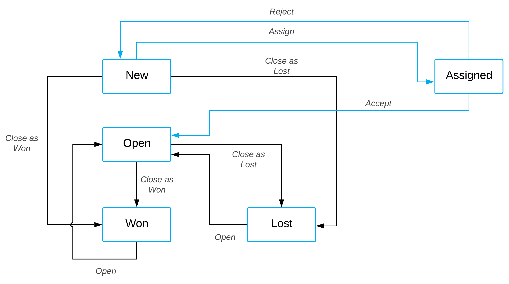

# Customizing a Predefined Workflow from Code {#_bf8fc578-a6b7-447a-b913-1cfa8d56b73d .concept}

You can customize a workflow in Visual Studio or in the Code Editor with the help of Acumatica Framework.

This example demonstrates the extending of the workflow for working with an opportunity by using Visual Studio. The predefined workflow for the [Opportunities](../UserGuide/CR_30_40_00.md) \(CR304000\) form includes the states \(shown in the blue rectangles and representing statuses\) and actions shown in the following diagram.


Suppose that in your customization efforts you need to incorporate a process of assigning a new opportunity before opening it. You need a new status for opportunities called *Assigned*. A user should be able to change a status from *New* to *Assigned* by clicking the **Assign** action, change the status from *Assigned* to*Open* by clicking the predefined **Accept** action, and change the status from *Assigned* to *New* by clicking the **Reject** action, which you will add. For an opportunity to be assigned, a user must be selected in the **Owner** box. Also, you need to add an auto-run action named `Auto-Assign` that is performed if a new opportunity is created and the **Owner** box is not empty. The `Auto-Assign` action changes the status of the opportunity to *Assigned*.

When a user clicks the **Accept** or **Reject** action, the user should provide the reason for changing the state. When a user clicks the **Assign** action, the user should specify the **Owner** of the opportunity. In both of these situations, you will use a dialog box to obtain this information.

The following diagram presents the possible statuses after customization and the actions that change statuses.



Based on these specifications, you will implement the new workflow for opportunities by performing the following general tasks, which are described in greater detail in the sections that follow:

1.  Adding a new state named `Assigned`, as described in [Add a New State Named Assigned](#_c083eddb-9de6-440f-bc26-ca3782f1a89b).
2.  Adding the following actions:

    -   `Assign`, which changes the state from *New* to *Assigned*
    -   `Accept`, which changes the state from *Assigned* to *Open*
    -   `Reject`, which changes the state from *Assigned* to *New*
    -   `AutoAssign`, which is performed if the **Owner** box is not empty
    For details, see [Add Actions](#_c25a19c9-8256-43aa-a894-0d7a9118229d).

3.  Adding the `OwnerNotEmpty` condition for the `AutoAssign` action, as described in [Add the OwnerNotEmpty Condition](#_8654dda6-a69b-42ba-9fa0-d0556be870b2).
4.  Adding dialog boxes for the actions so that a user can provide the required field values. \(For instructions, see [Add the Dialog Boxes](#_0e5ea709-d029-4ca2-a81c-7cbad57a1e9c).\)
5.  Removing the transition from the *New* to *Open* status.
6.  Updating the *New* state with the following changes:
    -   Update the list of values for the `Resolution` and `Status` field
    -   Adding the `Assign` and `AutoAssign` actions
    -   Removing the `Open` action
7.  Updating the `Open` state to make the `Owner` field required.
8.  Defining transitions from the *New* to *Assigned* states, from *Assigned* to *New* and *Open* states.

    For details on implementing Tasks 5–8, see [Update the Workflow Configuration](#_e35aa9db-0915-42c3-a68c-32292de58eb5).


## Before You Proceed { .section}

To be able to customize a workflow in Visual Studio, you need to create an extension library for your customization project. For details, see [To Create an Extension Library](cg_platform_tocreateextensionlib.md).

## Prepare the Graph Extension { .section}

To prepare the graph extension, do the following:

1.  Add the following using directives.

    ```
    using PX.Data.WorkflowAPI;
    using PX.Objects.CR.Workflows;
    ```

    You need the PX.Data.WorkflowAPI namespace to get access to workflow API, and the PX.Objects.CR.Workflows to get access to the OpportunityWorkflow and OpportunityMaint classes.

2.  Declare the graph extension, as the following code shows.

    ```
    public class OpportunityWorkflowExt : PX.Data.PXGraphExtension<OpportunityWorkflow, OpportunityMaint>
    {
    }
    ```

3.  In the graph extension, add the following service members. You will use them to declare fields, dialog boxes, and actions.

    ```
    private const string
    	_fieldReason = "Reason",
    	_fieldStage = "Stage",
    	_fieldOwnerID = "OwnerID",
    	_fieldDetails = "Details",
    	_formAccept = "FormAccept",
    	_formAssign = "FormAssign",
    	_formReject = "FormReject",
    	_actionAccept = "Accept",
    	_actionReject = "Reject",
    	_actionAssign = "Assign",
    	_actionAutoAssign = "AutoAssign",
    	_reasonUnassign = "UA",
    	_reasonRejected = "RJ",
    	_reasonTechnology = "TH",
    	_reasonRelationship = "RL",
    	_reasonPrice = "PR",
    	_reasonOther = "OT",
    	_reasonAssign = "NA",
    	_reasonInProcess = "IP",
    	_reasonFunctionality = "FC",
    	_reasonCompanyMaturity = "CM",
    	_reasonCanceled = "CL";
    ```

4.  Override the Configure method, as the following code shows.

    ```
    public override void Configure(PXScreenConfiguration config)
    {
      var context = config.GetScreenConfigurationContext<OpportunityMaint, CROpportunity>();
    }
    ```


## Add a New State Named Assigned {#_c083eddb-9de6-440f-bc26-ca3782f1a89b .section}

To add the new *Assigned* state, do the following:

1.  In the graph extension, declare the `States` class, as the following code shows.

    ```
    public static class States
    {
    	public const string
    		New = "N",
    		Open = "O",
    		Won = "W",
    		Lost = "L",
    		Assigned = "A";
    }
    ```

2.  In the overridden Configure method, declare the following variable.

    ```
    var assignedState = context.FlowStates.Create(States.Assigned, state => state
    	.WithFieldStates(fields =>
    	{
    		fields.AddField<CROpportunity.resolution>(field =>
    			field.ComboBoxValues(_reasonAssign));
    		fields.AddField<CROpportunity.ownerID>(field =>
    			field.IsRequired());
    	})
    	.WithActions(actions =>
    	{
    		actions.Add(g => g.createSalesOrder);
    		actions.Add(g => g.createInvoice);
    		actions.Add(g => g.validateAddresses);
    		actions.Add<OpportunityMaint.Discount>(e => e.recalculatePrices);
    		actions.Add(actionReject, a => a.IsDuplicatedInToolbar());
    		actions.Add(actionAccept, a => a.IsDuplicatedInToolbar());
    	}));
    ```

    In the code above, you define the Assigned state, field values to be assigned in this state, and actions available in this state.


## Add the Dialog Boxes {#_0e5ea709-d029-4ca2-a81c-7cbad57a1e9c .section}

You need to add dialog boxes that will prompt users for more information when they invoke the `Accept`, `Reject`, and `Assign` actions. The following instructions describe how to declare a dialog box for the Accept action; you will add the other two dialog boxes by performing similar actions.

To accept an opportunity, a user should provide the `Resolution` and `Stage` field values. To declare a dialog box for the `Accept` action, declare a variable for the dialog box in the overridden Configure method:

```
var formAccept = context.Forms.Create(_formAccept, form => form
	.Prompt("Details")
	.WithFields(fields =>
	{
		fields.Add(_fieldReason, field => field
		  .WithSchemaOf<CROpportunity.resolution>()
		  .IsRequired()
		  .Prompt("Reason")
		  .DefaultValue(_reasonInProcess)
		  .OnlyComboBoxValues(_reasonInProcess));
		
              fields.Add(_fieldStage, field => field
		  .WithSchemaOf<CROpportunity.stageID>()
		  .Prompt("Stage"));
	}));
```

In the code above, you create a dialog box with the Details title and add to it the following boxes:

-   A box based on the CROpportunity.resolution field, which is required in the dialog box. The title of the corresponding box is **Reason**.
-   A box based on the CROpportunity.stageID field. The title of the corresponding box is **Stage**.

For the `Assign` and `Reject` actions, you can declare similar dialog boxes named `formAssign` and `formReject`. You need to add the Owner field based on the CROpportunity.ownerID field to the `formAssign` dialog box, and you need to add the Resolution field and the Details field based on the CROpportunity.details field to the `formReject` dialog box.

## Add the OwnerNotEmpty Condition {#_8654dda6-a69b-42ba-9fa0-d0556be870b2 .section}

To define a new condition, in the overridden Configure method, declare the following variable.

```
var ownerNotNullCondition = context.Conditions.FromExpr(
  opp => opp.OwnerID != null).WithSharedName("OwnerNotEmpty");
```

## Add Actions {#_c25a19c9-8256-43aa-a894-0d7a9118229d .section}

To add the `Assign` action, declare the following variable in the overridden Configure method.

```
var actionAssign = context.ActionDefinitions.CreateNew(_actionAssign, action => action
	.WithFieldAssignments(fields =>
	{
		fields.Add<CROpportunity.resolution>(f => f.SetFromValue(_reasonAssign));
		fields.Add<CROpportunity.ownerID>(f => f.SetFromFormField(formAssign, _fieldOwnerID));
	})
	.DisplayName("Assign")
	.WithForm(formAssign)
	.InFolder(FolderType.ActionsFolder, "Lost")
	.MassProcessingScreen<UpdateOpportunityMassProcess>());
```

In the code above, you are creating a new action; you are also specifying which field values should change after the action is performed and which dialog box should be shown to provide these values. Also, you are specifying the location of the action on the form toolbar \(`ActionsFolder`\), the title of the action \(`Assign`\), and the graph of the processing form where the action should also be displayed \(`UpdateOpportunityMassProcess`\).

For the `Accept` and `Reject` actions, you can add similar variables named `actionAccept`and `actionReject`.

To add the auto-run `Auto-Assign` , which is performed if the `OwnerNotEmpty` condition is true, declare the following variable in the overridden Configure method.

**Note:** The **Auto-Assign** action is performed automatically so it should not be displayed on the form. To hide the action from the form, you call the IsHiddenAlways method.

```
var actionAutoAssign = context.ActionDefinitions.CreateNew(_actionAutoAssign, action => action
	.WithFieldAssignments(fields =>
	{
		fields.Add<CROpportunity.resolution>(f => f.SetFromValue(_reasonAssign));
	})
		.DisplayName("Auto-Assign")
              .IsHiddenAlways()
		);
```

## Update the Workflow Configuration {#_e35aa9db-0915-42c3-a68c-32292de58eb5 .section}

To apply all the entities you have declared, you need to call the UpdateScreenConfigurationFor method in the overridden Configure method, as the following code shows.

```
context.UpdateScreenConfigurationFor(screen =>
{
  return screen
    .UpdateDefaultFlow(config1 => config1.WithFlowStates
    (states =>
    {
      states.Update(States.New, state => state
       .WithFieldStates(fields =>
       {
         fields.UpdateField<CROpportunity.resolution>(field =>
          field.WithDefaultValue(_reasonUnassign)
            .ComboBoxValues(_reasonUnassign, _reasonCanceled, _reasonOther, _reasonRejected));
       })
      .WithActions(actions =>
      {
        actions.Add(actionAssign, a => a
            .IsDuplicatedInToolbar());

        actions.Add(actionAutoAssign, a => a
        .IsAutoAction(ownerNotNullCondition));
        actions.Remove("Open");
      }));
      states.Add(assignedState);
      states.Update(States.Open, state => state
        .WithFieldStates(fields =>
        {
          fields.AddField<CROpportunity.ownerID>(field =>
            field.IsRequired());
        }));
    })
    .WithTransitions(transitions =>
    {
      transitions.Remove(transition => 
        transition.From(States.New).To(States.Open).IsTriggeredOn("Open"));

      transitions.Add(transition => transition
        .From(States.New)
        .To(States.Assigned)
        .IsTriggeredOn(actionAssign));
      transitions.Add(transition => transition
        .From(States.New)
        .To(States.Assigned)
        .IsTriggeredOn(actionAutoAssign));
      transitions.Add(transition => transition
        .From(States.Assigned)
        .To(States.New)
        .IsTriggeredOn(actionReject)
        .WithFieldAssignments(fields =>
        {
          fields.Add<CROpportunity.ownerID>(f => f.SetFromExpression(null));
        })
        );
      transitions.Add(transition => transition
        .From(States.Assigned)
        .To(States.Open)
        .IsTriggeredOn(actionAccept));
    })
    )
    .WithActions(actions =>
    {
      actions.Add(actionAssign);
      actions.Add(actionAccept);
      actions.Add(actionReject);
      actions.Add(actionAutoAssign);
    })
    .WithForms(forms =>
    {
      forms.Add(formAssign);
      forms.Add(formReject);
      forms.Add(formAccept);
    })
    .WithFieldStates(fields =>
    {

      fields.Add<CROpportunity.status>(field => field
          .SetComboValues(
            (States.Assigned, "Assigned"),
            (States.New, "New"),
            (States.Open, "Open"),
            (States.Won, "Won"),
            (States.Lost, "Lost")));

      fields.Replace<CROpportunity.resolution>(field => field
        .SetComboValues(
                (_reasonTechnology, "Technology"),
                (_reasonRelationship, "Relationship"),
                (_reasonPrice, "Price"),
                (_reasonOther, "Other"),
                (_reasonAssign, "Assigned"),
                (_reasonInProcess, "In Process"),
                (_reasonFunctionality, "Functionality"),
                (_reasonCompanyMaturity, "Company Maturity"),
                (_reasonCanceled, "Canceled"),
                (_reasonRejected, "Rejected"),
                (_reasonUnassign, "Unassign")));
    })
    .WithSharedConditions(conditions => conditions.Add(ownerNotNullCondition));
});
```

In the code above, you are updating the workflow by doing the following:

-   Updating the list of states as follows:
    -   Updating the *New* state by adding new combo box values to the CROpportunity.resolution field, adding the `Assign` and `AutoAssign` actions, and removing the Open action
    -   Adding the *Assigned* state
    -   Updating the *Open* state by making the Owner field required
-   Updating the list of transitions as follows:
    -   Removing the transition of the *New* state to the *Open* state
    -   Adding the transition from the *New* state to the *Assigned* state triggered by the `Assign` action
    -   Adding the transition from the *New* state to the *Assigned* state triggered by the `AutoAssign` action
    -   Adding the transition from the *Assigned* state to the *New* state triggered by the `Reject` action
    -   Adding the transition from the *Assigned* state to the *Open* state triggered by the `Accept` action
-   Adding the `Assign`, `Accept`, `Reject`, and `AutoAssign` actions
-   Adding the `formAssign`, `formReject`, and `formAccept` dialog boxes
-   Updating fields as follows:
    -   Adding new combo box values to the CROpportunity.status field
    -   Replacing the values of the CROpportunity.resolution field with new ones

## Test the Customized Workflow { .section}

To test the customized workflow, do the following:

1.  Build the extension library.
2.  In Acumatica ERP, open the [Opportunities](../UserGuide/CR_30_40_00.md) \(CR304000\) form.
3.  Create a new opportunity with the **Owner** box empty.
4.  On the form toolbar, click **Actions** &gt; **Assign**.
5.  In the **Assign** dialog box, which opens, select an owner of the opportunity and a reason, and click **OK**.
6.  Notice that the status of the opportunity is changed to *Assigned*. The **Owner** box now contains the owner you specified in the dialog box.
7.  On the form toolbar, click **Actions** &gt; **Accept**.
8.  In the **Accept** dialog box, which opens, specify a reason and a stage, and click **OK**.
9.  Notice that the status of the opportunity is changed to *Open*.
10. Create a new opportunity with the **Owner** box filled in.
11. Notice that when the new record is saved, its status is *Assigned* instead of *New*.
12. On the form toolbar, click **Actions** &gt; **Reject**.
13. In the **Reject** dialog box, which opens, specify the reason and details, and click **OK**.
14. Notice that the status of the opportunity is changed to *New*.

**Parent topic:**[Defining a Workflow](../CustomizationPlatform/CG_GL_BL_Example_Workflows.md)

