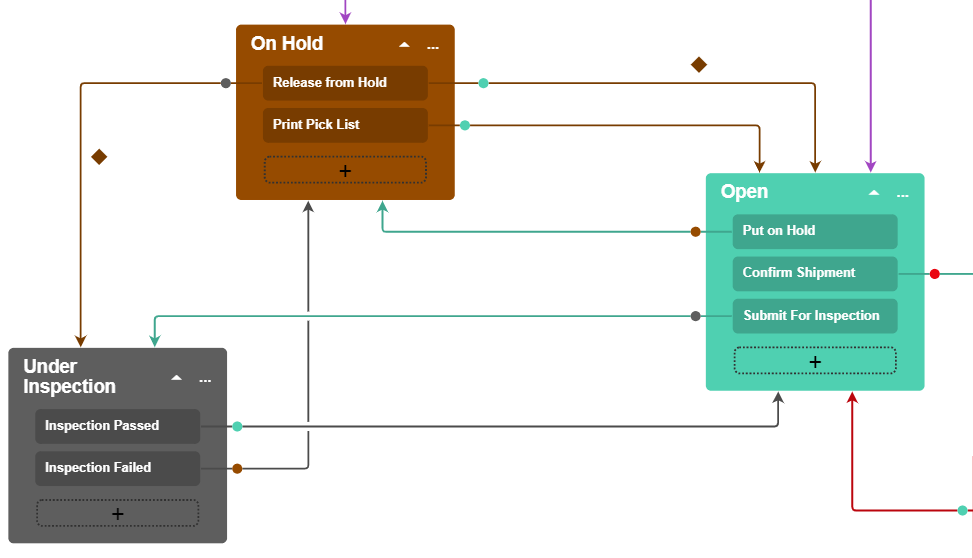

# Customizing a Predefined Workflow with the Workflow Visual Editor {#_a6a41091-d2b6-4f6d-9767-5260b10187ef .concept}

You can customize a workflow with the help of the Workflow Visual Editor.

The example in this topic demonstrates how to modify the workflow for working with shipments. The predefined workflow for the [Shipments](../UserGuide/SO_30_20_00.md) \(SO302000\) form includes the states and actions shown in the following screenshot.

")

Suppose that you want to add the *Under Inspection* status for your shipments, which should be an intermediate status between *On Hold* and *Open*. When a user clicks the **Release from Hold** action for a new shipment with the *On Hold* status, the status of the shipment should change to *Under Inspection* if the shipment has not passed the inspection yet. If the shipment has already passed the inspection once, its status should change to *Open*. To indicate whether the shipment has passed the inspection, you will add a new field for the shipment. You will also make all fields of a shipment disabled in the *Under Inspection* state, so that a user cannot edit the elements of a shipment that is under inspection.

After you customize the workflow, a user should be able to change the status of a shipment by clicking the appropriate action, as described in the following table.

|Initial State|Action|Target State|
|-------------|------|------------|
|*On Hold*|**Release from Hold**|*Under Inspection*|
|*Under Inspection*|**Inspection Failed**|*On Hold*|
|*Under Inspection*|**Inspection Passed**|*Open*|
|*Open*|**Submit for Inspection**|*Under Inspection*|

After customization, the diagram view of the workflow should contain the state, actions, and transitions shown in the following screenshot.

Based on these specifications, you will implement the new workflow for shipments by performing the following general steps, which are described in greater detail in the sections that follow:

1.  Adding the [Shipments](../UserGuide/SO_30_20_00.md) \(SO302000\) form to the list of customized screens, as described in [Step 1: Add the Shipments form to the List of Customized Screens](#_926751e5-f0b9-4406-8917-3ea26f7edbaa)
2.  Creating a new workflow based on the existing one, as described in [Step 2: Create a Custom Workflow Based on the Existing One](#_fde4eed1-fc26-4167-8b44-f208d01c63b0)
3.  Creating a new state for the workflow, as described in [Step 3: Create a New State for the Workflow](#_91942f7f-1095-4848-9de3-3d96e982c658)
4.  Adding a transition from the *Under Inspection* state to the *Open* state, as described in [Step 4: Add a Transition from the Under Inspection State to the Open State](#_72f2c308-78d3-4da2-83f5-cb17d5c6dcbd)
5.  Adding a transition from the *Open* state to the *Under Inspection* state, as described in [Step 5: Add a Transition from the Open State to the Under Inspection State](#_c7bd8063-0a45-4436-91a7-b94d04c02812)
6.  Adding a transition from the *Under Inspection* state to the *On Hold* state, as described in [Step 6: Add a Transition from the Under Inspection State to the On Hold State](#_e39edb16-1bbc-4d31-980d-6676feabe151)
7.  Adding a transition from the *On Hold* state to the *Under Inspection* state, as described in [Step 7: Add a Transition from the On Hold State to the Under Inspection State](#_50352ee2-0c5f-4ae9-8359-3f780ef12bc7)
8.  Modifying the *Under Inspection* state, as described in [Step 8: Modify the Under Inspection State](#_624cef37-79d1-4c80-9fb8-2293570faea4)
9.  Modifying the **Release from Hold** transition, as described in [Step 9: Modify the Release from Hold Transitions](#_4d707871-6353-4c67-b821-85203f648f91)
10. Modifying the **Submit For Inspection** and **Inspection Passed** transitions, as described in [Step 10: Modify the Submit for Inspection and Inspection Passed Transitions](#_2c6cc425-be36-48a6-9ba2-e4231a90d746)

## Step 1: Add the Shipments form to the List of Customized Screens {#_b59efc4e-b0a2-4277-9df3-52916e7867b6 .section}

To add the [Shipments](../UserGuide/SO_30_20_00.md) form to the list of customized screens, perform the following instructions:

1.  Open the Customization Project Editor.
2.  In the navigation pane, click **Screens**.
3.  On the page toolbar, click **Add Screen** &gt; **Customize Existing Screen**.
4.  In the **Customize Existing Screen** dialog box, which opens, select *SO302000*, which is the screen that corresponds to the [Shipments](../UserGuide/SO_30_20_00.md) form.
5.  Click **OK**.

    The row for the [Shipments](../UserGuide/SO_30_20_00.md) form is displayed in the table on the Customized Screens page, and **SO302000** is listed in the navigation pane under the **Screens** node.

For details on adding a form to the list of customized screens, see [To Add a Page Item for an Existing Form](CG_GL_Items_Screens_Adding.md).

## Step 2: Create a Custom Workflow Based on the Existing One {#_dcc7321b-58e2-4c17-abd3-e226cadf112c .section}

To create a new workflow, perform the following instructions:

1.  In the navigation pane of the Customization Project Editor, select **Screens** &gt; **SO302000** &gt; **Workflows**.

    The SO302000 \(Shipments\) Workflows page opens.

2.  On the page toolbar, click **Add Workflow**.
3.  In the **Add Workflow** dialog box, which opens, specify the following values:
    -   **Operation**: *Extend Predefined Workflow*
    -   **Base Workflow**: *Default Workflow*
    -   **Workflow Type**: *DEFAULT*
    -   **Workflow Name**: The internal name of the workflow
4.  Click **OK** to close the dialog box.

    A row for the workflow appears in the table on the Workflows page. Notice that the workflow’s status is *Inherited*.

5.  Clear the **Active** check box for the predefined workflow, and select the **Active** check box for the created workflow.
6.  On the page toolbar, click **Save**.
7.  In the table, click the name of the workflow.
8.  On the State Diagram: &lt;Workflow Name&gt; page, which opens, click **Diagram View**. Now you will add the new state and transitions.

## Step 3: Create a New State for the Workflow { .section}

To add a new state, perform the following instructions:

1.  On the page toolbar, click **Add State**.
2.  In the **Add State** dialog box, which opens, specify the following values:
    -   **Identifier**: `P`
    -   **Description**: `Under Inspection`
3.  Click **OK** to close the dialog box.

    A box with the *Under Inspection* state is added to the diagram. Notice that it does not contain any actions yet.

4.  Save your changes.

## Step 4: Add a Transition from the Under Inspection State to the Open State { .section}

You need to create a transition from the *Under Inspection* state to the *Open* state. To do so, perform the following instructions:

1.  In the box with the *Under Inspection* state, click the plus button.
2.  While holding down the mouse button, draw a line from the box with the *Under Inspection* state to the box with the *Open* state.
3.  In the **Add Transition** dialog box, which opens, click **Create** to add a new action.
4.  In the **New Action** dialog box, which opens, specify the following values:
    -   **Action Name**: `inspectionPassed`
    -   **Display Name**: `Inspection Passed`
5.  Click **OK** to close the dialog box.
6.  In the **Add Transition** dialog box, click **OK**, which closes the dialog box.

    A new transition is added to the diagram. Notice that the box with the *Under Inspection* state now contains a smaller box with the **Inspection Passed** action.

7.  Save your changes.

## Step 5: Add a Transition from the Open State to the Under Inspection State { .section}

To create a transition from the *Open* state to the *Under Inspection* state, perform the following instructions:

1.  Click the plus button in the box with the *Open* state.
2.  While holding down the mouse button, draw a line from the box with the *Open* state to the box with the *Under Inspection* state.
3.  In the **Add Transition** dialog box, which opens, click **Create** to add a new action.
4.  In the **New Action** dialog box, which opens, specify the following values:
    -   **Action Name**: `submitForInspection`
    -   **Display Name**: `Submit for Inspection`
5.  Click **OK** to close the dialog box.
6.  In the **Add Transition** dialog box, click **OK**, which closes the dialog box.

    The *Submit for Inspection* transition is added to the diagram. Notice that the box with the *Open* state now contains a smaller box with the *Submit for Inspection* action.

7.  Save your changes.

## Step 6: Add a Transition from the Under Inspection State to the On Hold State { .section}

To create a transition from the *Under Inspection* state to the *On Hold* state, perform the following instructions:

1.  Click the plus button in the box with the *Under Inspection* state.
2.  While holding down the mouse button, draw a line from the box with the *Under Inspection* state to the box with the *On Hold* state.
3.  In the **Add Transition** dialog box, which opens, click **Create** to add a new action.
4.  In the **New Action** dialog box, which opens, specify the following values:
    -   **Action Name**: `inspectionFailed`
    -   **Display Name**: `Inspection Failed`
5.  Click **OK** to close the dialog box.
6.  In the **Add Transition** dialog box, click **OK**, which closes the dialog box.

    The *Inspection Failed* transition is added to the diagram. Notice that the box with the *Inspection Failed* action is added to the box with the *Under Inspection* state.

7.  Save your changes.

## Step 7: Add a Transition from the On Hold State to the Under Inspection State { .section}

To create a transition from the *On Hold* state to the *On Inspection* state, perform the following instructions:

1.  Click the plus button in the box with the *On Hold* state.
2.  While holding down the mouse button, draw a line from the box with the *On Hold* state to the box with the *On Inspection* state.
3.  In the **Add Transition** dialog box, which opens, specify *Release from Hold* in the **Trigger Name** box.
4.  Click **OK** to close the dialog box.

    The *Release from Hold* transition is added to the diagram. Notice that no new box with an action is added to the box with the *On Hold* state. This is because a transition with the *Release from Hold* action has already been added to the *On Hold* state.

5.  Save your changes.

## Step 8: Modify the Under Inspection State { .section}

Suppose that you want all fields of a shipment to be disabled in the *Under Inspection* state \(and the corresponding UI elements unavailable\), so that a user cannot edit the shipment. You need to modify the *Under Inspection* state as follows:

1.  Click the ellipsis in the box with the state, and click **Edit State** in the context menu, which opens.
2.  On the **Fields** tab of the **State** dialog box, which opens, add the following fields:

    -   *Shipment*
    -   *Shipment Line*
    -   *Shipment Line Split*
    -   *Shipment Address*
    -   *Shipment Contact*
    -   *Sales Order Shipment*
    For each of the fields, select *&lt;Table&gt;* as the **Field Name**, and select the **Disabled** check box.

3.  On the **Action** tab of the **State** dialog box, select the **Duplicate on Toolbar** check box for both actions \(*Inspection Passed* and *Inspection Failed*\). This way, both actions that are available for the state are displayed on the page toolbar \(as a button\).
4.  Click **OK** to close the dialog box.
5.  Save your changes.

## Step 9: Modify the Release from Hold Transitions { .section}

You need to add the conditions for the *Release from Hold* transitions that go from the *On Hold* state to the *Open* state, and from the *On Hold* state to the *Under Inspection* state. With the conditions added, if a shipment has already passed an inspection once, clicking **Release from Hold** changes the shipment's status to *Open*. If the shipment has not passed the inspection, clicking **Release from Hold** changes the shipment's status to *Under Inspection*. To implement this, you also need to create a user-defined field that you will use as a status flag for the shipment. This field will indicate whether the shipment has passed the inspection.

Perform the following instructions:

1.  On the [Attributes](../UserGuide/CS_20_50_00.md) \(CS205000\) form, create an attribute with the *INSPPASSED* name, *Inspection Passed* description, and the *Checkbox* control type \(see [User-Defined Fields](../UserGuide/CS__con_User_Defined_Fields.md) for details\).
2.  On the [Shipments](../UserGuide/SO_30_20_00.md) \(SO302000\) form, click **Customization** &gt; **Manage User-Defined Fields**. On the [Edit User-Defined Fields](../UserGuide/cs_20_50_20.md) \(CS205020\) form, which opens, add a user-defined field for the created attribute \(for details, see [To Add User-Defined Fields to a Form](../UserGuide/Admin_HOW_AddUserField.md)\). On the **Visibility** tab, select the **Required** check box for the added field.

    **Note:** Instead of adding a user-defined field, you can add a field to the DAC \(see [To Add a Custom Data Field](CG_GL_BL_DAC_AddCustomField.md) for details\).

3.  In the navigation pane of the Customization Project Editor, select **Screens** &gt; **SO302000** &gt; **Conditions**.
4.  On the Conditions: SO302000 \(Shipments\) page, which opens, add two conditions with the following values:

    |Condition Name|Field Name|Condition|From Schema|Value|
    |--------------|----------|---------|-----------|-----|
    |`InspectionPassed`|*Inspection Passed*|*Equals*|Selected|Selected|
    |`InspectionNotPassedYet`|*Inspection Passed*|*Equals*|Selected|Cleared|

5.  In the diagram, double-click the *Release from Hold* transition from the *On Hold* state to the *Open* state. In the **Transition** dialog box, which opens, select the *InspectionPassed* condition in the **Condition** box.
6.  Click **OK** to close the dialog box.
7.  Double-click the *Release from Hold* transition from the *On Hold* state to the *Under Inspection* state. In the **Transition** dialog box, which opens, select the *InspectionNotPassedYet* condition in the **Condition** box.
8.  Click **OK** to close the dialog box.
9.  Save your changes.

    Notice that in the diagram, a diamond appears above each of the transitions.

## Step 10: Modify the Submit for Inspection and Inspection Passed Transitions { .section}

Modify the *Submit for Inspection* transition from the *Open* state to the *Under Inspection* state as follows:

1.  Double-click the transition.
2.  In the **Transition** dialog box, which opens, add the following values to the **Fields to Update After Transition** table.

    |Active|Field Name|From Schema|New Value|
    |------|----------|-----------|---------|
    |Selected|*Inspection Passed*|Cleared|`False`|

3.  Click **OK** to close the dialog box.
4.  Save your changes.

Modify the *Inspection Passed* transition from the *Under Inspection* state to the *Open* state as follows:

1.  Double-click the transition.
2.  In the **Transition** dialog box, which opens, add the following values to the **Fields to Update After Transition** table.

    |Active|Field Name|From Schema|New Value|
    |------|----------|-----------|---------|
    |Selected|*Inspection Passed*|Cleared|`True`|

3.  Click **OK** to close the dialog box.
4.  Save your changes.

**Parent topic:**[Defining a Workflow](../CustomizationPlatform/CG_GL_BL_Example_Workflows.md)

