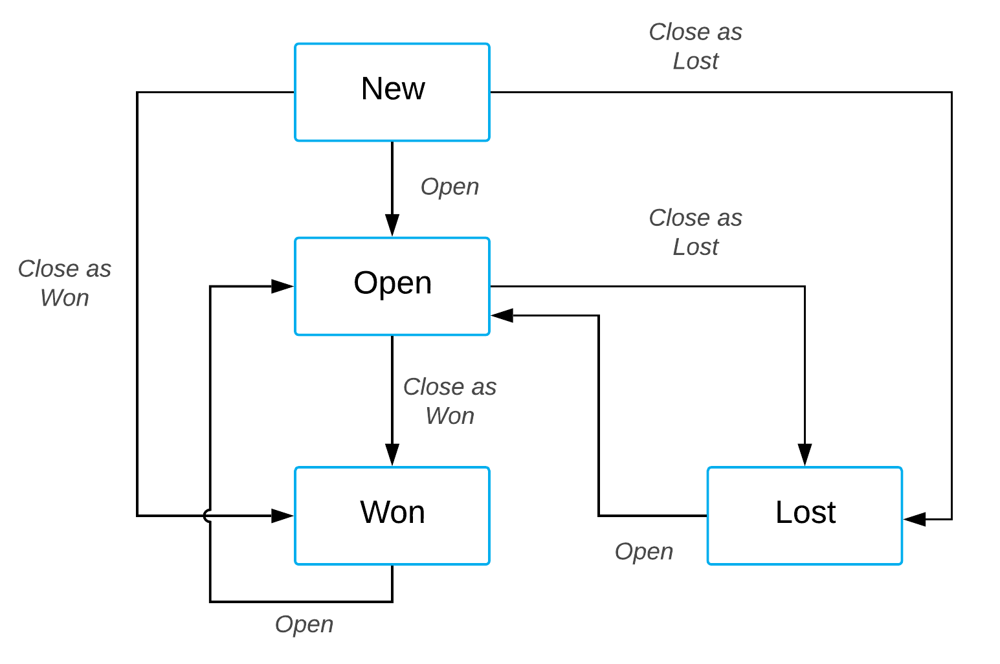
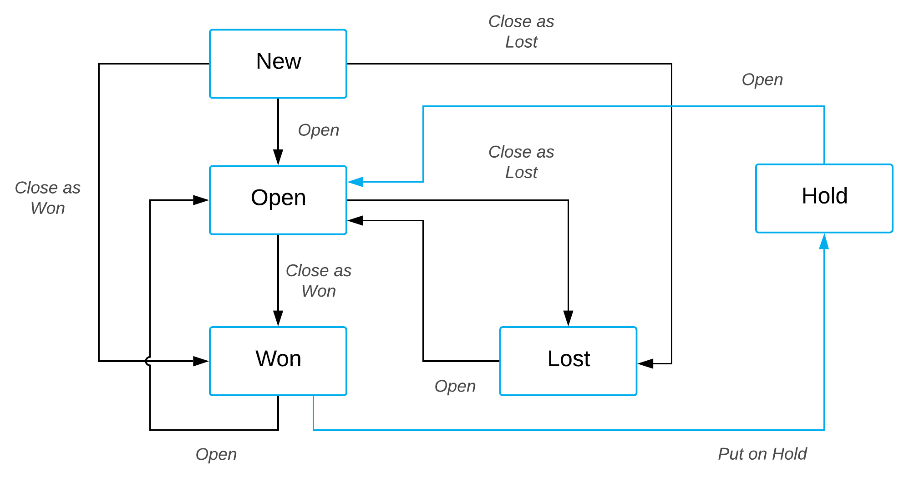

# Extending the Existing Workflow Without Coding from the Customization Project Editor {#_7002fb50-3aff-4819-b995-ef2d18f13272 .concept}

Some forms of Acumatica ERP have predefined workflows. You can extend these workflows in the Customization Project Editor, which gives you the tools and interface to make these changes without coding.

This example demonstrates the extending of the predefined workflow for working with an opportunity. The predefined workflow for the [Opportunities](../UserGuide/CR_30_40_00.md) \(CR304000\) form includes the states \(shown in the blue rectangles and representing statuses\) and actions shown in the following diagram.

Suppose that you need a new status called *Hold* that can be used for opportunities. After you perform customization, a user should be able to change an opportunity’s status from *Won* to *Hold* by clicking the **Hold** action, and change the status from *Hold* to *Open* by clicking the predefined **Open** action.

The following diagram presents the possible statuses after customization and the actions that change statuses.

Based on these specifications, you will implement the new workflow for opportunities by performing the following general tasks, which are described in greater detail in the sections that follow:

1.  Adding the [Opportunities](../UserGuide/CR_30_40_00.md) form to the list of customized screens as described in [Add the Opportunities Form to the List of Customized Screens](#_b59efc4e-b0a2-4277-9df3-52916e7867b6).
2.  On the Workflows page, creating a workflow based on the existing one as described in [Create a Custom Workflow Based on an Existing One](#_dcc7321b-58e2-4c17-abd3-e226cadf112c).
3.  In the Workflow Editor, adding the *Hold* state as described in [Add the Hold State to the Custom Workflow](#_48e4a12c-11de-4cfb-8cb5-752194ac8710).
4.  For the *Won* state, defining a transition and the **Hold** action as described in [Create the Transition from the Won State to the Hold State](#_9f2492ba-5c8f-43ed-8339-566ecb13d307).
5.  For the *Hold* state, adding a transition and the **Open** action as described in [Create the Transition from the Hold State to the Open State](#section_yt5_cbg_vkb).

## Add the Opportunities Form to the List of Customized Screens {#_b59efc4e-b0a2-4277-9df3-52916e7867b6 .section}

To add the [Opportunities](../UserGuide/CR_30_40_00.md) \(CR304000\) form in the list of customized screens, do the following:

1.  Open the Customization Project Editor.
2.  In the navigation pane, click **Screens**.
3.  On the page toolbar, click **Customize Existing Screen**.
4.  In the **Customize Existing Screen** dialog box, which opens, select the [Opportunities](../UserGuide/CR_30_40_00.md) form.
5.  Click **OK**.

    The [Opportunities](../UserGuide/CR_30_40_00.md) form is displayed on the Customized Screens page and is listed in the navigation pane under the **Screens** node.

For details on adding a form to the list of customized screens, see [To Add a Page Item for an Existing Form](CG_GL_Items_Screens_Adding.md).

## Create a Custom Workflow Based on an Existing One {#_dcc7321b-58e2-4c17-abd3-e226cadf112c .section}

To create a new workflow, do the following:

1.  In the navigation pane of Customization Project Editor, select **Screens** &gt; **CR304000** &gt; **Workflows**.

    The CR304000 \(Opportunities\) Workflows page opens.

2.  On the form toolbar, click **Add Workflow**.
3.  In the **Add Workflow** dialog box, which opens, specify the following values:
    -   **Operation**: *Extend Predefined Workflow*
    -   **Base Workflow**: *Default Workflow*
    -   **Workflow Type**: *DEFAULT*
    -   **Workflow Name**: The internal name of the workflow
4.  Click **OK**.

    The dialog box is closed, and the workflow appears in the table on the Workflows page. Notice that the workflow’s status is *Inherited*.

5.  Clear the **Active** check box for the predefined workflow, and select the **Active** check box for the created workflow.
6.  On the page toolbar, click **Save**.
7.  In the table, click the name of the workflow.

    The State Diagram: &lt;Workflow Name&gt; page opens. Now you will add the *Hold* state.

## Add the Hold State to the Custom Workflow {#_48e4a12c-11de-4cfb-8cb5-752194ac8710 .section}

To add the *Hold* state, do the following:

1.  On the toolbar of the **States and Transitions** pane, click **Add State**.
2.  In the **Add State** dialog box, which opens, specify the following values:
    -   **Identifier**: `H`
    -   **Description**: `Hold`
3.  Click **OK**.
4.  On the **States and Transitions** pane, place the *Hold* state after the *Won* state by using the buttons on the toolbar.

## Create the Transition from the Won State to the Hold State {#_9f2492ba-5c8f-43ed-8339-566ecb13d307 .section}

You need to create a transition from the *Won* to the *Hold* state. To perform this transition, you also need to create the *Put on Hold* action. Do the following:

1.  In the **States and Transitions** pane, select the *Won* state.
2.  On the toolbar of the **States and Transitions** pane, click **Add Transition**.
3.  In the **Add Transition** dialog box, which opens, select *Hold* as the **Target State**.
4.  Click **Create**, which is next to the **Trigger Name** box.
5.  In the **New Action** dialog box, which opens, enter the following values:
    -   **Action Name**: `PutOnHold`
    -   **Display Name**: `Hold`
6.  To save the action you have created, click **OK**.
7.  In the **Add Transition** dialog box, make sure the created action is specified in the **Action** box, and click **OK** to close the dialog box.
8.  On the page toolbar, click **Save**

## Create the Transition from the Hold State to the Open State {#section_yt5_cbg_vkb .section}

You now need to create a transition from the *Hold* state to the *Open* state. To perform this transition, you can use the existing *Open* action. by perform the following actions:

1.  In the **States and Transitions** pane, select the *Hold* state.
2.  On the toolbar of the **States and Transitions** pane, click **Add Transition**.
3.  In the **Add Transition** dialog box, which opens, specify the following values:
    -   **Action Name**: *Open \(Open\)*
    -   **Target State**: *Open*
4.  Click **OK** to close the dialog box.
5.  On the page toolbar, click **Save**.

**Parent topic:**[Defining a Workflow](../CustomizationPlatform/CG_GL_BL_Example_Workflows.md)

