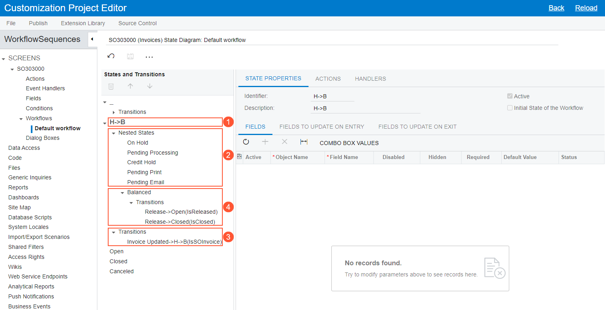
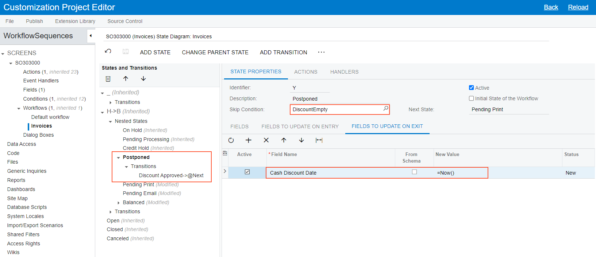

# Using a Composite State with the Workflow Editor {#_10892db4-6bc1-49d3-aecf-80cc13b23c9a .concept}

This topic describes an example of the customization of a composite state through the use of the Workflow Editor.

The screenshot below shows the default workflow of the [Invoices](../UserGuide/SO_30_30_00.md) \(SO303000\) form on the State Diagram: Default Workflow page of the Customization Project Editor. The composite state \(see Item 1 in the screenshot\) contains nested states \(Item 2\) that are part of a typical invoice workflow, as well as transitions \(Item 3\) to and from the composite state and the nested states. Notice that the *Balanced* nested state also contains transitions \(Item 4\).

Suppose that you want to add a new state, *Postponed*, to the workflow for the [Invoices](../UserGuide/SO_30_30_00.md) form after the *Credit Hold* state, specify a skip condition for it, and add a transition from this state to the next state in the workflow. The example in this topic demonstrates how you can do this.

## To Modify a Workflow with Composite States { .section}

To modify the default workflow of the [Invoices](../UserGuide/SO_30_30_00.md) \(SO303000\) form, which contains composite states, you would perform the following steps:

1.  Open the Customization Project Editor for a new or existing customization project, and add the [Invoices](../UserGuide/SO_30_30_00.md) form to the list of customized screens.
2.  On the SO303000 \(Invoices\) Workflows page, create a workflow named *Invoices* for the [Invoices](../UserGuide/SO_30_30_00.md) form.
3.  On the Conditions: SO303000 \(Invoices\) page, create a condition to make sure that the value in the **Cash Discount** box equals *0*.

    For details on conditions, see [Workflow Elements: General Information](../DeveloperGuide/WorkflowUI_ConfiguringWorkflowElements_GeneralInfo.md)

4.  Open the SO303000 \(Invoices\) State Diagram: Invoices page, and on the More menu, click **Add State**.
5.  In the **Add State** dialog box, which opens, specify the following settings:
    -   **Identifier**: `Y`
    -   **Description**: `Postponed`
    -   **Parent State**: *H-&gt;B*
6.  Click **OK** to close the dialog box.

    In the **States and Transitions** pane, the system adds the *Postponed* state after the last nested state \(*Balanced* in this case\).

7.  With *Postponed* selected in the pane, use the arrows on the pane toolbar to move the added state after the *Credit Hold* state.
8.  With the *Postponed* state still selected, select the created condition in the **Skip Condition** box of the **State Properties** tab.

    If the condition is fulfilled \(that is, if the value in the **Cash Discount** box equals *0*\) and a document is ready to enter the *Postponed* state, it then skips this state and automatically moves to the next state \(*Pending Print* in this case\).

9.  On the More menu, click **Add Transition**.
10. In the **Add Transition** dialog box, which is opened, click **Create**.
11. In the **New Action** dialog box, which is opened, specify the following settings for the action:
    -   **Action Name**: `DiscountApproved`
    -   **Display Name**: `Discount Approved`
    -   **Category**: *Processing*
12. Click **OK** to close the **New Action** dialog box.
13. In the **Target State** box of the **Add Transition** dialog box, select *@Next*.

    This setting indicates that the transition will lead to the next state in the sequence \(*Pending Print* in this case\).

14. Click **OK** to close the dialog box.

    The system adds the transition to the **Transitions** node of the *Postponed* state.

15. In the **States and Transitions** pane, click the *Postponed* state.
16. On the **Fields to Update on Exit** tab \(in the lower part of the **State Properties** tab\) for this state, add the *Cash Discount Date* field, and set its value to *=Now\(\)*.

    Each time a document leaves the *Postponed* state—that is, when the document moves to another state because a transition has been triggered \(in this case, the transition triggered by the *Discount Approved* action\)—the value of the *Cash Discount Date* field changes to the current date.

17. Save your changes.

The workflow with the added state is shown in the following screenshot.

**Parent topic:**[Defining a Workflow](../CustomizationPlatform/CG_GL_BL_Example_Workflows.md)

