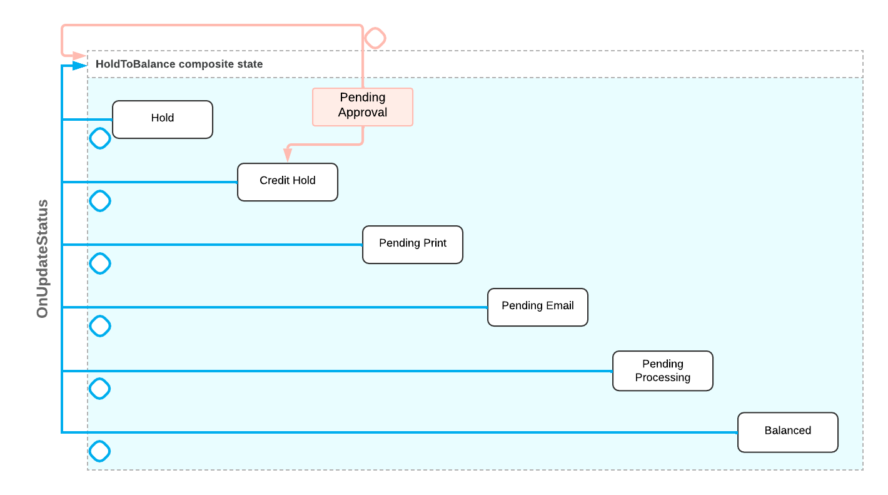

# Customizing a Composite State From Code {#_f12f80e1-f99f-4097-b15a-daab3bae444b .concept}

This topic describes customizing a composite state using Workflow API.

Suppose that you need to customize the workflow on the [Invoices and Memos](../UserGuide/AR_30_10_00.md) \(AR301000\) form. The workflow on this form includes a composite state that is shown in the following diagram. You need to add the **Pending Approval** state to the composite state and add the following transitions:

-   A transition to the beginning of the composite state
-   A transition to the next state in the composite state \(the **Credit Hold** state\) that is triggered by the **Approve** action



Such customization includes the following steps:

-   Adding actions that trigger transitions involving the new state to the form. For that, you need to extend the graph that defines the logic for the form.
-   Customizing the workflow for the form. For that, you need to extend the workflow that defines the logic for the form.
-   In the customized workflow, you need to do the following:
    -   Add a condition that defines when the new state is skipped in the composite state
    -   Add the new state to the composite state
    -   Add actions that trigger transitions from the new state
    -   Add transitions which involve the new state

To implement the proposed customization, do the following:

1.  Locate and customize the graph and the workflow for the [Invoices and Memos](../UserGuide/AR_30_10_00.md) form by doing the following:

    1.  By using the Element Inspector for the [Invoices and Memos](../UserGuide/AR_30_10_00.md) form, learn that the business logic of the form is defined in the `ARInvoiceEntry` graph. To find a class that defines the workflow for this form, look in the `PX.Obejcts.AR` namespace for a class that extends the `ARInvoiceEntry` graph: The names of the class is `ARInvoiceEntry_Workflow`.
    2.  In the `ARInvoiceEntry_Workflow` class, find the name of the composite state you need to customize: `HoldToBalance`.
    3.  Extend the `ARInvoice_Entry` graph as the following code shows. You will define the **Approve** action their later.

        ```
        namespace PX.Objects.AR
        {
            public class ARInvoiceEntry_Extension : PXGraphExtension<ARInvoiceEntry>
            {
        	
            }
        }
        ```

    4.  Extend the `ARInvoiceEntry_Workflow` class as the following code shows.

        ```
        public class ARInvoiceEntry_ApprovalWorkflow 
            : PXGraphExtension<ARInvoiceEntry_Workflow, ARInvoiceEntry>
        {
            public override void Configure(PXScreenConfiguration config)
            {
                Configure(config.GetScreenConfigurationContext<ARInvoiceEntry, ARInvoice>());
            }
        	
            protected virtual void Configure(WorkflowContext<ARInvoiceEntry, ARInvoice> context)
            {
        	
            }
        }
        ```

    In the code above, you declare an extension of the `ARInvoiceEntry` graph and override the Configure method inside it.

2.  Define a condition depending on which the **Pending Approval** state is skipped in the composite state.

    The **Pending Approval** state is skipped when the document is already approved—that is, the `ARRegister.approved` flag equals *true*. So, in the `ARInvoiceEntry_ApprovalWorkflow` class, define this condition in a condition class and in the `Configure` method, create the instance of the class as the following code shows.

    ```
    public class Conditions : Condition.Pack
    {
        public Condition IsApproved => GetOrCreate(b => b.FromBql<
            ARRegister.approved.IsEqual<True>
        >());
    }
    
    protected virtual void Configure(WorkflowContext<ARInvoiceEntry, ARInvoice> context)
    {
        var conditions = context.Conditions.GetPack<Conditions>();
    }
    ```

3.  Add the **Pending Approval** state to the composite state as the following code shows.

    **Note:** Before adding the state, define the string constant and the class for the state.

    ```
    context.UpdateScreenConfigurationFor(screen => screen
    .UpdateDefaultFlow(flow =>
    {
        return flow
            .WithFlowStates(states =>
            {
                states.UpdateSequence<State.HoldToBalance>(seq =>
                    seq.WithStates(sss =>
                    {
                        sss.Add<State.pendingApproval>(flowState =>
                        {
                            return flowState
                                .IsSkippedWhen(conditions.IsApproved)
                                .WithActions(actions =>
                                {
                                    actions.Add(approveAction, 
                                        a => a.IsDuplicatedInToolbar());
                                })
                                .PlaceAfter<State.hold>();
                        });
                    }));
    ```

    Inside the Configure method, you call the UpdateScreenConfigurationFor method. In the lambda expression for the method, you call the UpdateDefaultFlow method to modify the workflow for the Invoices and Memos form. In the lambda expression for the UpdateDefaultFlow method, you call the WithFlowStates method to access the states of the workflow. In the lambda expression for the WithFlowStates method, you call the UpdateSequence method to update the composite state. As a type parameter of the UpdateSequence method, you specify the name of the composite state. In the lambda expression for the UpdateSequence method, you call the WithStates method to access the states of the composite state. In the lamda expression for the WithStates method, you add the PendingApproval state.

    In the state definition, you call the IsSkippedWhen method to specify a condition when the state should be skipped. By calling the PlaceAfter method, you specify that the Pending Approval state should be the next state after the Hold state.

4.  Add the Approve action that triggers the transition from the Pending Approval state.

    In the ARInnvoiceEntry\_Extension class, define the Approve action as the following code shows.

    ```
    public PXAction<ARInvoice> Approve;
    [PXButton()]
    [PXUIField(DisplayName = "Approve", Enabled = false)]
    protected virtual IEnumerable approve(PXAdapter adapter) => adapter.Get();
    ```

    In the Configure method, create an action definition using the action defined in the graph and add it to the screen configuration as the following code shows.

    ```
    
    var approvalCategory = context.Categories.Get(ARInvoiceEntry_Workflow.CategoryID.Approval);
    var approveAction = context.ActionDefinitions
        .CreateExisting<ARInvoiceEntry_ApprovalWorkflow>(g => g.approve, a => a
            .WithCategory(approvalCategory)
            .PlaceAfter(g => g.releaseFromHold)
            .IsHiddenWhen(conditions.IsApprovalDisabled)
            .WithFieldAssignments(fa => fa.Add<ARRegister.approved>(e => e.SetFromValue(true))));
    
    context.UpdateScreenConfigurationFor(screen =>
    {
        return screen
            ...
            .WithActions(actions =>
            {
                actions.Add(approveAction);
            });
    });
    ```

5.  Implement transitions from the **Pending Approval** state as the following code shows.

    ```
    .WithTransitions(transitions =>
    {
        transitions.AddGroupFrom<State.pendingApproval>(ts =>
        {
            ts.Add(t => t
                .To<State.HoldToBalance>()
                .IsTriggeredOn(g => g.OnUpdateStatus));
            ts.Add(t => t
                .ToNext()
                .IsTriggeredOn(approveAction)
                .When(conditions.IsApproved));
        });
    }
    ```

    In the code above, you implement the following stats:

    -   A transition that is triggered by the OnUpdateStatus event handler. This transition will allow the workflow engine to start searching for a proper state inside a composite state after the Pending Approval state.
    -   A transition that is triggered by the Approve action and happens when document is already approved. The target state of the transition is Credit Hold due to the PlaceAfter method called in the Pending Approval state definition.

**Parent topic:**[Defining a Workflow](../CustomizationPlatform/CG_GL_BL_Example_Workflows.md)

