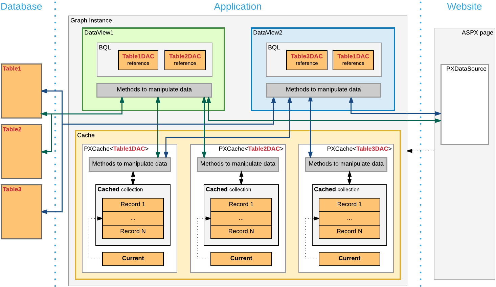

# Graph {#_35479a4b-6dd4-43e9-be70-86261be50833 .concept}

A business logic controller \(BLC, also referred as *graph*\) is used to provide the business logic for an Acumatica ERP form. A graph instance is created when a data request occurs and discarded after the request is processed.

With Acumatica Framework, the application programmer is restricted from direct database access and from writing SQL queries. Database specifics are hidden for the application behind data access classes, and the SQL queries are constructed declaratively through Business Query Language \(BQL\). Through a set of generic classes, the BQL library provides a rich syntax for building the equivalents of SQL queries of any complexity. Unlike SQL statements, BQL statements operate with data access classes, rather than database tables, and provide compatibility between different database engines. The BQL library supports MS SQL and MySQL database engines, as well as access to the database through the ODBC provider.

Each graph contains the Caches collection of cache objects and the Views collection of data view objects. The framework handles these objects automatically; you don't have to initialize and control them. A PXView data view object contains two main parts:

-   The BQL command, which is defined by the type of the data view
-   The optional delegate, which constructs the data set that is returned instead of the BQL command's execution result

PXView objects, like graphs, are initialized and destructed on each round trip.

**Note:** The order in which data views are defined in a graph is important, because it defines the order of saving data to the database. \(This order, however doesn't define the order in which data views are executed.\) The data view that you specify in the PrimaryView property should always be defined first in the graph.

If a BQL statement of a data view refers to multiple data access classes \(DACs\), the data view creates the PXCache object for each DAC to keep appropriate data records, as shown in the following diagram.

If multiple data views contain a reference to the same DAC, for this DAC, the graph cache contains a single PXCache object that is used by the data views.

On a webpage, you bind each container to a data view that provides data for the container. To bind a container and a data view, you specify the data view name in the DataMember property of the container in the ASPX code. When a webpage requests data, the system invokes the ExecuteSelect\(\) method of the graph with the data view name passed as an argument to execute every data view bound to the containers of the webpage. Note that data views that aren't bound to a container are not executed by a request from the UI.

When a data record is modified on the page, the framework invokes the ExecuteInsert\(\),ExecuteUpdate\(\), or ExecuteDelete\(\) method of the graph, passing the name of the data view as an argument. The graph gets the data view by its name and invokes the corresponding method of the data view.

**Note:** You shouldn't use the ExecuteSelect\(\), ExecuteInsert\(\), ExecuteUpdate\(\), and ExecuteDelete\(\) methods for purposes other than debugging.

You use the [Customization Tools](CG_Platform_Tools.md) of the Acumatica Customization Platform to create a custom graph and to create new members and override existing ones in an existing graph.

To declare a custom graph, you derive a class from `PXGraph<>`. Also, this graph must be declared with the `public` access modifier to be correctly recognized by the Acumatica Customization Platform.

-   **[To Create a Custom Graph](../CustomizationPlatform/CG_GL_BL_Graph_NewGraph.md)**  

-   **[To Add a New Member](../CustomizationPlatform/CG_GL_BL_Graph_NewMember.md)**  

-   **[To Add an Action](../CustomizationPlatform/CG_GL_BL_Graph_AddAction.md)**  

**Parent topic:**[Customizing Business Logic](../CustomizationPlatform/CG_GL_BL.md)

