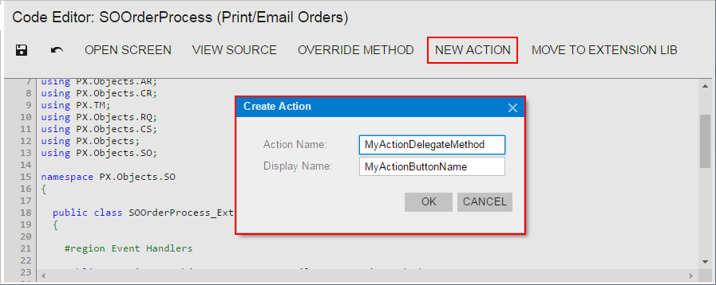

# To Add an Action {#_02d50988-c79a-43ce-99a7-af697b506551 .concept}

To add a new action to the toolbar of an original form of Acumatica ERP, you have to add to the appropriate graph extension the action declaration, toolbar button declaration, and action delegate method. \(See [Graph Extensions: Creating a Graph Extension Through the UI](../StudioDeveloperGuide/CodeCustomization_GraphExtension_CreateInEditor.md) for details.\)

To add a new action to the toolbar of a custom form, you have to add the action code to the appropriate custom graph. \(See [To Create a Custom Graph](CG_GL_BL_Graph_NewGraph.md) for details.\)

**Note:** You can also add an action in the Screen Editor. For details, see [Action Configuration: General Information](../DeveloperGuide/WorkflowUI_Actions_GeneralInfo.md).

You can use the [Code Editor](../UserGuide/AU_20_40_00_CodeEditor.md) to add an action template to the graph extension or custom graph that is saved in a customization project as a *Code* item and currently opened in the editor. To do this, perform the following actions:

1.  Click the **New Action** button of the Code Editor to open the **Create Action** dialog box.
2.  In the dialog box, specify the name of the action delegate method in the **Action Name** box and the name of the corresponding button in the **Display Name** box, as shown in the following screenshot.

    

3.  Click **OK** to create the action template and add it to the item.

The system adds to the code a template of the action declaration that includes the following class members:

-   The declaration of the action delegate method
-   The declaration of the button attributes to add the button to the form toolbar with the specified name
-   The template of the action delegate method

The following example shows the template code for an action.

```
public PXAction<DACName> myActionDelegateMethod;

[PXButton]
[PXUIField(DisplayName = "MyActionButtonName")]
protected void MyActionDelegateMethod()
{
  // the body of the action delegate method
}
```

If the code of a graph extension or custom graph is moved to an extension library whose binary file is added to the customization project as a *File* item, you should develop the action code from scratch by using Visual Studio. If you make changes to the extension library file in the file system, you have to update the appropriate *File* item in the customization project. See [To Update a File Item in a Project](CG_GL_Items_Files_Updating.md) for details.

**Parent topic:**[Graph](../CustomizationPlatform/CG_GL_BL_Graph.md)

