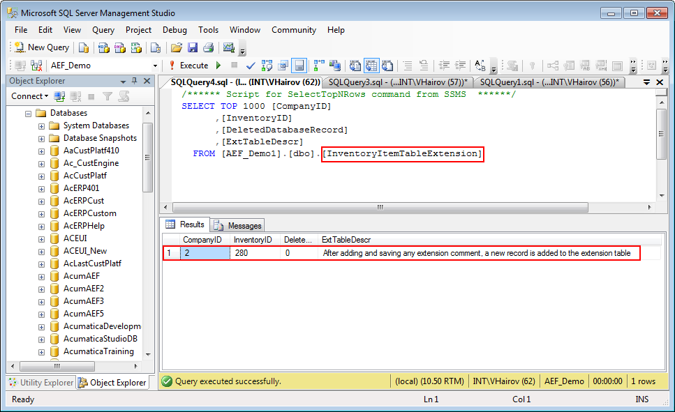
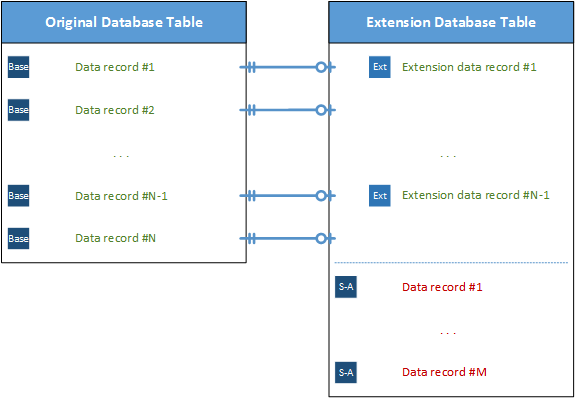
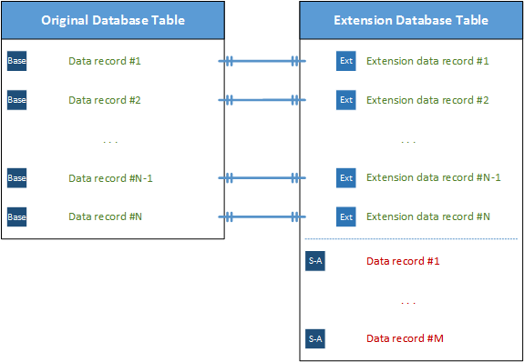

# DAC Extension Mapped to an Extension Table {#_6ec2fdc9-f489-468d-b0d6-1edbc908870f .concept}

You can define a DAC extension mapped to an extension table by using either the default *Inner Join* way or the optional *Left Outer Join* way. To specify which way is used, you need to set the value for the IsOptional parameter of the PXTable attribute. By default, the system sets this parameter value to *false*. You need to specify the IsOptional parameter value only if you need to set its value to *true*.

```

[PXTable(IsOptional = value)]
public class TableExtension : PXCacheExtension<BaseDAC>
{ ... }
```

If the DAC contains surrogate and natural keys, then the PXTable attribute attached to the DAC extension should reference the surrogate key as well as other database key fields \(but not the natural key\). If the DAC doesn't have surrogate and natural keys, no key fields should be specified in the PXTable attribute. See the following code example of the declaration of the PXTable attribute with key references.

```

[PXTable(typeof(BaseDAC.surrogateKey),
         typeof(BaseDAC.otherDBKeyField),
         IsOptional = value)]
public class TableExtension : PXCacheExtension<BaseDAC>
{ ... }
```

**Tip:** The natural key is a user-friendly value that is not used as a key in the database. The surrogate key, which is the internal value corresponding to the natural key, is not shown to the user and is assigned by the system. When you use a natural key, the DAC field that serves as a surrogate key is bound to the database key column, but is not marked as key within its attributes.

In the sample code shown below, the Location database table contains both the surrogate LocationID key and the natural LocationCD key. The Location database table main key contains the BAccountID and LocationID columns. Because LocationCD is a natural key, we need to specify the corresponding surrogate key, LocationID, as well as the other database key field, BAccountID, in the PXTable attribute.

```

[PXTable(typeof(Location.locationID),
         typeof(Location.bAccountID))]
public class LocationTableExtension : PXCacheExtension<Location>
{ ... }
```

## The Left Outer Join Way {#_fed09a3f-917c-46b4-a6f7-bb523fb65cd8 .section}

The following example shows the declaration of a DAC extension mapped to an extension table with the *Left Outer Join* way. Notice that the IsOptional parameter of the PXTable attribute is set to true.

```
[PXTable(IsOptional = true)]
class LeftJoinTableExtension : PXCacheExtension<BaseDAC>
{
}
```

The *Left Outer Join* way covers the common steps required to add an extension tables to a customization project. For details on populating an extension table with records, see [Edit SQL Script Dialog Box](../UserGuide/AU_20_90_00.md#_fc6ac68c-a25e-4f4b-944b-7644ddfbe94d).

The *Left Outer Join* way:

-   Can be used when the original and extension database tables are not necessarily synchronized.
-   Causes an extension table record to be created when the appropriate original table record is created or updated.
-   Never excludes an original database table record from the result set.
-   Calculates the default field values if no extension table record is found.
-   Can be used as a standalone DAC.

The following example shows the declaration of the InventoryItemTableExtension DAC extension mapped to the extension table with the *Left Outer Join* way.

```

[PXTable(typeof(InventoryItem.inventoryID), IsOptional = true)]
public class InventoryItemTableExtension : PXCacheExtension<InventoryItem>
{
    #region ExtTableDescr
    public abstract class extTableDescr : PX.Data.IBqlField
    {
    }
    [PXDBString(255)]
    [PXDefault("Additional description")]
    [PXUIField(DisplayName = "Ext_Table Description")]
    public string ExtTableDescr { get; set; }
    #endregion
}
```

Suppose that you have added the corresponding **Ext\_Table Description** control to the header area of the Stock Items \(IN202500\) form. If you open the form, by clicking navigation buttons on the form toolbar, you can ensure that all the stock items are visible, while the **Ext\_Table Description** control has the default *Additional description* value set.

If you update a data record \(by changing the value of any control, including **Ext\_Table Description**\), a new database record is added to the extension table.



When you use the *Left Outer Join* way, data records within the original and extension tables are not necessarily synchronized \(as the figure below illustrates\); data record synchronization works as follows:

-   If an appropriate data record does not exist within an extension table when the system queries the original table, the system automatically generates and assigns default values to every field of the DAC extension that is mapped to the extension table; otherwise, DAC extension field values are read from the database.
-   When a new record is inserted into the original table, the system automatically inserts a new record into the extension table.
-   If a data record does not exist within an extension table when the system updates the original table, the system automatically inserts a data record into the extension table. Otherwise, if there are no modified fields of the DAC extension that is mapped to the extension table, the system does not update the extension table data record.
-   When the system deletes the data record in the original table, it automatically deletes the appropriate data record from the extension table, if such a record exists.

**Tip:**

To use an extension table independently from the original database table, you should declare a data view by using a DAC extension that is mapped to an extension table as the main DAC, as shown below.

```

public class BaseBLCExt : PXGraphExtension<BaseBLC>
{
    public PXSelect<TableExtension> Objects;
}
```

In the example of the data view declaration above, extension table data records have no reference to the original database table records. You can work with these data records just as you would work with any other DAC instance.



## The Inner Join Way { .section}

The *Inner Join* is the default way.

The following example shows the declaration of a DAC extension mapped to an extension table with the default *Inner Join* way.

```

[PXTable]
class InnerJoinTableExtension : PXCacheExtension<BaseDAC>
{
}
```

The *Inner Join* way:

-   Can be used only when the original table and extension table are always synchronized.
-   Causes an extension table record to be automatically created only when the appropriate original database table record is created.
-   Requires the main key column values to be copied from the original table to each extension table.
-   Excludes an original database table record from the result set when no corresponding extension table record is found.
-   Can be used as a standalone DAC.

The sample code below shows the declaration of the InventoryItemTableExtension DAC extension, which is mapped to the extension table by using the default *Inner Join* way.

```

[PXTable(typeof(InventoryItem.inventoryID))]
 public class InventoryItemTableExtension : PXCacheExtension<InventoryItem>
{
    #region ExtTableDescr
    public abstract class extTableDescr : PX.Data.IBqlField
    {
    }
    [PXDBString(255)]
    [PXDefault("Additional description")]
    [PXUIField(DisplayName = "Ext_Table Description")]
    public string ExtTableDescr { get; set; }
    #endregion
}
```

If you again open the Stock Items \(IN202500\) form, by clicking navigation buttons on the form toolbar of the Stock Items form, you will see that only one stock item is visible, and it has the modified **Ext\_Table Description**.

To have access to the other database table records, you need to populate the extension table with the appropriate records. You can do this by using the following script.

```

INSERT INTO [dbo].[InventoryItemTableExtension]
SELECT 
    CompanyID, 
    InventoryID, 
    0, 
    N'Additional description'
FROM [dbo].[InventoryItem]
WHERE NOT EXISTS
(
    SELECT * FROM [dbo].[InventoryItemTableExtension] AS t 
    WHERE t.CompanyID = [dbo].[InventoryItem].CompanyID 
        AND t.InventoryID = [dbo].[InventoryItem].InventoryID
)
GO
```

After you copy data records from the InventoryItem database table to the InventoryItemTableExtension user extension table, you will notice that all stock items are visible again.

When you use the *Inner Join* way, the data records within the base and extended tables must always be synchronized \(see the screenshot below\). With this way, data record synchronization works as follows:

-   If an appropriate data record does not exist within an extension table when the system queries the original table, the system excludes the original table record from the result set.
-   When a new record is inserted into the original table, the system automatically inserts a new record into the extension table.
-   When the system updates the data record in the original table, it does not update the extension table if there are no modified fields of the DAC extension that is mapped to the extension table.
-   When it deletes the original table data record, the system automatically deletes the appropriate data record from the extension table, if such a record exists.

**Tip:** To use the extension table independently from the original database table, you should declare a data view by using a DAC extension, which is mapped to an extension table, as the main DAC \(for details, see the [The Left Outer Join Way](#_fed09a3f-917c-46b4-a6f7-bb523fb65cd8) section\).



**Parent topic:**[To Create an Extension Table](../CustomizationPlatform/CG_GL_DBSchema_CustomColumns.md)

