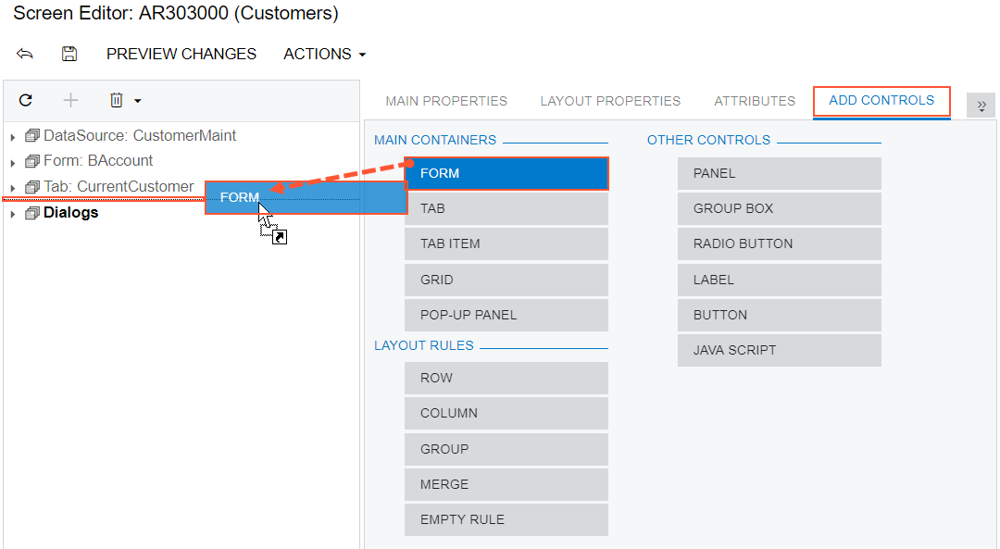

# To Add a Form Container {#_ee674938-9f49-4f83-8ac7-1731a90944bb .concept}

You can add a new PXFormView container to a form of Acumatica ERP. To do this, perform the following actions:

1.  Open the form in the [Screen Editor](../UserGuide/AU_20_45_20.md), as described in [To Add a Page Item for an Existing Form](CG_GL_Items_Screens_Adding.md).
2.  In the editor, click the **Add Controls** tab item.
3.  From the **Main Containers** group, drag the **Form** container to the required place in the Control Tree, as shown in the following screenshot.

    

    **Note:** The area of a form container is visible on a customized form only if it contains at least one visible control.

4.  In the Control Tree, select the form container that has been added, and specify the item properties. as described in [To Set a Container Property](CG_GL_UI_PXForm_Properties.md).
5.  Click **Save** on the toolbar of the Screen Editor to save your changes to the customization project.

For more information about PXFormView, see [Form Container \(PXFormView\)](CG_GL_UI_PXForm.md).

**Parent topic:**[Existing Form](../CustomizationPlatform/CG_GL_UI_ExistForm.md)

