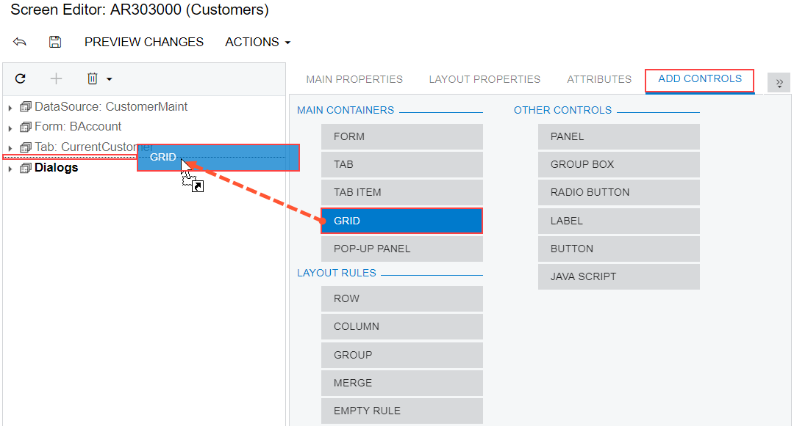

# To Add a Grid Container {#_d2d08267-8757-4330-8f2c-f8d00bbb901c .concept}

You can add a new PXGrid container to an existing form of Acumatica ERP. To do this, perform the following actions:

1.  Open the form in the [Screen Editor](../UserGuide/AU_20_45_20.md), as described in [To Add a Page Item for an Existing Form](CG_GL_Items_Screens_Adding.md).
2.  In the editor, click the **Add Controls** tab item.
3.  From the **Main Containers** group, drag the **Grid** container to the required place in the Control Tree, as shown in the following screenshot.

    

    **Note:** A grid is visible on a customized form only if it contains at least one column for a field.

4.  In the Control Tree, select the grid that has been added, and specify the item properties, as described in [To Set a Container Property](CG_GL_UI_PXForm_Properties.md).
5.  Click **Save** on the toolbar of the Screen Editor to save your changes to the customization project.

For more information about PXTab, see [Tab Container \(PXTab\)](CG_GL_UI_Tab.md).

**Parent topic:**[Existing Form](../CustomizationPlatform/CG_GL_UI_ExistForm.md)

