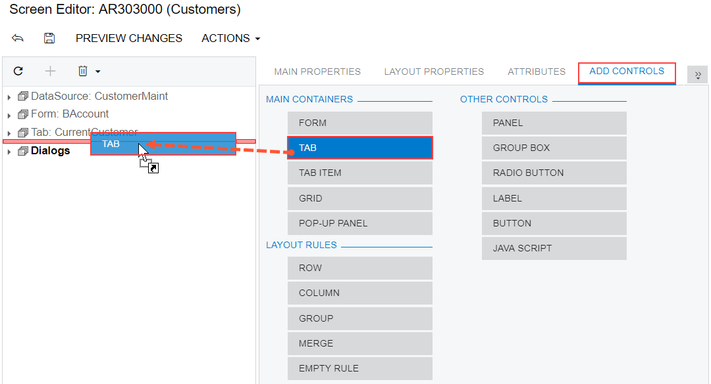

# To Add a Tab Container {#_85eaba7a-eb2f-4787-a6b3-eb5c9718eeaa .concept}

You can add a new PXTab container to an existing form of Acumatica ERP. To do this, perform the following actions:

1.  Open the form in the [Screen Editor](../UserGuide/AU_20_45_20.md), as described in [To Add a Page Item for an Existing Form](CG_GL_Items_Screens_Adding.md).
2.  In the editor, click the **Add Controls** tab item.
3.  From the **Main Containers** group, drag the **Tab** container to the required place in the Control Tree, as shown in the following screenshot.

    

    The PXTab container cannot exist without nested PXTabItem containers. Therefore, when you add a PXTab container, the Screen Editor creates a nested PXTabItem container.

    **Note:** A tab container is visible on a customized form only if there is at least one control for a field in a nested PXTabItem container.

4.  In the Control Tree, select the tab that has been added, and specify the item properties, as described in [To Set a Container Property](CG_GL_UI_PXForm_Properties.md).
5.  Click **Save** on the toolbar of the Screen Editor to save your changes to the customization project.

For more information about PXTab, see [Tab Container \(PXTab\)](CG_GL_UI_Tab.md).

-   **[To Add a New Tab Item to a Tab](../CustomizationPlatform/CG_GL_Forms_CustForm_AddContainer_TabItem.md)**  

**Parent topic:**[Existing Form](../CustomizationPlatform/CG_GL_UI_ExistForm.md)

