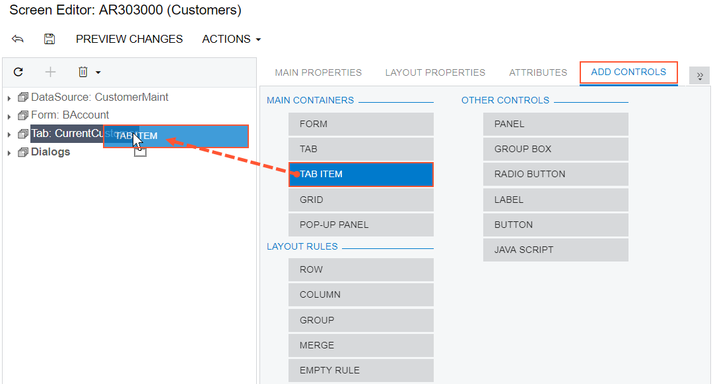
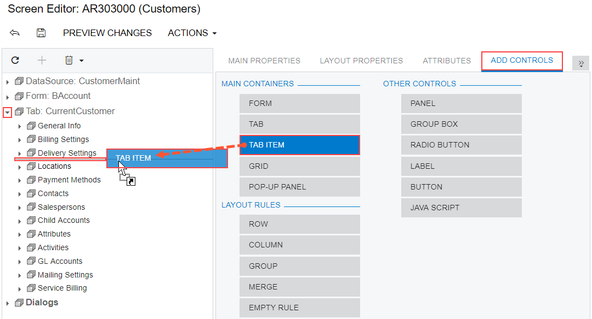

# To Add a New Tab Item to a Tab {#_02894962-1600-4fc7-8599-62f77144119d .concept}

You can add a new PXTabItem container to a tab on an existing form of Acumatica ERP. To do this, perform the following actions:

1.  Open the form in the [Screen Editor](../UserGuide/AU_20_45_20.md), as described in [To Add a Page Item for an Existing Form](CG_GL_Items_Screens_Adding.md).
2.  In the editor, click the **Add Controls** tab item.
3.  From the **Main Containers** group of the tab item, drag the **Tab Item** container above the customized tab, as shown in the following screenshot.

    

    If the tab contains multiple tab items and you need to add a tab item to a certain position in the tab, you should expand the tab node in the Control Tree to see the existing tab items and drag the **Tab Item** container to the required position, as the following screenshot shows.

    

    **Note:** A tab item is visible if it contains at least one control for a field.

4.  In the Control Tree, select the tab item that has been added, and specify the item properties, as described in [To Set a Container Property](CG_GL_UI_PXForm_Properties.md).
5.  Click **Save** on the toolbar of the Screen Editor to save your changes to the customization project.

**Parent topic:**[To Add a Tab Container](../CustomizationPlatform/CG_GL_Forms_CustForm_AdContainer_Tab.md)

