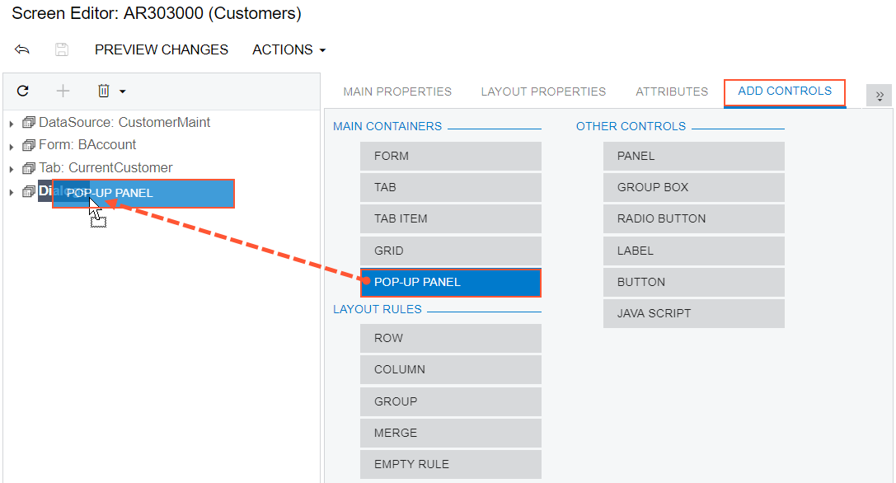

# To Add a Dialog Box {#_28f998fd-0fa5-4439-9bcc-239079ff4db7 .concept}

You can add a custom dialog box to an Acumatica ERP form. If the dialog box must contain controls for data fields, you should generally perform the following operations:

-   Add a new PXSmartPanel container to the ASPX page, as described in this topic.
-   If needed, define a custom data access class with the declaration of the data fields to be used for controls in the dialog box. See [To Create a Custom Data Access Class](CG_GL_Items_Code_CustomDAC.md) for details.
-   If needed, in the extension for the graph that is specified in the TypeName property of the PXDataSource control of the ASPX page, add business logic for the dialog box. \(See [To Customize an Existing Graph](CG_GL_Items_Code_AddingGraphExt.md) for details.\) For example, in the graph extension, you can do the following:
    -   Declare a new data view that provides data for the dialog box controls, as described in [To Add a New Member](CG_GL_BL_Graph_NewMember.md)
    -   Add an action \(with a button on the form toolbar\) to open the dialog box
    -   Add other business logic for the dialog box
-   If the smart panel container must include a box for a data field, add a data-bound container, such as PXFormView. Then bind the new container to the data view declared in the graph or graph extension \(see [Use of the DataMember Property of Containers](../StudioDeveloperGuide/CW__con_PXForm_Properties_DataMember.md) in the Acumatica Framework Guide for details\) whose BQL statement refers to the data access class with the field declaration.
-   If the smart panel must contain a row of buttons, add a nested PXPanel container with the SkinID property set to *Buttons* \(see [Use of the SkinID Property of Containers](../StudioDeveloperGuide/CW__con_PXForm_Properties_SkinID.md) in the Acumatica Framework Guide for details\), and add the buttons to the nested panel, as described in [To Add Another Supported Control](CG_GL_UI_PXForm_AddStControl.md).

To add a new PXSmartPanel container to an ASPX page, perform the following actions:

1.  Open the form in the [Screen Editor](../UserGuide/AU_20_45_20.md), as described in [To Add a Page Item for an Existing Form](CG_GL_Items_Screens_Adding.md).
2.  In the editor, click the **Add Controls** tab item.
3.  From the **Main Containers** group of the tab item, drag the **Pop-up Panel** container into the **Dialogs** node in the Control Tree, as shown in the following screenshot.

    

    **Note:** A dialog box can be displayed if it contains at least one visible control.

4.  In the Control Tree, select the new container that has been added.
5.  Specify the item properties, as described in [To Set a Container Property](CG_GL_UI_PXForm_Properties.md).
6.  Click **Save** on the toolbar of the Screen Editor to save your changes to the customization project.

**Parent topic:**[Existing Form](../CustomizationPlatform/CG_GL_UI_ExistForm.md)

