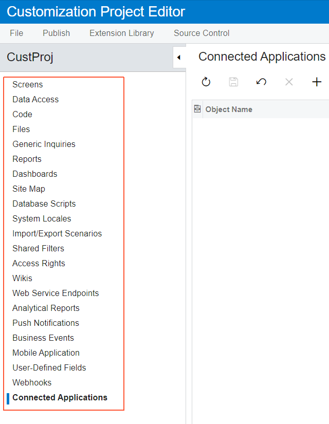

# Managing Items in a Project {#_502518d7-8b83-49ab-ab55-c94b80534ec9 .concept}

You use the [Customization Project Editor](../UserGuide/SM_20_45_10.md) to manage the items in a customization project. The editor includes a page to support each type of item in a customization project. \(See [Types of Items in a Customization Project](CG_Platform_Project_ItemTypes.md) for details.\) By using the navigation pane of the editor, shown in the following screenshot, you can open these pages \(each of which is described in detail in the corresponding part of this guide\).

-   **[Adding Customization Items to Customization Projects](../CustomizationPlatform/CustomizationProjects_AddingItems_Mapref.md)**  

-   **[Customized Screens](../CustomizationPlatform/CG_GL_Items_Screens.md)**  

-   **[Customized Data Classes](../CustomizationPlatform/CG_GL_Items_DACs.md)**  

-   **[Code](../CustomizationPlatform/CG_GL_Items_Code.md)**  

-   **[Custom Files](../CustomizationPlatform/CG_GL_Items_Files.md)**  

-   **[Generic Inquiries](../CustomizationPlatform/CG_GL_Items_GI.md)**  

-   **[Custom Reports](../CustomizationPlatform/CG_GL_Items_Reports.md)**  

-   **[Dashboards](../CustomizationPlatform/CG_GL_Items_Dashboards.md)**  

-   **[Site Map](../CustomizationPlatform/CG_GL_Items_SiteMap.md)**  

-   **[Database Scripts](../CustomizationPlatform/CG_GL_Items_DBScripts.md)**  

-   **[System Locales](../CustomizationPlatform/CG_GL_Items_Translations.md)**  

-   **[Import and Export Scenarios](../CustomizationPlatform/CG_GL_Items_IntScenarios.md)**  

-   **[Shared Filters](../CustomizationPlatform/CG_GL_Items_SharedFilters.md)**  

-   **[Access Rights](../CustomizationPlatform/CG_GL_Items_AccessRights.md)**  

-   **[Wikis](../CustomizationPlatform/CG_GL_Items_Wiki.md)**  

-   **[Web Service Endpoints](../CustomizationPlatform/CG_GL_Items_WebServices.md)**  

-   **[Analytical Reports](../CustomizationPlatform/CG_GL_Items_AnaliticalReports.md)**  

-   **[Push Notifications](../CustomizationPlatform/CG_GL_Items_PushNotifications.md)**  

-   **[Business Events](../CustomizationPlatform/CG_GL_Items_BusinessEvents.md)**  

-   **[Mobile Application](../CustomizationPlatform/CG_GL_Items_MobileApp.md)**  

-   **[User-Defined Fields](../CustomizationPlatform/CG_GL_Items_UserDefinedFields.md)**  

-   **[Webhooks](../CustomizationPlatform/CG_GL_Items_Webhooks.md)**  

-   **[Connected Applications](../CustomizationPlatform/CG_GL_Items_ConnectedApplications.md)**  

