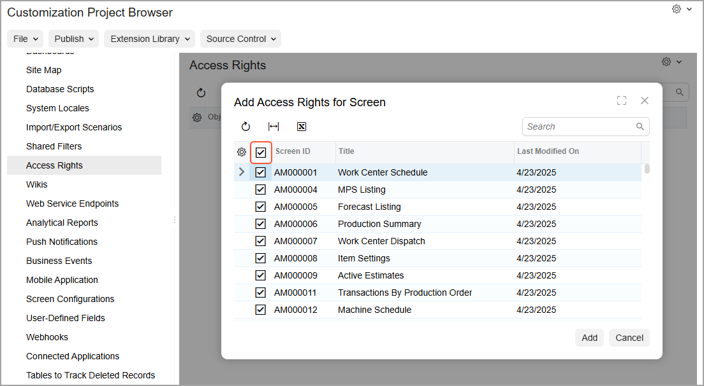
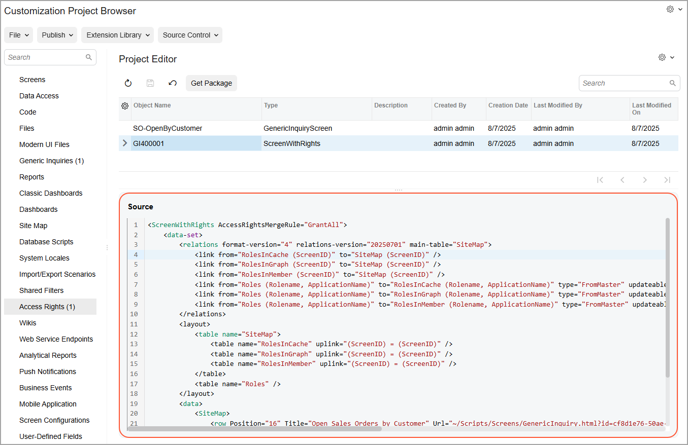

# To Add Access Rights to a Project {#_f8341de4-fec5-4bb7-8c3c-5ee0b45a839f .concept}

When you create or change the access rights for a screen, role, or user in an Acumatica ERP tenant, these changes are saved in the tenant’s database. These access rights can be added to a customization project.

## Addition of Access Rights to the Customization Project { .section}

You can add to a customization project the roles’ access rights to screens in the current tenant. To do this, perform the following general actions:

1.  Open the customization project in the Customization Project Editor. \(See [To Open a Project](CG_GL_Project_Opening.md) for details.\)
2.  In the navigation pane, click **Access Rights**.

    The [Access Rights](../UserGuide/AU_20_52_00.md) page opens.

3.  On the page toolbar, click **Add New Record**.
4.  In the **Add Access Rights for Screen** dialog box, which opens, select the Included check box for the forms \(screens\) whose access rights you want to add to the customization project when you click **Add**.

    You can instead add all forms by selecting the Included check box in the column header \(shown below\). You’d do this primarily when you want to transfer all access rights from one tenant to another. By default, the system adds access rights to the customization project with the *Copy From Current Tenant* merge rule.

    

5.  Click **Add** to add the selected forms’ access rights to the table on the page and close the dialog box.

The system adds to the customization project the access rights data for the selected forms. You can view the HTML source code of each project item on the [Edit Project Items](../UserGuide/AU_ItemXMLEditor.md) page \(shown below\).

A screen’s merge rule determines how the system applies the access rights from the customization project as it’s published. You can change a screen’s merge rule by selecting the needed option in the **Merge Rule** column on the [Access Rights](../UserGuide/AU_20_52_00.md) page:

-   *Grant All*: To set the access rights to *Granted* for all user roles in the system.
-   *Revoke All*: To set the access rights to *Revoked* for all user roles in the system.
-   *Copy from Current Tenant* \(default\): To copy the access rights from the current tenant to the target tenant. You select this option when you’re transferring the access rights from the current tenant to a target tenant—for example, from a staging tenant where you’ve configured and tested specific access rights for multiple screens to a production tenant.

    For roles not included in the customization project, the system handles access rights based on the form’s availability in the target tenant as follows:

    -   The form exists in the target tenant: Access rights remain unchanged.
    -   The form doesn’t exist in the target tenant \(that is, it's a new form with no access rights specified for it in this tenant\): The system sets the access rights to *Revoked*. That is, after the customization project has been published, you need to grant the access rights explicitly.

**Tip:** The form is considered existing in the target tenant if it is listed on the [Site Map](../UserGuide/SM_20_05_20.md) \(SM200520\) form.

## Publication of Multiple Projects with the Same ScreenWithRights Items { .section}

If you publish multiple customization projects that contain the same *ScreenWithRights* items, the system performs the following actions:

-   If a level is specified for each of the projects, merges the projects, adds to the merged project the *ScreenWithRights* items from the project with the highest level, and displays a warning that the *ScreenWithRights* items from other projects will be ignored
-   If the projects have the same level or no level is specified for at least one of the projects, does not publish the projects and displays an error

**Parent topic:**[Access Rights](../CustomizationPlatform/CG_GL_Items_AccessRights.md)

