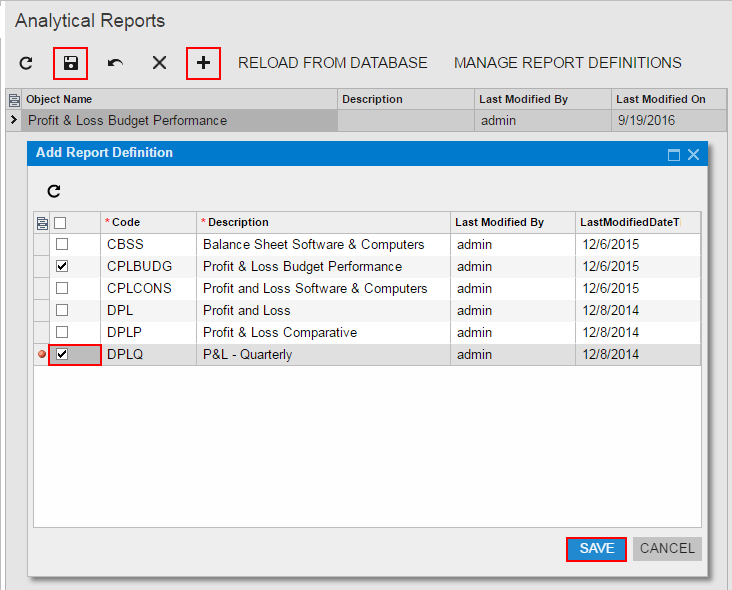
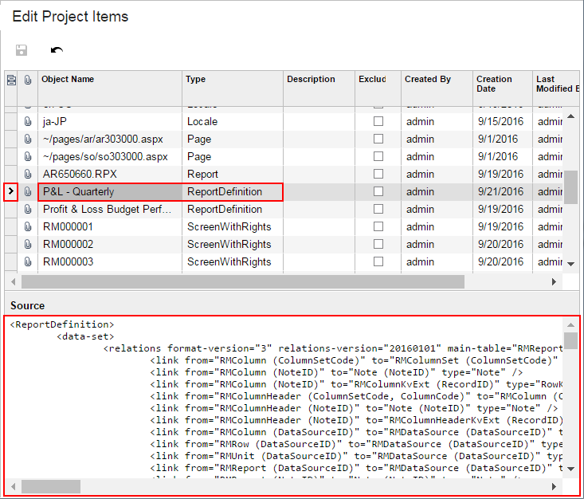

# To Add a Custom Analytical Report to a Project {#_187cd95b-cb0f-4fe2-a399-52df41813fe8 .concept}

You can add a custom analytical report to a customization project. To do this, perform the following actions:

1.  Open the customization project in the Customization Project Editor. \(See [To Open a Project](CG_GL_Project_Opening.md) for details.\)
2.  Click **Analytical Reports** in the navigation pane to open the [Analytical Reports](../UserGuide/AU_20_60_03.md) page.
3.  On the page toolbar, click **Add New Record** \(+\), as shown in the screenshot below.
4.  In the list of custom analytical reports in the **Add Report Definition** dialog box, which opens, select the check box for each report that you want to include in the project.

    **Tip:** The **Add Report Definition** dialog box displays all the custom analytical reports that exist in your instance of Acumatica ERP. You can select multiple custom analytical reports to add them to the project simultaneously.

5.  In the dialog box, click **OK** to add each selected analytical report to the page table.
6.  On the page toolbar, click **Save** to save the changes to the customization project.

    

The system adds to the project the data from the database for each selected custom analytical report. You can view each new item in the Project Items table of the [Edit Project Items](../UserGuide/AU_ItemXMLEditor.md), as shown in the following screenshot.

A *ReportDefinition* item contains all the data required to recreate the corresponding analytical report in any instance of Acumatica ERP.

**Attention:** To give users the ability to navigate to the custom analytical report in Acumatica ERP, you have to add the appropriate site map node to the customization project on the [Site Map](../UserGuide/AU_20_80_00.md) page of the Customization Project Editor.

**Parent topic:**[Analytical Reports](../CustomizationPlatform/CG_GL_Items_AnaliticalReports.md)

