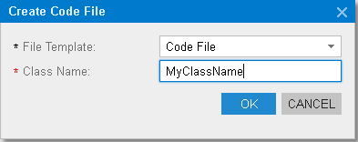
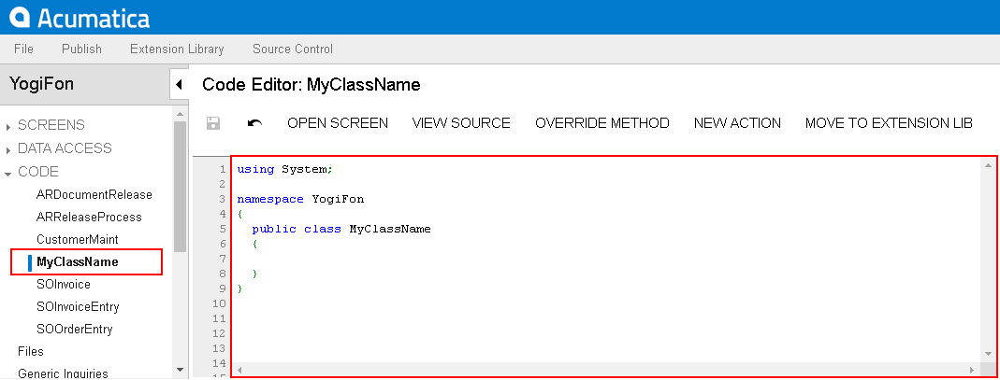

# To Add Custom Code to a Project {#_16f9c15a-325b-47f5-bacf-4a06ce72251e .concept}

You can add a *.cs* file with some custom code to a customization project. To do this, perform the following actions:

1.  Open the customization project in the editor. \(See [To Open a Project](CG_GL_Project_Opening.md) for details.\)
2.  Click **Code** in the navigation pane to open the [Code](../UserGuide/AU_20_40_00.md) page.
3.  Click **Add New Record** on the page toolbar.
4.  In the **Create Code File** dialog box, which opens, select *Code File* in the **File Template** box, as the screenshot below shows.
5.  In the **Class Name** box, specify the name of the new class to be added to the project.
6.  Click **OK**.

    

The platform creates the code template of the new class, saves the code as a *Code* item of the project in the database, and opens the item in the [Code Editor](../UserGuide/AU_20_40_00_CodeEditor.md), as the following screenshot shows.

**Parent topic:**[Code](../CustomizationPlatform/CG_GL_Items_Code.md)

