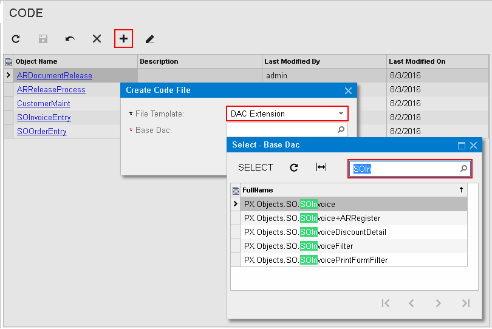

# To Customize an Existing Data Access Class {#_d8c06d06-e88b-48d7-ad1a-2f3f1d2ddd66 .concept}

If you know the name of the data access class to be customized, you can create a *Code* item with the DAC extension template on the Code page of the Customization Project Editor by using the **Create Code File** dialog box.

To do this, perform the following actions:

1.  Open the customization project in the editor.
2.  Click **Code** in the navigation pane to open the Code page.
3.  Click **Add New Record** \(+\) on the page toolbar.
4.  In the **Create Code File** dialog box, which opens, select *DAC Extension* in the **File Template** box, as the screenshot below shows.
5.  In the **Base DAC** box, select the name of the data access class to be customized.
6.  Click **OK**.

    

The platform creates the template of the class that is derived from the PXCacheExtension&lt;&gt; class, saves the code as a *Code* item of the project in the database, and opens the item in the [Code Editor](../Shared/../UserGuide/AU_20_40_00_CodeEditor.md).

**Note:** Inside the extension, you must implement the IsActive method which enables the extension on condition. For details, see [To Enable a DAC Extension Conditionally \(IsActive\)](../Shared/../CustomizationPlatform/CG_GL_BL_DAC_IsActive.md).

**Parent topic:**[Code](../CustomizationPlatform/CG_GL_Items_Code.md)

