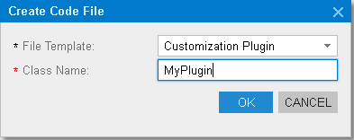

# To Add a Customization Plug-In to a Project {#_c69443fe-4d32-47a9-85aa-b2882aa259ef .concept}

As a part of a complex customization, you might need to make changes to the website beyond the customization project. For example, you might need to change the website configuration. In such situations, you can add a customization plug-in to the project with the code to be executed at the end of the publication process.

To add a customization plug-in, perform the following actions:

1.  Open the customization project in the editor. \(See [To Open a Project](CG_GL_Project_Opening.md) for details.\)
2.  Click **Code** in the navigation pane to open the [Code](../UserGuide/AU_20_40_00.md) page.
3.  Click **Add New Record** on the page toolbar.
4.  In the **Create Code File** dialog box, which opens, select *Customization Plug-in* in the **File Template** box, as the screenshot below shows.
5.  In the **Class Name** box, enter the name of the plug-in to be added to the project.
6.  Click **OK**.

    


The system generates the plug-in code by template, as shown below.

```
using System;
using PX.Data;
using Customization;

namespace YogiFon
{
  //The customization plug-in is used to execute custom actions after the customization project has been published	
  public class MyPlugin: CustomizationPlugin
  {
    //This method is executed right after website files are updated, but before the website is restarted
    //The method is invoked on each cluster node in a cluster environment
    //The method is invoked only if runtime compilation is enabled
    //Do not access custom code published to bin folder; it may not be loaded yet
    public override void OnPublished()
    {
      this.WriteLog("OnPublished Event");
    }
    
    //This method is executed after the customization has been published and the website is restarted.	
    public override void UpdateDatabase()
    {
      this.WriteLog("UpdateDatabase Event");
    }
  }
}

```

When a customization project that contains a customization plug-in has been published, the corresponding `.cs` file is created in the `App_RuntimeCode` folder of the website.

The Acumatica Customization Platform uses the `App_RuntimeCode` folder to keep the CS code of the *DAC* and *Code* items of all the published customization projects. By default, at run time, the platform compiles the code of this folder in a separate library and dynamically links the library to the Acumatica ERP application. \(See [Run-Time Compilation](CG_Platform_TO_Code_RunTime.md) for details.\) If you set the UseRuntimeCompilation key in the &lt;appSettings&gt; section of the `web.config` file \(located in the website folder\) to *False*, the platform uses the `App_Code/Caches` folder instead the `App_RuntimeCode` one for the customization code. In this case, the OnPublished method of a customization plug-in cannot be executed. Execution of the UpdateDatabase method does not depend on the UseRuntimeCompilation key value.

**Parent topic:**[Code](../CustomizationPlatform/CG_GL_Items_Code.md)

