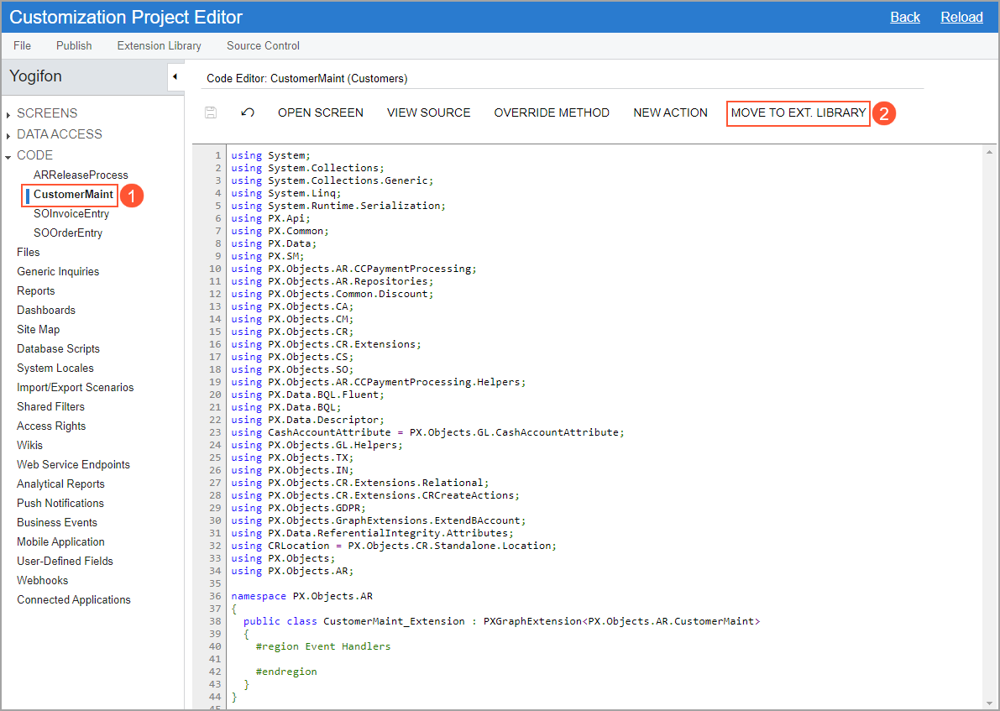
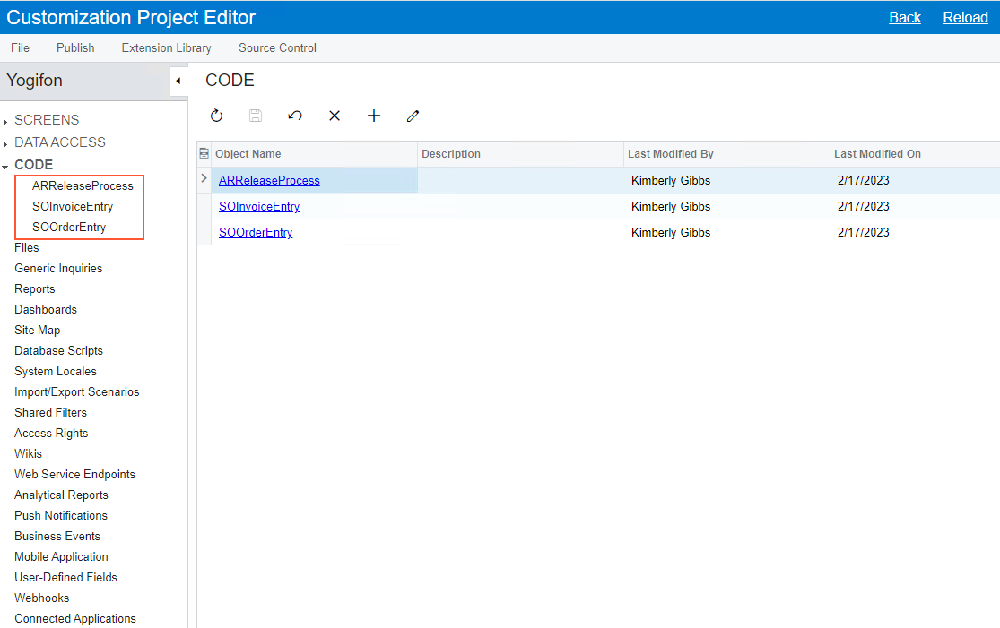
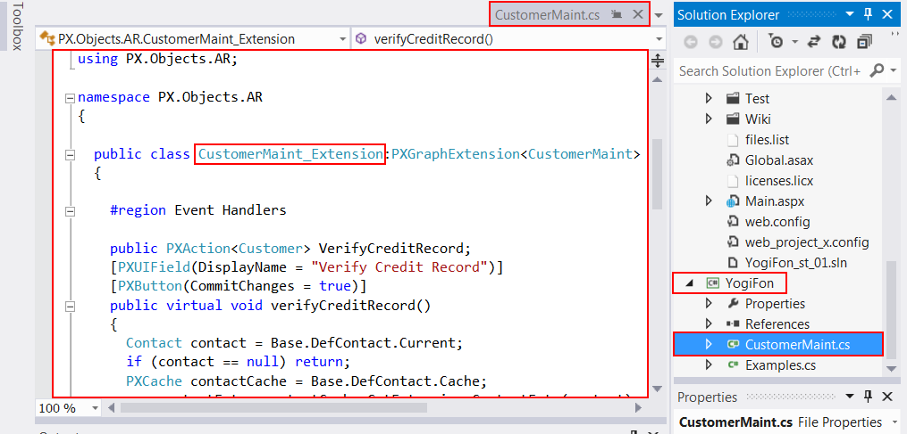

# To Move a Code Item to the Extension Library {#_1d898e7c-7547-41d1-b276-da60f964576b .concept}

You can develop customization code either as *Code* items in a customization project or as source code included in an extension library project in Microsoft Visual Studio. Some part of a customization may exist in the *Code* items of a customization project, while another part can be included in an extension library that is added in the customization project as a dynamic link library \(DLL\) file. \(See [Extension Library](CG_Platform_TO_Code_CS_ExtLibrary.md) for details.\)

If you have a *Code* item in a customization project that you want to move to an extension library to compile it into a DLL file, you can use the **Move to Ext. Library** button on the page toolbar of the [Code Editor](../UserGuide/AU_20_40_00_CodeEditor.md) page.

After the operation is complete, the *Code* item that is currently displayed in the work area of the Code Editor is removed from the customization project, and a file with the same source code is appended to the extension library that is bound to the customization project. The system assigns a similar name to the file: For example, if the *Code* item name was CodeItemName, the name of the created file will be `CodeItemName.cs`.

The operation of moving code to an extension library is irreversible. If you need to move source code from an extension library to a *Code* item of a customization project, use the following approach:

-   In Visual Studio \(or any text editor\), open the file, select the needed source code, and copy it to the clipboard.
-   Create a new *Code* item in the customization project.
-   Delete the code template from the created item.
-   Paste the code from the clipboard, and save the *Code* item to the customization project.
-   Delete the source code file from the extension library.

To move the code from a *Code* item to an extension library, you perform the following general actions:

1.  You open the customization project in the Customization Project Editor. \(See [To Open a Project](CG_GL_Project_Opening.md) for details.\)
2.  You click **Code** in the navigation pane to open the [Code](../UserGuide/AU_20_40_00.md) page.
3.  In the page table, you click the name of the item to be moved to open the [Code Editor](../UserGuide/AU_20_40_00_CodeEditor.md) page for the item.
4.  On the page toolbar, you click **Move to Ext. Library**.

    **Attention:** Before you launch the operation, be sure that the customization project is bound to an existing extension library. \(See [Customization Project Editor](../UserGuide/SM_20_45_10.md) for details.\)

For example, suppose you need to move the CustomerMaint *Code* item \(see Item 1 in the following screenshot\) to the YogiFon extension library \(Item 2\).

When the operation is complete, the CustomerMaint *Code* item is removed from the customization project, as shown in following screenshot.

In place of the removed item, the `CustomerMaint.cs` file with the same source code is appended to the bound extension library project, as shown in the following screenshot.

See [Extension Library \(DLL\) Versus Code in a Customization Project](CG_Platform_TO_Code_ExtLib_vsCode.md) for our recommendations about where you should keep your customization code.

**Parent topic:**[Code](../CustomizationPlatform/CG_GL_Items_Code.md)

