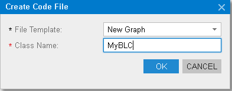

# To Create a Custom Business Logic Controller {#_f466950b-6a96-46e1-a4dd-960eed374dd9 .concept}

You can add a custom business logic controller to a customization project on the Code page of the Customization Project Editor.

To do this, perform the following actions:

1.  Open the customization project in the editor.
2.  Select **Code** in the navigation pane to open the Code page.
3.  Click **Add New Record** \(+\) on the page toolbar.
4.  In the **Create Code File** dialog box, which opens, select *New Graph* in the **File Template** box, as the screenshot below shows.
5.  In the **Class Name** box, specify the class name of the business logic controller to be created.
6.  Click **OK**.

    

The platform creates the code template of the class derived from the PXGraph&lt;&gt; class, saves the code as a *Code* item of the project in the database, and opens the item in the [Code Editor](../Shared/../UserGuide/AU_20_40_00_CodeEditor.md).

**Parent topic:**[Code](../CustomizationPlatform/CG_GL_Items_Code.md)

