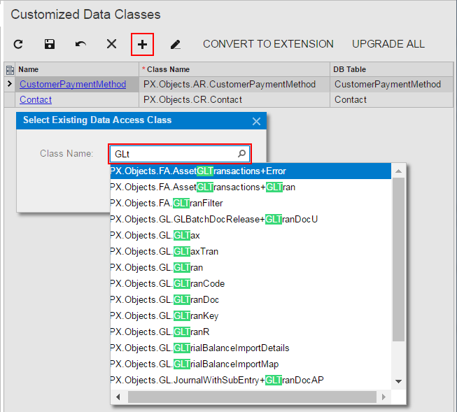

# To Add a DAC Item for an Existing Data Access Class to a Project {#_79930f45-ab3c-43af-b668-c534fb75ee9a .concept}

Before modifying an existing data access class, you have to add a *DAC* item for the class to the customization project. This item is used to store the data of the class extension in XML format. After the item is created, you can modify the class members by using the [Data Class](../UserGuide/AU_DataClassEditor.md). After the customization project is published, the `.cs` file for the item is created in the file system, and you can develop the C\# code of the class extension in Microsoft Visual Studio. You can use the Data Class Editor as well as Visual Studio to add custom fields to existing data access classes.

You can add a *DAC* item for an existing data access class to a customization project by using the [Element Inspector](../UserGuide/AU_ElementInspector.md), or you can create and add the item on the Customized Data Classes page of the Customization Project Editor.

The following sections provide detailed information:

-   [To Add a DAC Item by Using the Element Inspector](#_4bd6e805-664f-42eb-b280-05363719415c)
-   [To Add a DAC Item on the Customized Data Classes page](#_10f4ca24-92c2-400e-9952-964a25302a41)

## To Add a DAC Item by Using the Element Inspector {#_4bd6e805-664f-42eb-b280-05363719415c .section}

1.  Open the form in the browser.
2.  On the form title bar, click **Customization** &gt; **Inspect Element** to open the [Element Inspector](../UserGuide/AU_ElementInspector.md).
3.  On the form, select a UI element for a field of the class to be customized to open the [Element Properties Dialog Box](../UserGuide/AU_ElementInspector.md#_8ce780b0-243f-480c-8b4c-ed6431116e3f) for the element.

    The dialog box displays the name of the data access class that contains the selected element in the **Data Class** box, as shown in the screenshot below.

4.  In the dialog box, click **Actions &gt; Customize Data Fields**.

    

    If there is no currently selected customization project, the inspector opens the [Table 1](../UserGuide/AU_CustomizationMenu.md#_6adfabb5-9264-4273-938a-db4a41510b1c) to force you to select an existing customization project or to create a new one.

Acumatica Customization Platform creates the *DAC* item for the class, adds the item to the currently selected customization project, and opens the class in the [Data Class](../UserGuide/AU_DataClassEditor.md).

The platform assigns the new item the name of the data access class.

## To Add a DAC Item on the Customized Data Classes page {#_10f4ca24-92c2-400e-9952-964a25302a41 .section}

1.  Open the customization project in the editor. \(See [To Open a Project](CG_GL_Project_Opening.md) for details.\)
2.  Click **Data Access** in the navigation pane to open the [Data Access](../UserGuide/AU_20_30_01.md) page.
3.  On the page toolbar, click **Add New Record**.
4.  In the **Select Existing Data Access Class** dialog box, which opens, select the class in the **Class Name** box.

    You can type the class name in the **Class Name** box or search for the class by a part of its name, as shown in the screenshot below. As soon as you add the class, the [Data Class](../UserGuide/AU_DataClassEditor.md) opens for it so that you can modify the fields of this class and add custom fields to it.

    

5.  On the page toolbar, click **Save** to save the item in the customization project.

As soon as you have modified the attributes of an existing field of the class or added a new field to the class and saved the changes in the Data Class Editor, the class is added to the customization project and appears in the table of the [Data Access](../UserGuide/AU_20_30_01.md) page.

To go back to the [Data Access](../UserGuide/AU_20_30_01.md) page of the Customization Project Editor, select **Data Access** on the navigation pane. You can see that the added item is saved to the list of project items.

**Parent topic:**[Customized Data Classes](../CustomizationPlatform/CG_GL_Items_DACs.md)

