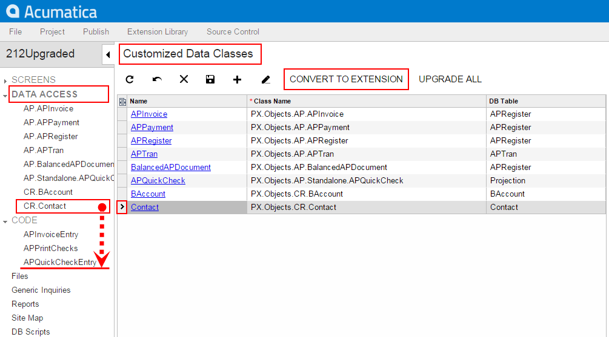
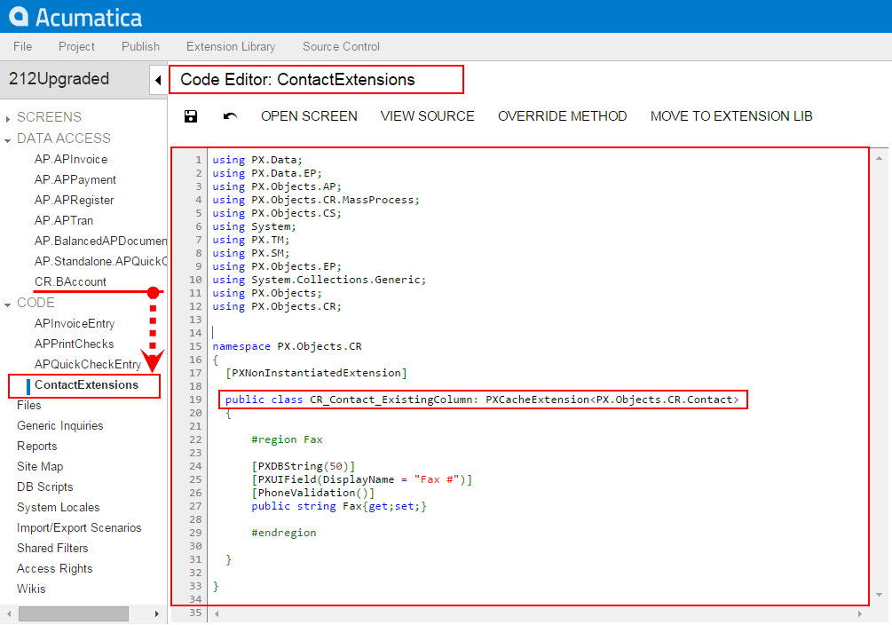

# To Convert a DAC Item to a Code Item {#_4e3f8e4b-7d2b-4720-a833-a8c0a3d02643 .concept}

If you have a customized data access class that is added to the project as a *DAC* item, then you can convert the class changes into the class extension code \(a *Code* item\) to complete the extension development in the Code Editor or in Microsoft Visual Studio. \(See [Supported DAC Extension Formats](CG_Platform_Framework_CS_DACExt_DACFormat.md) for details.\)

To do this, perform the following actions:

1.  Open the customization project in the Customization Project Editor. \(See [To Open a Project](CG_GL_Project_Opening.md) for details.\)
2.  Click **Data Access** in the navigation pane to open the [Data Access](../UserGuide/AU_20_30_01.md) page.
3.  In the page table, select the item to be converted, as the screenshot below shows.
4.  On the page toolbar, click **Convert to Extension**.

    

The platform converts the XML content of the selected item to C\# code, deletes the *DAC* item in the customization project, adds the created code to the project as a *Code* item, and opens it in the [Code Editor](../UserGuide/AU_20_40_00_CodeEditor.md), as shown in the following screenshot.

This operation is irreversible. After you convert the XML data to C\# code, you will not be able to work with the item in the Data Class Editor or convert it back to a *DAC* item. You will be able to edit the code in Code Editor and Visual Studio.

**Attention:** The **Convert to Extension** action also affects all the inherited classes of the specified DAC if the classes are customized.

The system obtains the name of the *Code* item from the DAC name by appending the *Extensions* suffix to it. After the publication of the customization project, the actual customization code of the class is available in the `<DACName>Extensions.cs` file in the `App_RuntimeCode` folder of the website. For example, if you apply the action to the CR.Contact class, as shown in the screenshots above, the operation converts the *DAC* item to the *Code* item, automatically giving it the name of ContactExtensions. The action removes the CR.Contact *DAC* item class from the project and adds the ContactExtensions *Code* item.

**Parent topic:**[Customized Data Classes](../CustomizationPlatform/CG_GL_Items_DACs.md)

