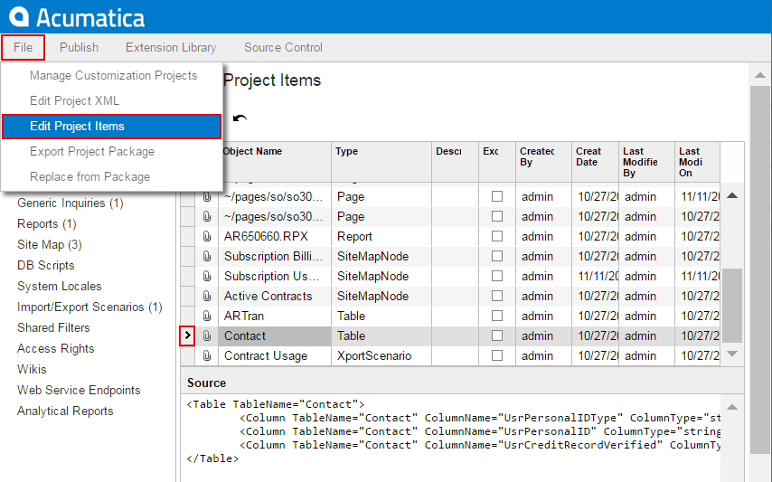

# To Delete Items from the Project on the Edit Project Items Page {#_6dd39f69-956d-4c5a-80e8-87e802c821a2 .concept}

You can delete multiple items from the customization project on the Edit Project Items page of the Customization Project Editor. To do this, perform the following actions:

1.  On the menu of the editor, click **File &gt; Edit Project Items**.
2.  In the table of the Edit Project Items page, which opens, click the item to be deleted, as the following screenshot shows.

    

3.  Press Delete on the keyboard to delete the selected row from the table.
4.  If you need to delete multiple items from the project, repeat Steps 2–3 for each item.
5.  On the page toolbar, click **Save** to save the change in the project.

**Parent topic:**[Customized Screens](../CustomizationPlatform/CG_GL_Items_Screens.md)

