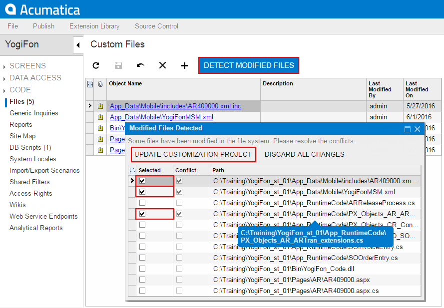

# To Update a File Item in a Project {#_c55aa41b-44ab-4364-8b11-5725c159bb36 .concept}

If you have modified a file of a customization project in the file system and need to use the modified version of the file in the project, you have to update the copy of the file in the database. To do this, perform the following actions:

1.  Open the customization project in the Customization Project Editor. \(See [To Open a Project](CG_GL_Project_Opening.md) for details.\)
2.  Click **Files** in the navigation pane to open the [Files](../UserGuide/AU_20_45_00.md) page.
3.  On the page toolbar, click **Detect Modified Files**, as shown in the screenshot below.
4.  In the **Modified Files Detected** dialog box, which opens, ensure that the **Conflict** check box is selected for the file.

    

5.  If multiple files in the project were changed, and you do not want to update some files at the moment, clear the selection of these files in the **Selected** column.
6.  Click **Update Customization Project** to update the selected files.

If you click **Discard All Changes**, the Acumatica Customization Platform resolves the conflict by overriding the file in the file system using the file copy in the database.

If you make changes to custom files added to a customization project in the file system, the platform does not publish or export the project while a file in the file system differs its copy in the database. You have to resolve all such conflicts before publication or export of the project. See [Detecting the Project Items Modified in the File System](CG_Platform_TO_Features_AutoDetectMF.md) for details.

-   **[Detecting the Project Items Modified in the File System](../CustomizationPlatform/CG_Platform_TO_Features_AutoDetectMF.md)**  

**Parent topic:**[Custom Files](../CustomizationPlatform/CG_GL_Items_Files.md)

