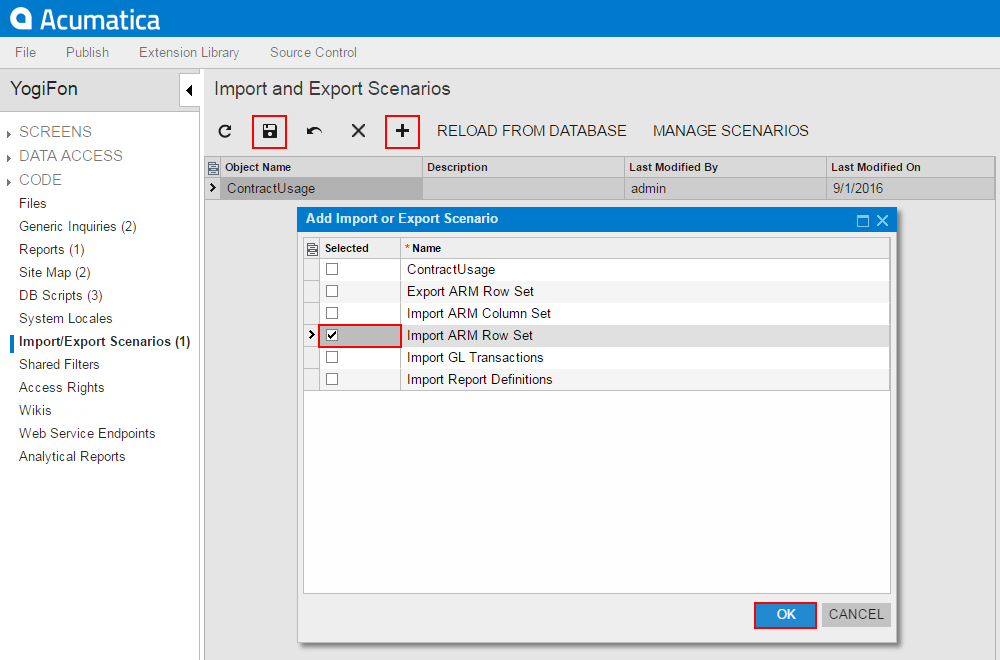
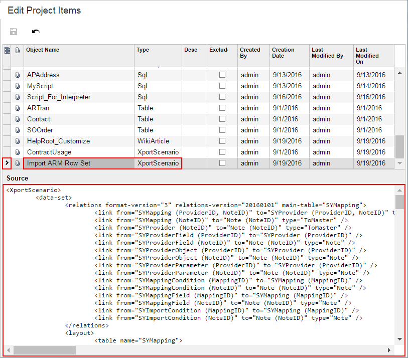

# To Add an Integration Scenario to a Project {#_6ce18c9d-2097-4cb3-b25a-083e75a212ea .concept}

You can add a custom integration scenario to a customization project. To do this, perform the following actions:

1.  Open the customization project in the Customization Project Editor. \(See [To Open a Project](CG_GL_Project_Opening.md) for details.\)
2.  Click **Import/Export Scenarios** in the navigation pane to open the [Import and Export Scenarios](../UserGuide/AU_20_55_00.md) page.
3.  On the page toolbar, click **Add New Record**, as shown in the screenshot below.
4.  In the list of integration scenarios in the **Add Import or Export Scenario** dialog box, which opens, select the check box for each scenario that you want to include in the project.

    **Tip:** The **Add Import or Export Scenario** dialog box displays all the custom integration scenarios that exist in your instance of Acumatica ERP. You can select multiple integration scenarios to add them to the project simultaneously.

5.  In the dialog box, click **OK** to add each selected integration scenario to the page table.
6.  On the page toolbar, click **Save** to save the changes to the customization project.

    

The system adds to the project the data from the database for each selected integration scenario. You can view each new *XportScenario* item in the Project Items table of the [Edit Project Items](../UserGuide/AU_ItemXMLEditor.md), as shown in the following screenshot.

An *XportScenario* item contains all the data required for the integration scenario. Therefore, the item includes the data of the data provider.

**Parent topic:**[Import and Export Scenarios](../CustomizationPlatform/CG_GL_Items_IntScenarios.md)

