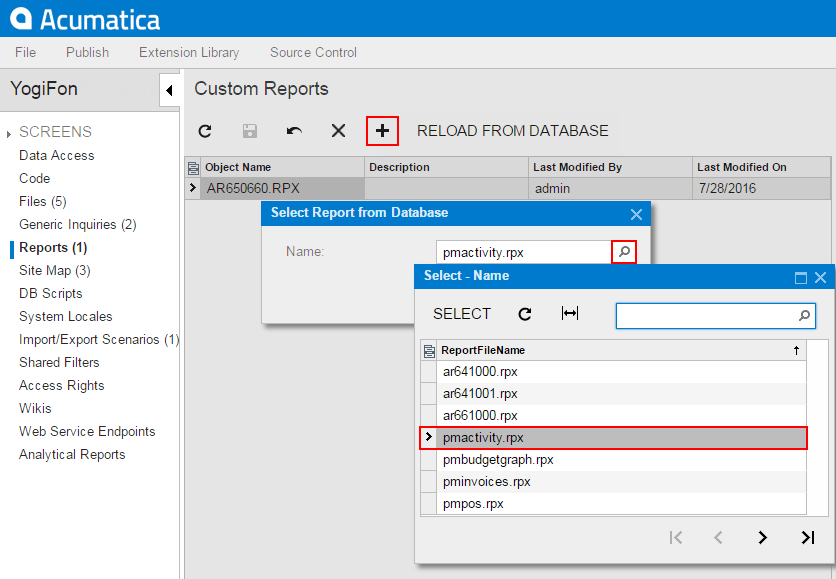

# To Add a Custom Report to a Project {#_776bfc8f-54eb-44c7-845a-0ff36758fb02 .concept}

You can add an Acumatica Report Designer custom report to a customization project. Before adding a report to a project, you have to construct the report in Acumatica Report Designer and save the report to the database. \(For more information about reports, see [Acumatica Report Designer Guide](../UserGuide/ReportDesigner_Main.md).\)

To add a custom report to a project, perform the following actions:

1.  Open the customization project in the Customization Project Editor. \(See [To Open a Project](CG_GL_Project_Opening.md) for details.\)
2.  Click **Reports** in the navigation pane to open the [Reports](../UserGuide/AU_20_70_00.md) page.
3.  On the page toolbar, click **Add New Record**, as shown in the screenshot below.
4.  In **Name** box of the **Select Report from Database** dialog box, which opens, select the report that you want to include in the project.

    **Tip:** If a custom report is created in Acumatica Report Designer and saved as a file in the file system, you cannot add the report to a customization project as a *Report* item.

5.  In the dialog box, click **OK** to add the selected report to the customization project.

    

**Attention:** To give users the ability to navigate to the custom report in Acumatica ERP, you have to add the appropriate site map node to the customization project on the [Site Map](../UserGuide/AU_20_80_00.md) page of the Customization Project Editor.

**Parent topic:**[Custom Reports](../CustomizationPlatform/CG_GL_Items_Reports.md)

