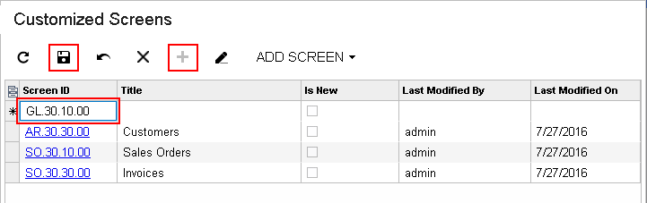

# To Add a Page Item for an Existing Form {#_cc880c6f-f936-4d52-9751-38c914e10cdf .concept}

You can add a *Page* item for an existing form to a customization project by using both the [Customization Menu](../UserGuide/AU_CustomizationMenu.md) and the [Element Inspector](../UserGuide/AU_ElementInspector.md), or you can add the item in the [Customization Project Editor](../UserGuide/SM_20_45_10.md).

The following sections provide detailed information:

-   [To Add a Page Item by Using the Element Inspector](#_1ddee5d6-4d9f-4eb8-a340-ee618bcd67c7)
-   [To Add a Page Item on the Customized Screens Page](#_00c904f5-f899-4178-9460-bbb43a0c6d19)

## To Add a Page Item by Using the Element Inspector {#_1ddee5d6-4d9f-4eb8-a340-ee618bcd67c7 .section}

To add a *Page* item for an existing form to a customization project by using the [Element Inspector](../UserGuide/AU_ElementInspector.md), perform the following actions:

1.  Open the form in the browser.
2.  On the form title bar, click **Customization &gt; Inspect Element** to launch the Element Inspector.
3.  On the form, select the UI element \(or area\) to be customized, to open the [Element Properties Dialog Box](../UserGuide/AU_ElementInspector.md#_8ce780b0-243f-480c-8b4c-ed6431116e3f) for the element \(or area\).
4.  In the dialog box, click **Customize**.
5.  If there is no currently selected customization project and the inspector opens the [Table 1](../UserGuide/AU_CustomizationMenu.md#_6adfabb5-9264-4273-938a-db4a41510b1c), select an existing customization project or create a new one.

Acumatica Customization Platform creates the *Page* item for the form, adds the item to the currently selected customization project, and opens the form in the [Screen Editor](../UserGuide/AU_20_45_20.md).

The platform assigns to the new item a name that corresponds to the form ID.

## To Add a Page Item on the Customized Screens Page {#_00c904f5-f899-4178-9460-bbb43a0c6d19 .section}

To add a *Page* item for an existing form to a customization project by using the Customization Project Editor, perform the following actions:

1.  Open the customization project in the editor. \(See [To Open a Project](CG_GL_Project_Opening.md) for details.\)
2.  Click **Screens** in the navigation pane to open the [Screens](../UserGuide/AU_20_10_00.md) page.
3.  On the page toolbar, click **Customize Existing Screen**.
4.  In the **Customize Existing Screen** dialog box, which opens, specify the needed form and click **OK**.

As soon as you add the item, the [Screen Editor](../UserGuide/AU_20_45_20.md) opens for the form so that you can start changing the form layout.

To go back to the [Screens](../UserGuide/AU_20_10_00.md) page of the Customization Project Editor, click **Screens** on the navigation pane. You can see that the added form is saved to the list of project items.

If you know the screen ID of the form, you can add the appropriate item directly to the table of the Customized Screens page. To do this, perform the following actions \(shown in the screenshot below\):

1.  On the page toolbar, click **Add Row**.
2.  In the **Screen ID** column of the new row, type the screen ID of the form.
3.  On the page toolbar, click **Save** to save the item to the project.

The screenshot below shows the screen ID of the Journal Transactions form entered in the table: `GL301000`. As soon as you specify the screen ID, press Tab on the keyboard to view the name of the form, which appears in the **Title** column; make you sure you are adding the item for the needed form.

To modify the layout of a form, open the [Screen Editor](../UserGuide/AU_20_45_20.md) for the form by clicking the **Screen ID** of the form in the table or in the navigation pane of the Customization Project Editor.

**Parent topic:**[Customized Screens](../CustomizationPlatform/CG_GL_Items_Screens.md)

