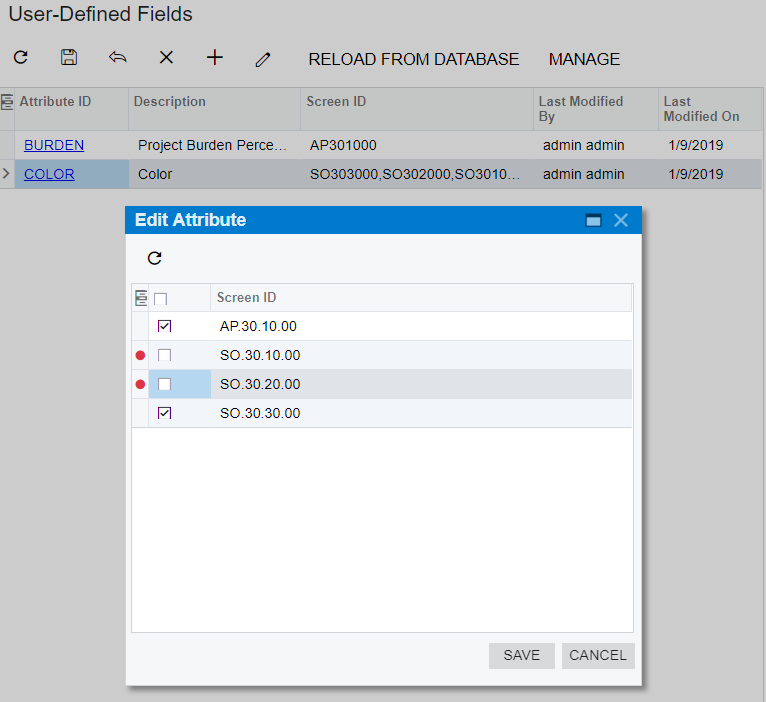
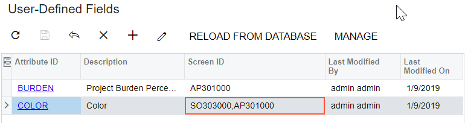

# To Add a User-Defined Field to a Customization Project {#_e01f29d3-b6b1-40f4-a2d1-45c9d01bdde3 .concept}

To add a user-defined field to customization project, you can use a field previously defined in Acumatica ERP, or create a field in Customization Project Editor. After that you can include the field in the current customization project.

## To Add a New User-Defined Field { .section}

To add a new user-defined field, proceed as follows:

1.  On the navigation pane of the Customization Project Editor, click **User-Defined Fields** to open the [User-Defined Fields](../UserGuide/AU_23_00_00.md) page.
2.  On the page toolbar, click **Add New Record**.
3.  In the **Add User-Defined Fields** dialog box, which opens, select an attribute for the user-defined field you are adding, and click **Save**.

    The user-defined field appears in the list on the User-Defined Fields page, and the dialog box is closed. Now you need to specify the IDs of the screens on which the field will appear. By default, the added field appears with all screens where it is used in the instance.

4.  In the row with the user-defined field, click the link in the **Attribute ID** column.
5.  In the **Edit Attribute** dialog box \(see the following screenshot\), which opens, select the forms for which you want to save the fields in the customization project.

    **Tip:** In this dialog box, you can see only the IDs of the screens for which the user-defined field was added. To add a user-defined field to a screen, on the title bar of the screen, select **Customization &gt; Manage User-Defined Fields** and add the field.

    

6.  Click **Save** to save your changes, close the dialog box, and return to the User-Defined Fields page.

    The selected form IDs are listed in the **Screen ID** column of the user-defined field you edited, as shown in the following screenshot.

    

7.  On the page toolbar, click **Save**.

**Parent topic:**[User-Defined Fields](../CustomizationPlatform/CG_GL_Items_UserDefinedFields.md)

