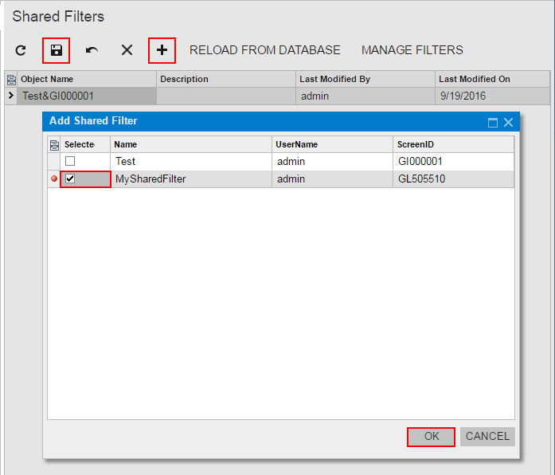
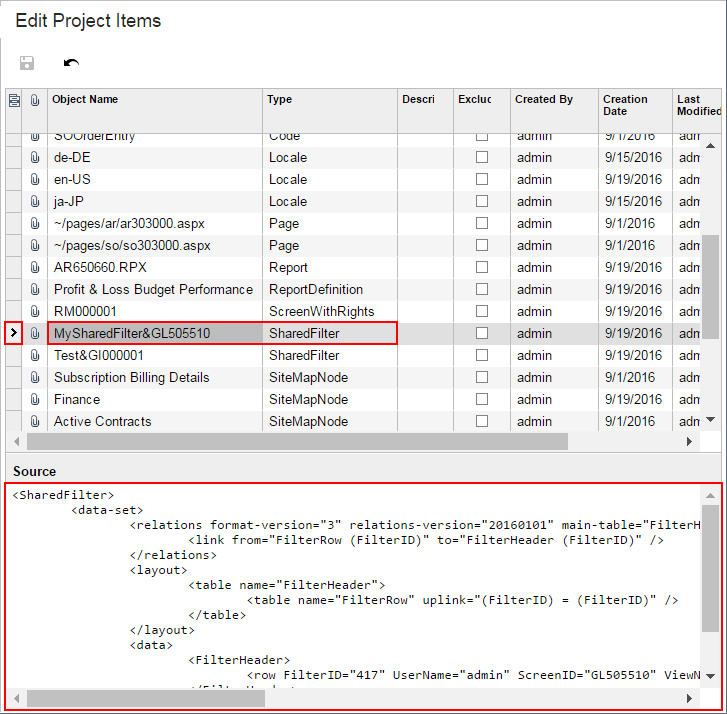

# To Add a Shared Filter to a Project {#_642204fb-1ec6-4aa9-a166-63ce2deccd1c .concept}

You can add a custom reusable shared filter to a customization project. To do this, perform the following actions:

1.  Open the customization project in the Customization Project Editor. \(See [To Open a Project](CG_GL_Project_Opening.md) for details.\)
2.  Click **Shared Filters** in the navigation pane to open the [Shared Filters](../UserGuide/AU_20_51_00.md) page.
3.  On the page toolbar, click **Add New Record**, as shown in the screenshot below.
4.  In the list of integration scenarios in the **Add Shared Filter** dialog box, which opens, select the check box for each filter that you want to include in the project.

    **Tip:** The **Add Shared Filter** dialog box displays all the custom shared filters that exist in your instance of Acumatica ERP. You can select multiple shared filters to add them to the project simultaneously.

5.  In the dialog box, click **OK** to add the selected filter or filters to the page table.
6.  On the page toolbar, click **Save** to save the changes to the customization project.

    

The system adds to the project the data from the database for each selected shared filter. You can view each new *SharedFilter* item in the Project Items table of the [Edit Project Items](../UserGuide/AU_ItemXMLEditor.md), as shown in the following screenshot.

**Parent topic:**[Shared Filters](../CustomizationPlatform/CG_GL_Items_SharedFilters.md)

