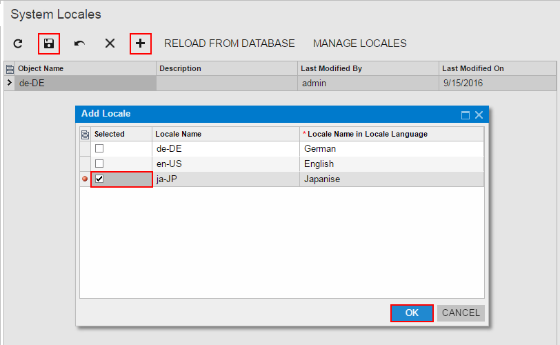
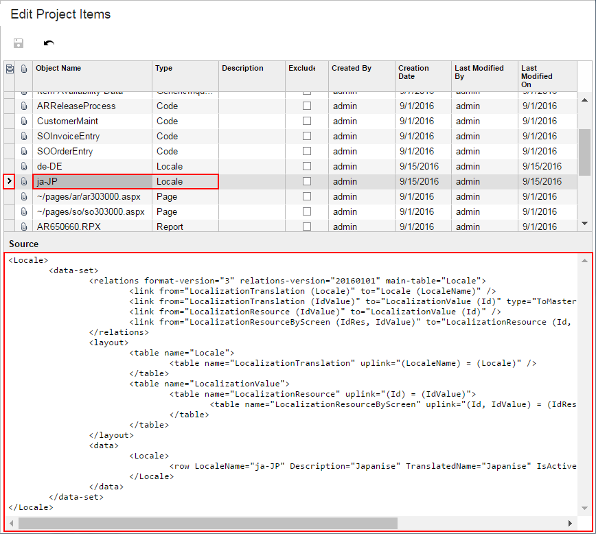

# To Add a System Locale to a Project {#_2db2cd74-3dca-4e65-9c1c-fcaed25822fe .concept}

You can add a system locale to a customization project. To do this, perform the following actions:

1.  Open the customization project in the Customization Project Editor. \(See [To Open a Project](CG_GL_Project_Opening.md) for details.\)
2.  Click **System Locales** in the navigation pane to open the System Locales page.
3.  On the page toolbar, click **Add New Record** \(+\), as shown in the screenshot below.
4.  In the list of system locales in the **Add Locale** dialog box, which opens, select the check box for each locale that you want to include in the project.

    **Note:** The **Add Locale** dialog box displays all the system locales that exist in your instance of Acumatica ERP. You can select multiple system locales to add them to the project simultaneously.

5.  In the dialog box, click **OK** to add each selected locale to the page table.
6.  On the page toolbar, click **Save** to save the changes to the customization project.

    

The system adds to the project the data from the database for each selected system locale. You can view each new *Locale* item in the Project Items table of the [Edit Project Items](../UserGuide/AU_ItemXMLEditor.md), as shown in the following screenshot.

**Parent topic:**[System Locales](../CustomizationPlatform/CG_GL_Items_Translations.md)

