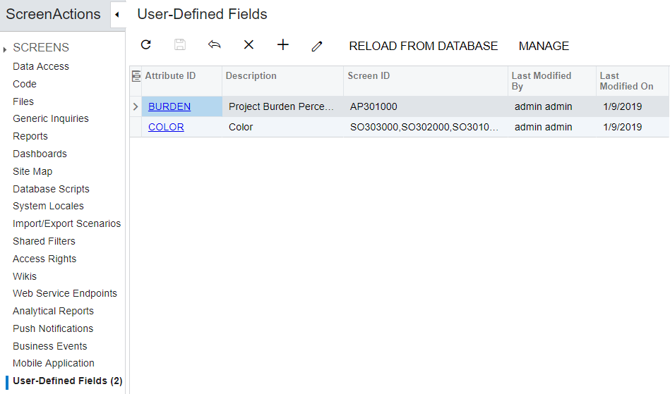

# User-Defined Fields {#_ec199ee5-3238-415b-9318-78c4c03bc22b .concept}

The Customization Project Editor includes the [User-Defined Fields](../UserGuide/AU_23_00_00.md) \(AU230000\) page, which is shown in the screenshot below. On this page, you can do the following:

-   Update field properties that have been updated by users in an instance of Acumatica ERP by clicking **Reload from Database**.
-   Add a new user-defined field based on existing attributes. For details on defining attributes, see [Attributes](../UserGuide/CS__con_Attributes.md).
-   View detailed information about a user-defined field.
-   Modify the list of screens on which the field is displayed.
-   Remove an existing user-defined field.

You can add a user-defined field either on the applicable form of Acumatica ERP or on the [User-Defined Fields](../UserGuide/AU_23_00_00.md) page of the Customization Project Editor. Any user-defined fields you add in the Customization Project Editor are added to the current customization project with all other items; when the project has been completed, it can be exported and imported.

**Note:** You can add user-defined fields for the Self-Service Portal as well.

-   **[To Add a User-Defined Field to a Customization Project](../CustomizationPlatform/CG_GL_Items_Screens_UserDefinedFields.md)**  

**Parent topic:**[Managing Items in a Project](../CustomizationPlatform/CG_GL_Items.md)

