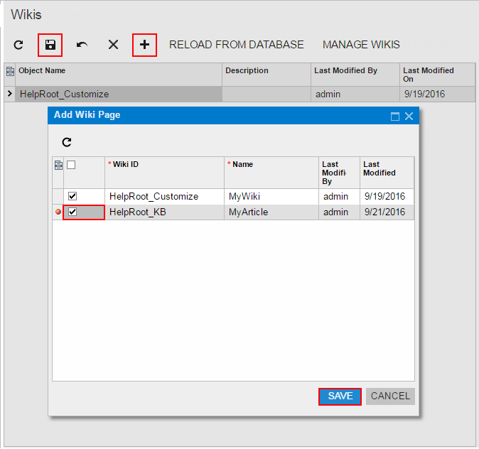
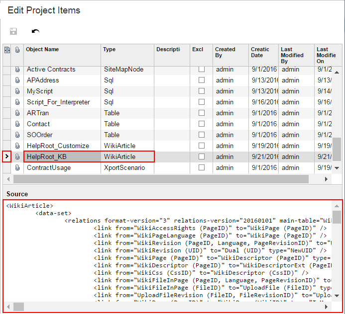

# To Add a Custom Wiki to a Project {#_f2df166e-0973-44f3-bf3b-aba8216fa2ba .concept}

In Acumatica ERP, you can create a new wiki or modify the properties of an existing one. For example, you can change the access rights to wiki folders and edit the list of categories available for the wiki. Any change to wikis is saved for the appropriate wiki in the database for the current tenant.

You can add to a customization project the wiki that are saved in the database for the current tenant. To do this, perform the following actions:

1.  Open the customization project in the Customization Project Editor. \(See [To Open a Project](CG_GL_Project_Opening.md) for details.\)
2.  Click **Wikis** in the navigation pane to open the Wikis page.
3.  On the page toolbar, click **Add New Record** \(+\), as shown in the screenshot below.
4.  In the list of custom wikis in the **Add Wiki Page** dialog box, which opens, select the check box for each wiki that you want to include in the project.

    **Note:** The **Add Wiki Page** dialog box displays all the custom wikis that exist in your instance of Acumatica ERP. You can select multiple wikis to add them to the project simultaneously.

5.  In the dialog box, click **OK** to add the selected wiki to the page table.
6.  On the page toolbar, click **Save** to save the changes to the customization project.

    

The system adds to the project each selected wiki. You can view each new *WikiArticle* item in the Project Items table of the [Edit Project Items](../UserGuide/AU_ItemXMLEditor.md), as shown in the following screenshot.

A *WikiArticle* item contains all the data required to recreate the corresponding wiki in any instance of Acumatica ERP.

**Parent topic:**[Wikis](../CustomizationPlatform/CG_GL_Items_Wiki.md)

