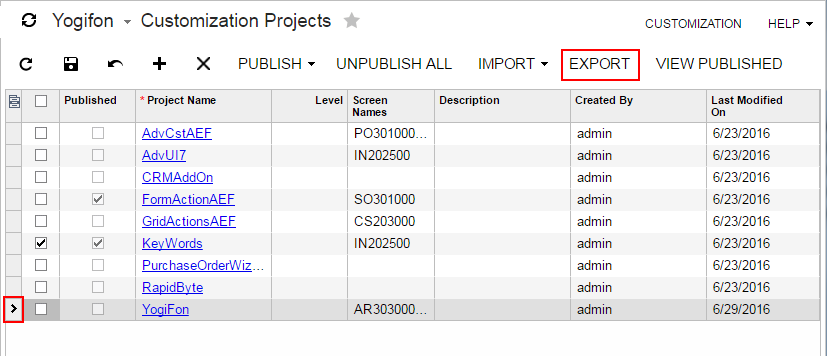
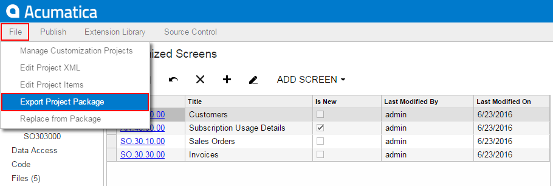
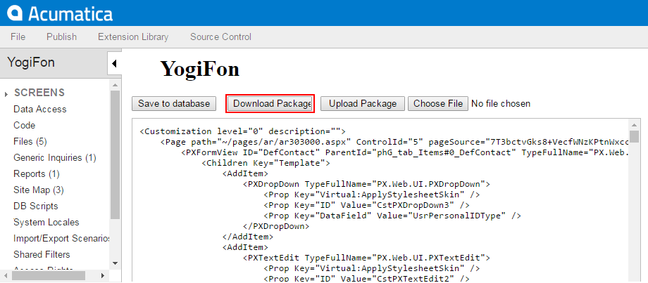

# To Export a Project {#_5d2160eb-0219-4cc0-af6d-e3cb29ab8d2b .concept}

You can export \(download\) a customization project when the project is finished to deploy the customization to the target system. Also, you can download the package to have a backup copy of the customization project you are working on.

Before you download the package, we recommend that you make sure you have included all the needed changes in the customization project. To do this, you take the following actions:

-   Make sure that you have added all custom files to the project and uploaded the latest actual version of the files to the project. See [To Update a Project](CG_GL_Projects_Updating.md) for details.
-   Make sure that the database schema is updated in the customization project. See [To Update Custom Tables in the Project](CG_GL_Items_DBScripts_UpdatingCustTable.md) for details.
-   Make sure you have added the needed site map nodes to the project. See [Site Map](CG_GL_Items_SiteMap.md) for details.
-   Publish the project and test the customization before downloading the deployment package, to ensure that you have no issues.

To download the deployment package of a customization project, you should export the project. You can export a customization project in the following ways:

-   [By using the Customization Projects form](#section_ezh_m1d_nw)
-   [Through the Customization Project Editor](#section_e54_m1d_nw)

The system creates the deployment package of the project and downloads the `zip` file of the package on your machine. The file has the same name as the customization project. For more information about a deployment package, see [Deployment of a Customization Result](CG_Platform_Project_Deployment.md).

## Exporting a Customization Project by Using the Customization Projects form {#section_ezh_m1d_nw .section}

To export a customization project by using the [Customization Projects](../UserGuide/SM_20_45_05.md) \(SM204505\) form, perform the following actions:

1.  Navigate to **System &gt; Customization &gt; Manage &gt; Customization Projects**.
2.  In the project list of the form, click the row of the customization project to be exported.

    The row is highlighted in the table, as the screenshot below shows.

3.  Click **Export** on the form toolbar to export the highlighted project.

    

## Exporting the Customization Project Opened in the Customization Project Editor {#section_e54_m1d_nw .section}

To export the customization project that is currently opened in the [Customization Project Editor](../UserGuide/SM_20_45_10.md), click **File** &gt; **Export Project Package** on the editor menu, as shown in the following screenshot.

Also, you can export the customization project from the [Project XML Editor](../UserGuide/AU_ProjectXMLEditor.md) of the [Customization Project Editor](../UserGuide/SM_20_45_10.md) by clicking **Download Package** on the page toolbar, as shown in the following screenshot.

**Parent topic:**[Managing Customization Projects](../CustomizationPlatform/CG_GL_Projects.md)

