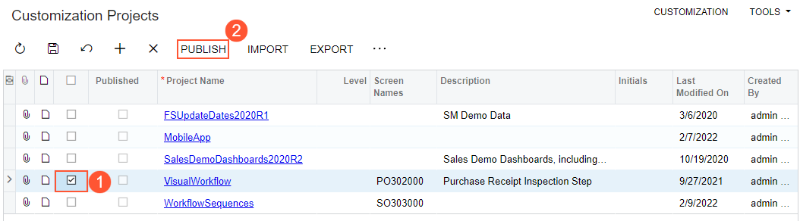

# To Publish a Single Project {#_739ba5bb-cf0e-40ff-91ca-4f1f1723db1f .task}

You can publish a single customization project by using the **Publish** command on the [Customization Projects](../UserGuide/SM_20_45_05.md) \(SM204505\) form.

To to do this, perform the following actions:

1.  Open the [Customization Projects](../UserGuide/SM_20_45_05.md) form.
2.  In the project list, select the check box \(in the unlabeled column\) for the needed customization project \(see Item 1 in the screenshot below\).
3.  Clear any selected check boxes in this column for other customization projects.

    **Note:** All previously published projects that are not selected will be unpublished.

4.  On the More menu, click **Publish** to initiate the publication of the selected project \(Item 2\).

    

**Parent topic:**[Publishing Customization Projects](../CustomizationPlatform/CG_GL_Projects_Publishing.md)

