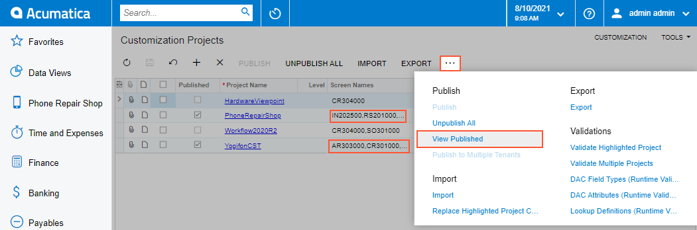
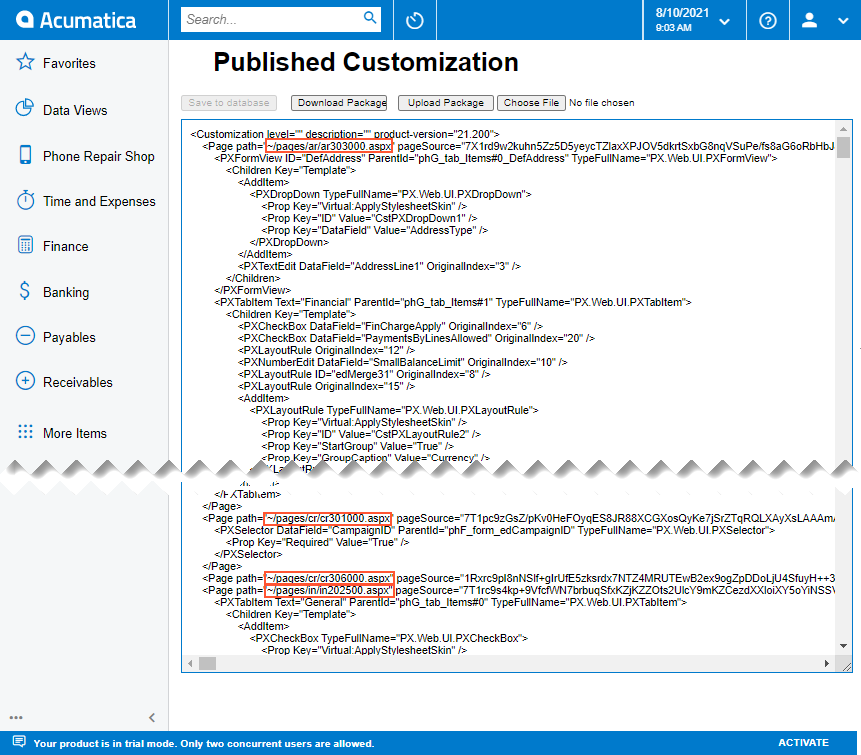

# To View a Published Customization {#_bd06aff2-4bb8-4ad5-af65-ad878f9e259c .task}

You can view the merged content of multiple customization projects that are currently published by using the [Published Customization Page](../UserGuide/SM_20_45_05.md#_fd17db89-2c99-4c0d-978d-dc81141fca72) of the [Customization Projects](../UserGuide/SM_20_45_05.md) \(SM204505\) form.

When you publish multiple projects at once, the platform merges the projects into a single project and then applies this project to the application instance. \(See [Project Publication: General Information](CustomizationProjects_PublishingProjects_GeneralInfo.md) for details.\) To view the content of the merged project, perform the following actions:

1.  Open the [Customization Projects](../UserGuide/SM_20_45_05.md) form.
2.  On the More menu \(under **Publish**\), click **View Published**, as the following screenshot shows.

    

The Published Customization page opens. The screenshot below shows two simultaneously published customization projects, PhoneRepairShop and YogifonCST. The Published Customization page shows the result of merging these projects.

**Parent topic:**[Publishing Customization Projects](../CustomizationPlatform/CG_GL_Projects_Publishing.md)

