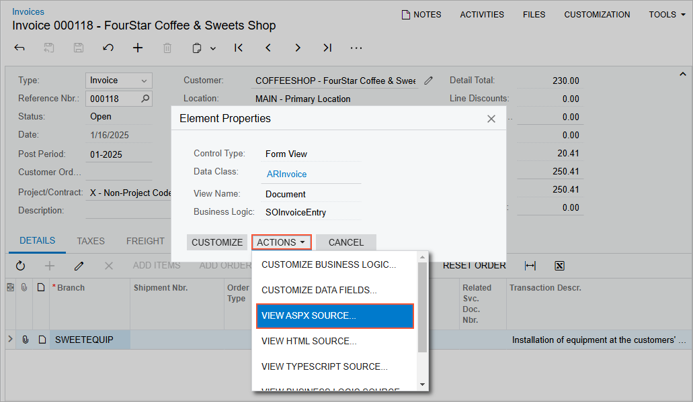

# To Explore the ASPX Code of a Form \(Classic UI\) {#_e38e179d-cd54-48fa-a9ce-f26a52e97f0c .concept}

If you need to look closely at the data views that provide data for control containers on a form or to see the corresponding webpage structure—that is, the layout of the containers and the types and properties of the controls—you may need to explore the original ASPX code of the form.

To explore this code, perform the following actions:

1.  On the selected form, click **Customization &gt; Inspect Element** on the form title bar, as shown in the following screenshot, to activate the [Element Inspector](../UserGuide/AU_ElementInspector.md).

    

2.  Click a control or an area of the form to open the **Element Properties** dialog box for the control or area. \(For details, see [Element Properties Dialog Box](../UserGuide/AU_ElementInspector.md#_8ce780b0-243f-480c-8b4c-ed6431116e3f).\)
3.  In the dialog box, click **Actions** &gt; **View ASPX Source**, as shown in the following screenshot.

    

4.  On the **Screen ASPX** of the [Source Code](../UserGuide/SM_20_45_70.md) \(SM204570\) form, which opens, view the original ASPX code of the form in the Source Code pane.
5.  If you need to look closely at the data views that provide data for control containers on the current form, search on the page for the `DataMember` string. The DataMember property is used to bind a control container of a form to a data view defined in the business logic controller \(BLC\) of the form. The property value is the name of the data view.

    **Tip:** Each DataMember property value can correspond to any data view name of the BLC. Any container \(for example, PXTab, PXGridLevel, or PXFormView\) must be bound to a data view declared within a BLC. Any data view except for the main data view can be used by an unlimited number of containers. The main data view must be bound to a single container.

**Parent topic:**[Exploring the Source Code](../CustomizationPlatform/CG_GL_Stages_Explore.md)

