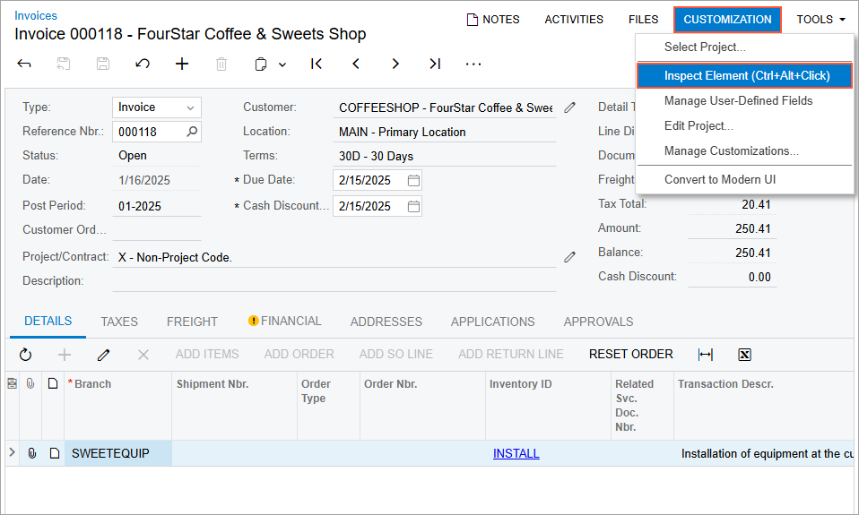
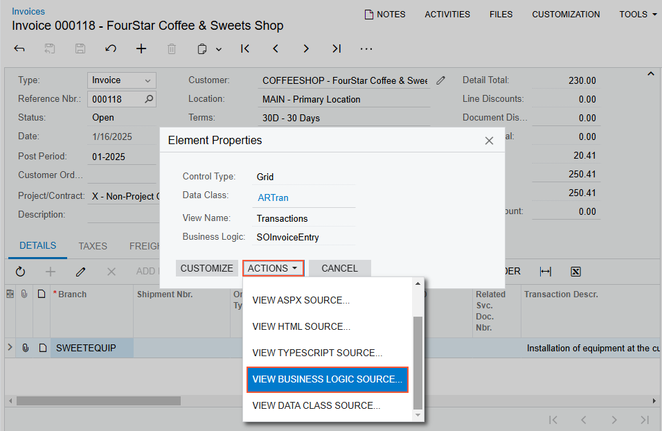

# To Explore the C\# Code of a BLC {#_3aefb7f7-8213-449b-a4c6-2bf9a0d1d750 .concept}

If you need to customize the business logic for a form of Acumatica ERP, you have to explore the original source code of the business logic controller \(BLC\) that provides the business logic for the form. The goal of exploring the code is to discover the data views, methods, and event handlers of the BLC.

To do this, perform the following actions:

1.  On the selected form, click **Customization &gt; Inspect Element** on the form title bar, as shown in the following screenshot, to activate the [Element Inspector](../UserGuide/AU_ElementInspector.md).

    

2.  Click a control or an area of the form to open the **Element Properties** dialog box for the control or area. \(For details, see [Element Properties Dialog Box](../UserGuide/AU_ElementInspector.md#_8ce780b0-243f-480c-8b4c-ed6431116e3f)\). In the dialog box, click **Actions** &gt; **View Business Logic Source**, as shown in the following screenshot.

    

3.  On the **Business Logic** tab of the [Source Code](../UserGuide/SM_20_45_70.md) \(SM204570\) form, which opens for the BLC, view the source code in the Source Code pane. Use the navigation pane to find a method or event handler by its name and open it.

Also, you can open the original BLC code in the Source Code browser in the following ways:

-   From the [Code Editor](../UserGuide/AU_20_40_00_CodeEditor.md), by clicking **View Source** on the page toolbar
-   From the [Screen Editor](../UserGuide/AU_20_45_20.md), by clicking **View Source** on the toolbar of the **Events** tab

**Parent topic:**[Exploring the Source Code](../CustomizationPlatform/CG_GL_Stages_Explore.md)

