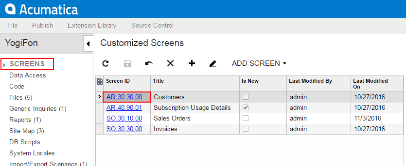
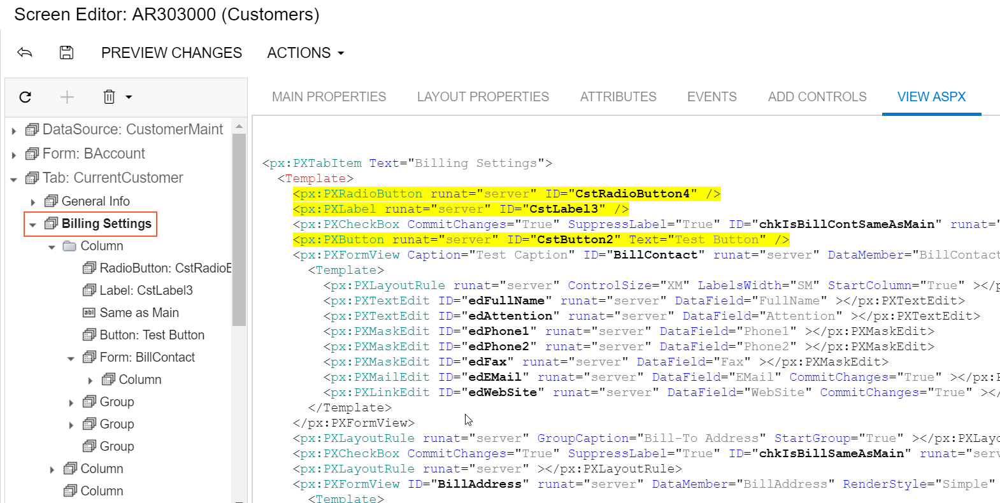

# To Find a Customization of the ASPX Code {#_70c71664-bd9a-4e5e-b4f9-2beb8cd70132 .concept}

If the ASPX code for a form is customized, to explore changes in the code, you use the [Screen Editor](../UserGuide/AU_20_45_20.md) of the [Customization Project Editor](../UserGuide/SM_20_45_10.md), which you access by using the [Customization Projects](../UserGuide/SM_20_45_05.md) \(SM204505\) form.

**Tip:** The Source Code browser can display only the original ASPX code of a webpage.

To detect whether a form is currently customized, do the following:

1.  Open the form in the browser.
2.  Click **Tools** on the title bar of the form.

If the form has been customized, the screen ID has the *CST.* prefix.

Once you know the form has been customized, to find the customization of the ASPX code of the form, perform the following actions:

1.  Determine the published customization projects that contain changes for the form as follows:
    1.  Navigate to **System &gt; Customization &gt; Manage &gt; Customization Projects**
    2.  On the form, view the list of the customization projects.
    3.  In the **Screen Names** column, for the published customization projects \(those for which the **Published** check box is selected\), scan the form IDs to identify the projects that contains changes for this form.
2.  To explore a published project that contains changes for this form, perform the following actions:
    1.  Click the name of the project to open it in the [Customization Project Editor](../UserGuide/SM_20_45_10.md).
    2.  In the navigation pane of the editor, click **Screens** to open the Customized Screens page.
    3.  On the page \(see the screenshot below\), click the form ID in the **Screen ID** column to open the [Screen Editor](../UserGuide/AU_20_45_20.md) for the form.

        

    4.  In the Screen Editor, select the **View ASPX** tab item to view the customized ASPX code of the node that is currently selected in the Control Tree
    5.  Explore each node of the tree to find the changes, which are highlighted in yellow, as the following screenshot shows.

        

**Parent topic:**[Exploring the Source Code](../CustomizationPlatform/CG_GL_Stages_Explore.md)

